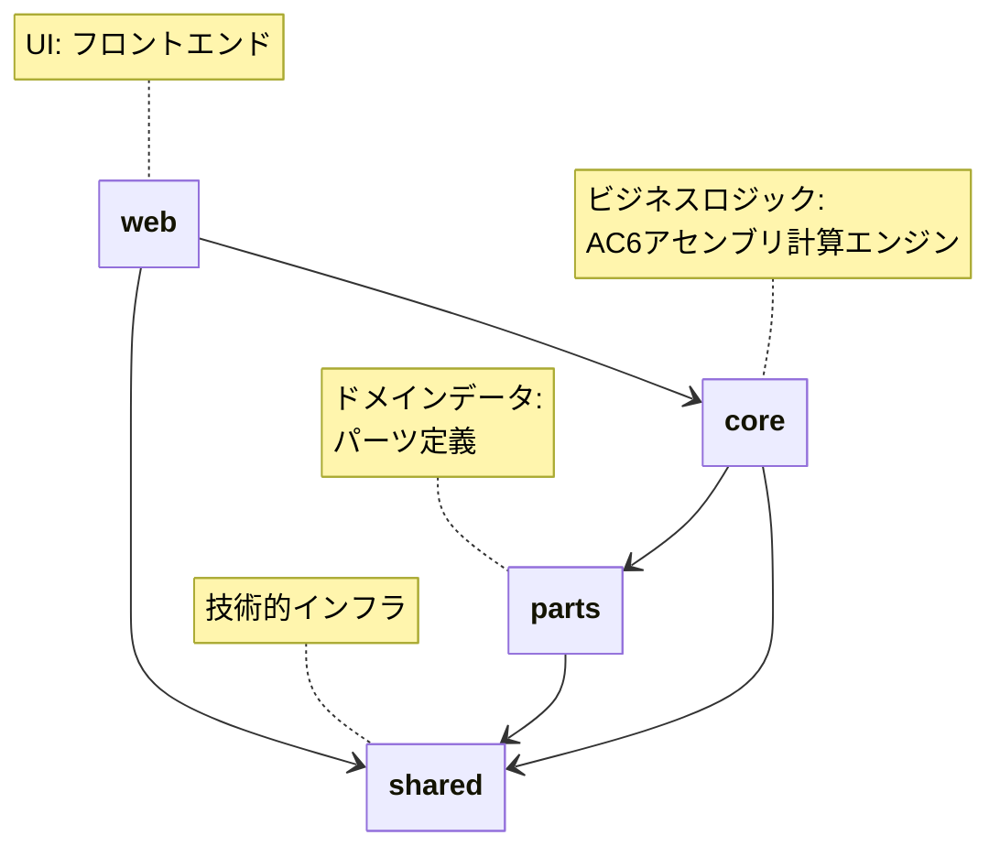

# AC6 ASSEMBLE TOOL

[](https://github.com/tooppoo/ac6_assemble_tool/actions/workflows/ci-lighthouse.yml)
[](https://github.com/tooppoo/ac6_assemble_tool/actions/workflows/ci-lint.yml)
[](https://github.com/tooppoo/ac6_assemble_tool/actions/workflows/ci-test.yml)
[](https://codecov.io/gh/tooppoo/ac6_assemble_tool)

## プロジェクト概要

**AC6 Assemble Tool** は Armored Core 6 (AC6) プレイヤー向けのメカ組み立て支援ツールです。複雑なパーツの組み合わせから最適な機体構成を作成し、性能を分析・評価できる Web アプリケーションです。

### 本番環境

- Production URL: <https://ac6-assemble-tool.philomagi.dev/>
- ホスティング: Cloudflare Pages
- デプロイ: main ブランチへのプッシュ時に自動実行

## 主な機能

### 機体組み立て機能

- **パーツ選択**: 頭部、コア、腕部、脚部、武装、ブースター、FCS、ジェネレーター、拡張パーツの組み合わせ
- **リアルタイム計算**: AP、防御力、重量、EN消費量などの性能値をリアルタイム表示
- **制約チェック**: 積載制限、EN出力制限、腕部積載制限の自動検証とアラート表示

### 性能分析・レポート機能

- **詳細レポート**: 25項目以上の性能指標を分析（AP、各種防御力、EN効率、重量配分など）
- **ステータス表示**: 危険・警告・正常の3段階でパフォーマンス状況を可視化
- **カスタムレポート**: 表示項目の選択・非表示切り替え機能

### パーツデータ管理

- **バージョン対応**: 複数のゲームパッチ（v1.06.1、v1.07、v1.08.1、v1.09.1等）に対応
- **パーツ検索・フィルター**: 製造企業、カテゴリ、性能値での絞り込み
- **データ更新**: ゲームアップデートに応じたパーツデータの追加・更新

### データ永続化・共有

- **ローカル保存**: IndexedDB を使用した機体構成の保存・読み込み
- **URL共有**: 機体構成をクエリパラメータで共有可能
- **履歴管理**: 過去に作成した機体構成の履歴管理

## プロジェクト構成

本プロジェクトは **monorepo** 構成を採用しており、複数のパッケージで構成されています。

### コアパッケージ

```txt
packages/
├── core/         # ビジネスロジック・計算エンジン
├── parts/        # パーツデータ管理
├── web/          # Web フロントエンド
└── shared/       # 共通ユーティリティ（logger等）
```

#### @ac6_assemble_tool/core

**責務**: AC6 アセンブリ計算エンジン

- 機体組み立てロジック
- パーツフィルタリング
- ランダム生成・検証
- データシリアライズ（URL/クエリパラメータ）
- データ永続化（IndexedDB）

#### @ac6_assemble_tool/parts

**責務**: パーツデータ定義とバージョン管理

- パーツ型定義（フレーム系、武装系、内装系、拡張系）
- パッチバージョン対応
- パーツ実体定義

#### @ac6_assemble_tool/web

**責務**: Web フロントエンド UI

- SvelteKit ベースの Web アプリケーション
- ビュー固有ロジック（フィルター、インタラクション、レポート）
- 国際化対応（i18n）
- パッチバージョン別データ管理

#### @ac6_assemble_tool/shared

**責務**: 技術的インフラレイヤー

- 構造化ログ（logger）
- 共通ユーティリティ

### サポートパッケージ

```txt
packages/
├── spec/         # テスト仕様・共通テストライブラリ
├── tsconfig/     # 共通 TypeScript 設定
├── eslint/       # 共通 ESLint 設定
└── docs/         # ドキュメント専用パッケージ
```

### 依存関係図



## 開発環境のセットアップ

### 前提条件

- **Node.js**: 22.19.0
- **pnpm**: 10.18.2

### インストール

```bash
pnpm install
```

### 開発サーバー起動

```bash
pnpm run dev
```

開発サーバーがデフォルトで `http://localhost:5173` で起動します。

## 開発ワークフロー

### ビルド

```bash
pnpm run build          # 本番ビルド
pnpm run build:test     # テスト用ビルド
```

### テスト

```bash
pnpm run test           # テスト実行
pnpm run test:watch     # テスト監視モード
pnpm run coverage       # カバレッジ測定
```

**テスト要件**:

- カバレッジ 80% 以上を維持
- テストファイルは実装と同じディレクトリに配置（`.spec.ts` または `.test.ts`）

### コード品質チェック

```bash
pnpm run lint           # ESLint チェック
pnpm run format         # Prettier フォーマット（自動修正）
pnpm run check-types    # TypeScript 型チェック
```

### パッケージ別操作

```bash
pnpm web <command>      # web パッケージ操作
pnpm core <command>     # core パッケージ操作
pnpm parts <command>    # parts パッケージ操作
pnpm shared <command>   # shared パッケージ操作
```

**例**:

```bash
pnpm web dev            # web パッケージの開発サーバー起動
pnpm core test          # core パッケージのテスト実行
```

### リリースプロセス

```bash
# 1. changeset を追加（PR作成前）
pnpm changeset

# 2. GitHub Actions から WebCreateRelease を実行
# タグ付与・Release作成・Webパッケージのバージョンアップまで自動実行
```

## アーキテクチャ

### 技術スタック

#### フロントエンド

- **Svelte 5** + **SvelteKit**: メインフレームワーク
- **TypeScript**: 型安全性確保
- **Vite**: 高速ビルドツール
- **Sveltestrap**: Bootstrap 5 ベースの Svelte コンポーネントライブラリ
- **i18next**: 多言語対応（日本語・英語）

#### 状態管理・データ

- **Svelte Stores**: リアクティブ状態管理
- **Dexie**: IndexedDB ラッパーライブラリ（データ永続化）
- **Zod**: スキーマバリデーション

#### 開発環境

- **pnpm workspaces**: パッケージ間依存管理
- **Turbo**: タスクランナーとキャッシュシステム
- **Vitest**: テストランナー
- **ESLint** + **Prettier**: コード品質・フォーマット

### 主要な設計決定

重要なアーキテクチャ決定は **ADR (Architecture Decision Record)** として記録されています。

- [docs/adr/20251018-logger-placement-in-shared-package.md](docs/adr/20251018-logger-placement-in-shared-package.md): logger を packages/shared に配置する決定

詳細なアーキテクチャ情報は以下を参照してください：

- [docs/steering/product.md](docs/steering/product.md): プロダクト概要
- [docs/steering/tech.md](docs/steering/tech.md): 技術スタック
- [docs/steering/structure.md](docs/steering/structure.md): プロジェクト構造

## 環境変数

Cloudflare Pages の環境変数設定で以下を構成：

- `PUBLIC_REPORT_BUG_URL`: バグレポート URL
- `PUBLIC_REPORT_REQUEST_URL`: 機能リクエスト URL
- `PUBLIC_LOG_LEVEL`: ログレベル設定
- `PUBLIC_SITE_URL`: サイト URL

## 貢献ガイドライン

### Issue / PR の作成

- Issue: `.github/ISSUE_TEMPLATE/` のテンプレートに従う
- Pull Request: `.github/pull_request_template.md` に従う
- 各項目は空欄にせず、内容がない場合は「なし」と明記
- **1 Issue = 1目的、1 PR = 1論点**

## ライセンス

MIT License

## 関連リンク

- [AGENTS.md](AGENTS.md): AI エージェント向け開発指針（開発原則の詳細）
- [CLAUDE.md](CLAUDE.md): Claude Code Spec-Driven Development
- [docs/steering/](docs/steering/): プロジェクト全体のコンテキストと技術スタック
- [docs/adr/](docs/adr/): アーキテクチャ決定記録
