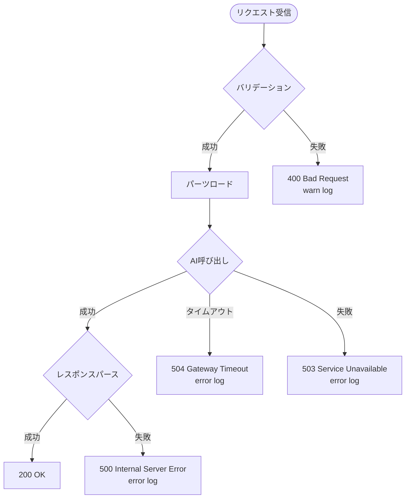

# Technical Design Document

## Overview

本機能は、AC6 Assemble Toolにおいて、自然言語クエリに基づいてパーツを推奨するHTTP APIを提供する。Cloudflare Workers AI（Llama系モデル）を活用し、既存のパーツデータの`ai_summary`と`ai_tags`を用いて、ユーザーの意図を理解し最適なパーツを提案する。

**Purpose**: プレイヤーが「高火力の武器が欲しい」といった自然言語でパーツ要求を入力すると、AIが適合度を判定して推奨パーツと理由を返す。これによりパーツ選択の試行錯誤時間を削減し、データドリブンな機体構築を支援する。

**Users**: AC6 Assemble Toolのエンドユーザー（プレイヤー）が、packages/webのUIから本APIを呼び出す。開発者は、このAPIをpackages/apiに実装し、Cloudflare Workersへデプロイする。

**Impact**: 既存のAC6 Assemble Toolに新しいHTTP APIエンドポイント（POST `/api/recommend`）を追加する。packages/webからの非同期通信により、パーツ選択UXを向上させる。packages/api は現在シンプルなHonoアプリケーションであり、今回が初の実質的なAPI機能の追加となる。

### Goals

- Cloudflare Workers AI（Llama 3.1-8b-instruct-fast推奨）を用いた自然言語ベースのパーツ推奨機能を実装
- 3秒以内のレスポンス時間で、スロット指定によるフィルタリングをサポート
- 型安全なリクエスト/レスポンス処理と構造化ログによる運用性確保
- packages/partsへの一方向依存を維持し、monorepo構成の原則に準拠

### Non-Goals

- パーツデータの新規作成・更新機能（`ai_summary`/`ai_tags`は既存データを活用）
- ユーザー認証・認可機能（将来的な拡張として検討）
- リアルタイムストリーミングレスポンス（初期実装ではバッチレスポンスのみ）
- 複数モデルの動的切り替え（初期実装では単一モデル固定）

---

## Architecture

### Existing Architecture Analysis

packages/api は現在、最小構成のCloudflare Workers アプリケーションである：

- **フレームワーク**: Hono（軽量なHTTPルーティング）
- **既存エンドポイント**: `GET /`（Hello Worldレスポンス）
- **構成**: `src/index.ts`にHonoインスタンスを作成し、`wrangler.jsonc`でAIバインディング設定済み
- **依存関係**: 現時点で他のmonorepoパッケージへの依存なし（独立したAPI層）

本機能は、この既存のHonoアプリケーションに新しいルート（POST `/api/recommend`）を追加する形で実装する。packages/partsとpackages/sharedへの依存を新規追加する。

### High-Level Architecture


### Architecture Integration

**既存パターンの保持**:
- Honoフレームワークを使用したHTTPルーティング（`src/index.ts`の既存Honoインスタンスを拡張）
- Cloudflare Workers環境での実行（`wrangler.jsonc`設定準拠）
- TypeScript型安全性とVitestテスト構成

**新規コンポーネントの追加理由**:
- **RecommendHandler**: POST `/api/recommend`エンドポイントのハンドラ関数（Honoルート定義）
- **Request Validator**: Valibotスキーマによるリクエストボディ検証（型安全性MUST要件）
- **AI Inference Service**: Cloudflare Workers AI呼び出しをカプセル化し、エラーハンドリングとタイムアウト処理を集約
- **Parts Loader**: packages/partsから必要なパーツデータをロードし、スロットフィルタリングを実行

**技術スタックとの整合性**:
- **Hono**: 既存のpackages/api標準フレームワーク
- **Valibot**: プロジェクト全体で採用されているバリデーションライブラリ（packages/coreで使用実績）
- **構造化ログ**: packages/sharedのloggerを使用（AGENTS.md L99, dependencies.md L100）

**ステアリング準拠**:
- **依存の一方向性**: packages/api → packages/parts, packages/shared（AGENTS.md L170, dependencies.md L14）
- **レイヤー分離**: API層としてpackages/apiを独立配置（structure.md準拠）
- **型安全性**: Valibot + TypeScript型定義による型レベルプログラミング（AGENTS.md L149）

---

## Technology Stack and Design Decisions

### Technology Alignment

本機能は既存のpackages/api技術スタックに整合する形で実装する：

**既存技術の活用**:
- **Cloudflare Workers**: 実行環境（既存）
- **Hono v4.11.3**: HTTPルーティング（既存）
- **Wrangler**: デプロイツール（既存）
- **Vitest**: テストフレームワーク（既存）

**新規導入する依存関係**:
- **@ac6_assemble_tool/parts**: パーツデータおよび型定義の参照
- **@ac6_assemble_tool/shared**: 構造化logger
- **valibot**: リクエスト/レスポンスバリデーション（packages/coreで使用実績あり、バージョン統一を検討）

**新規導入の正当性**:
- packages/partsへの依存は、パーツ推奨機能の核心要件（ai_summary/ai_tags活用）であり不可避
- packages/sharedのloggerは、構造化ログ出力のMUST要件（AGENTS.md L99）に準拠
- valibotは、型安全性MUST要件（AGENTS.md L115）を満たすため必須

### Key Design Decisions

#### Decision 1: Cloudflare Workers AI モデル選定

**Decision**: Llama 3.1-8b-instruct-fast を推奨モデルとして採用

**Context**: パーツ推奨にはテキスト理解と適合度判定が必要。複数のLlamaモデルが利用可能だが、レスポンス時間3秒以内の要件を満たす必要がある。

**Alternatives**:
1. **Llama 3.1-70b-instruct**: 高精度だが推論時間が長くタイムアウトリスク高
2. **Llama 3.1-8b-instruct（標準版）**: 精度とレスポンスのバランス型
3. **Llama 3.1-8b-instruct-fast**: 高速化に最適化、多言語対話に適合

**Selected Approach**: Llama 3.1-8b-instruct-fast

**Rationale**:
- パフォーマンス要件（3秒以内）を優先し、高速化最適化版を選択
- 日本語パーツデータ（ai_summary/ai_tags）を扱うため、多言語対話対応が重要
- 8bモデルでも推奨タスクには十分な精度を期待できる（単純な適合度判定）

**Trade-offs**:
- 獲得: 高速レスポンス、タイムアウトリスク低減、多言語対応
- 犠牲: 70bモデルと比較した推論精度（ただし推奨タスクには影響軽微）

#### Decision 2: AI推論プロンプト設計

**Decision**: ユーザークエリと全対象パーツのai_summary/ai_tagsを一括でLLMに送信し、JSONフォーマットでスコア付き推奨結果を返す構造化プロンプトを採用

**Context**: パーツ数は各スロットあたり数十件程度。LLMにどのようにパーツ情報を提示し、推奨結果をどう返させるかが設計課題。

**Alternatives**:
1. **パーツごとに個別推論**: 各パーツをLLMに順次問い合わせてスコアリング
2. **埋め込みベクトル検索**: Workers AI Embeddingでベクトル化し、コサイン類似度でランキング
3. **構造化プロンプトによる一括推論**: 全パーツ情報を1プロンプトで送信し、JSON形式で結果取得

**Selected Approach**: 構造化プロンプトによる一括推論

プロンプト例:

```txt
You are a parts recommendation system for AC6 Assemble Tool.

User query: "{query}"
Target slot: "{slot}" (optional)

Parts candidates (JSON array):
[
  {"id": "HD001", "summary": "BAWS製ヘッド。AP1250...", "tags": ["ヘッド", "バランス型"...]},
  ...
]

Task: Analyze the user query and parts data, then return top 3-5 recommended parts in JSON format:
{
  "recommendations": [
    {"partId": "HD001", "reason": "理由の説明", "score": 0.95},
    ...
  ]
}
```

**Rationale**:
- 代替案1（個別推論）は、API呼び出しが多数発生しタイムアウトリスク高
- 代替案2（埋め込みベクトル）は、初期実装としては複雑度が高く、Vectorizeの追加設定が必要
- 構造化プロンプトは、1回のAI呼び出しで完結し、レスポンス時間を最小化できる
- Llama 3.1-8b-instruct-fastは128Kトークンコンテキストウィンドウを持ち、全パーツデータ送信に十分

**Trade-offs**:
- 獲得: シンプルな実装、高速レスポンス、初期開発コスト低
- 犠牲: パーツ数が極端に増えた場合のスケーラビリティ（ただし現状のデータ規模では問題なし）

#### Decision 3: エラーハンドリング戦略

**Decision**: Result型（@praha/byethrow）を内部処理で使用し、HTTPレスポンスでは標準HTTPステータスコードとエラーメッセージを返す

**Context**: AGENTS.md L143でResult型使用が推奨されているが、HTTPエンドポイントではステータスコードによるエラー表現が標準。

**Alternatives**:
1. **Result型のみ**: 全てのエラーをResult型で表現し、HTTPレスポンスもカスタム形式
2. **例外スロー**: try-catchベースのエラーハンドリング
3. **ハイブリッド**: 内部処理でResult型、HTTP境界で標準ステータスコード

**Selected Approach**: ハイブリッド（内部Result型 + HTTP標準ステータス）

**Rationale**:
- packages/coreおよびpackages/sharedで@praha/byethrowを採用済み（dependencies.md L274）
- HTTPエンドポイントでは、クライアント（packages/web）がステータスコードを期待
- Result型で内部エラーを型安全に扱い、ハンドラ層でHTTPレスポンスに変換

**Trade-offs**:
- 獲得: 型安全なエラー処理、標準的なHTTP APIインターフェース
- 犠牲: 変換レイヤーの追加（ただし薄い変換ロジックで実装可能）

---

## System Flows

### Sequence Diagram: パーツ推奨フロー


### Process Flow: AI推論プロンプト処理


---

## Requirements Traceability

| Requirement | 要件概要 | 実現コンポーネント | インターフェース | フロー図 |
| ------------- | --------- | ------------------ | ---------------- | --------- |
| 1.1 | POST /api/recommend エンドポイント | Hono Router, RecommendHandler | `POST /api/recommend` | シーケンス図 |
| 1.2 | query フィールド受付 | Request Validator (Valibot) | `RecommendRequest` スキーマ | プロセスフロー: バリデーション |
| 1.3 | slot フィールド（オプショナル）受付 | Request Validator, Parts Loader | `RecommendRequest.slot?` | プロセスフロー: フィルタリング |
| 1.4 | query 空文字列検証 | Request Validator | Valibot `string().min(1)` | プロセスフロー: バリデーション失敗 |
| 1.5 | recommendations 配列レスポンス | AI Inference Service, RecommendHandler | `RecommendResponse` 型 | シーケンス図: 200 OK |
| 1.6 | partId, partName, reason, score フィールド | AI Inference Service | `Recommendation` 型 | プロセスフロー: JSON検証 |
| 2.1 | パーツデータロード | Parts Loader | `loadParts(slot?): ACParts[]` | シーケンス図: loadParts |
| 2.2 | スロット指定フィルタリング | Parts Loader | `filterBySlot(parts, slot)` | プロセスフロー: フィルタリング分岐 |
| 2.3 | ai_summary/ai_tags 抽出 | Parts Loader | `ACParts.ai_summary`, `ACParts.ai_tags` | プロセスフロー: プロンプト生成 |
| 2.4 | Workers AI呼び出し | AI Inference Service | `env.AI.run(model, prompt)` | シーケンス図: Workers AI |
| 2.5 | reason/score 解析 | AI Inference Service | `parseRecommendations(response)` | プロセスフロー: パース |
| 2.6 | スコア降順ソート | AI Inference Service | `sortByScore(recommendations)` | プロセスフロー: ソート |
| 2.7 | 上位3-5件選択 | AI Inference Service | `selectTop(recommendations, 5)` | プロセスフロー: 選択 |
| 3.1 | AI呼び出し失敗時503 | RecommendHandler, Logger | HTTPステータス503 | シーケンス図: AI失敗分岐 |
| 3.2 | 3秒タイムアウト | AI Inference Service | `Promise.race()` with timeout | シーケンス図: タイムアウト分岐 |
| 3.3 | タイムアウト時504 | RecommendHandler, Logger | HTTPステータス504 | シーケンス図: タイムアウト |
| 3.4 | JSON不正時400 | Request Validator, Logger | HTTPステータス400 | プロセスフロー: バリデーション失敗 |
| 3.5 | 予期しない例外時500 | RecommendHandler, Logger | HTTPステータス500 | シーケンス図: 例外ハンドラ |
| 3.6-3.7 | エラーログ出力（機微情報除外） | Structured Logger | `logger.error(message, context)` | 全エラー分岐 |
| 5.1 | Valibot バリデーション | Request Validator | `v.parse(schema, data)` | プロセスフロー: バリデーション |
| 5.2-5.5 | 型安全性とバリデーションエラーログ | Request Validator, AI Inference Service, Logger | TypeScript型定義 + Valibot | シーケンス図: バリデーション分岐 |
| 6.1-6.6 | 構造化ログ | Structured Logger (packages/shared) | `logger.info/debug/error(message, context)` | シーケンス図: 全ログ出力 |
| 7.1-7.5 | monorepo依存管理 | Parts Loader, Logger | `@ac6_assemble_tool/parts`, `@ac6_assemble_tool/shared` | アーキテクチャ図 |
| 8.1-8.5 | Cloudflare Workers統合 | Hono Router, AI Inference Service, wrangler設定 | `env.AI` binding, `wrangler dev/deploy` | アーキテクチャ図 |

---

## Components and Interfaces

### API Layer

#### Hono Router (既存拡張)

**Responsibility & Boundaries**
- **Primary Responsibility**: HTTPルーティングとミドルウェア処理
- **Domain Boundary**: API層のエントリポイント
- **Data Ownership**: リクエスト/レスポンスの受け渡し
- **Transaction Boundary**: HTTP リクエストスコープ

**Dependencies**
- **Inbound**: packages/web（HTTP client）
- **Outbound**: RecommendHandler
- **External**: Hono v4.11.3

**Contract Definition (API Contract)**

| Method | Endpoint | Request | Response | Errors |
| -------- | ---------- | --------- | ---------- | -------- |
| POST | /api/recommend | `RecommendRequest` | `RecommendResponse` | 400, 500, 503, 504 |

#### Request Schema (Valibot):

```typescript
const RecommendRequestSchema = v.object({
  query: v.pipe(v.string(), v.minLength(1)),
  slot: v.optional(v.union([
    v.literal('head'),
    v.literal('arms'),
    v.literal('core'),
    v.literal('legs'),
    v.literal('booster'),
    v.literal('fcs'),
    v.literal('generator'),
    v.literal('arm-unit'),
    v.literal('back-unit'),
    v.literal('expansion')
  ]))
});

type RecommendRequest = v.InferOutput<typeof RecommendRequestSchema>;
```

#### **Response Schema**:

```typescript
interface RecommendResponse {
  recommendations: Recommendation[];
}

interface Recommendation {
  partId: string;
  partName: string;
  reason: string;
  score: number; // 0.0-1.0
}
```

#### **Error Response Schema**:

```typescript
interface ErrorResponse {
  error: {
    message: string;
    code?: string;
  };
}
```

#### RecommendHandler

**Responsibility & Boundaries**
- **Primary Responsibility**: パーツ推奨エンドポイントのビジネスロジック調整
- **Domain Boundary**: パーツ推奨ドメイン
- **Data Ownership**: リクエスト処理フローの制御
- **Transaction Boundary**: HTTPリクエストスコープ

**Dependencies**
- **Inbound**: Hono Router
- **Outbound**: Request Validator, Parts Loader, AI Inference Service, Structured Logger
- **External**: なし

#### Service Interface:

```typescript
interface RecommendHandler {
  handle(c: Context): Promise<Response>;
}

// Hono Context型を利用した実装
async function handle(c: Context): Promise<Response> {
  // 1. リクエストバリデーション
  // 2. パーツロード
  // 3. AI推論呼び出し
  // 4. レスポンス生成
  // 5. エラーハンドリング
  // 6. ログ出力
}
```

**Preconditions**: リクエストボディがJSON形式
**Postconditions**: HTTPレスポンスを返す（成功時200, エラー時4xx/5xx）
**Invariants**: 全てのエラーがログ出力される

#### Request Validator

**Responsibility & Boundaries**
- **Primary Responsibility**: リクエストボディのバリデーション
- **Domain Boundary**: 入力検証層
- **Data Ownership**: バリデーション結果
- **Transaction Boundary**: バリデーション処理スコープ

**Dependencies**
- **Inbound**: RecommendHandler
- **Outbound**: なし
- **External**: valibot

**Service Interface**:
```typescript
interface RequestValidator {
  validate(body: unknown): Result<RecommendRequest, ValidationError>;
}

function validate(body: unknown): Result<RecommendRequest, ValidationError> {
  try {
    const validated = v.parse(RecommendRequestSchema, body);
    return Result.ok(validated);
  } catch (error) {
    return Result.err(new ValidationError(error));
  }
}
```

**Preconditions**: bodyがobject型
**Postconditions**: Result型でバリデーション結果を返す
**Invariants**: 例外をスローせず、Result型で失敗を表現

### Domain Layer

#### Parts Loader

**Responsibility & Boundaries**
- **Primary Responsibility**: パーツデータのロードとスロットフィルタリング
- **Domain Boundary**: パーツデータアクセス層
- **Data Ownership**: ロードされたパーツ配列
- **Transaction Boundary**: データロードスコープ

**Dependencies**
- **Inbound**: RecommendHandler
- **Outbound**: @ac6_assemble_tool/parts
- **External**: なし

**External Dependencies Investigation**:
- **@ac6_assemble_tool/parts**: monorepo内部パッケージ、パーツ型定義とデータ実体を提供
- **主要エクスポート**: `heads`, `arms`, `cores`, `legs`, `booster`, `fces`, `generators`, `armUnits`, `backUnits`, `expansions`
- **型定義**: `ACParts<Classification, Manufacture, Category>` 型でai_summaryとai_tagsを含む
- **バージョン**: packages/parts v1.8.1（workspace内）

**Service Interface**:

```typescript
import type { ACParts } from '@ac6_assemble_tool/parts/types/base/types';

type SlotType = 'head' | 'arms' | 'core' | 'legs' | 'booster' | 'fcs' | 'generator' | 'arm-unit' | 'back-unit' | 'expansion';

interface PartsLoader {
  loadParts(slot?: SlotType): ACParts[];
}

function loadParts(slot?: SlotType): ACParts[] {
  // スロット指定がない場合は全パーツ
  // スロット指定がある場合は該当スロットのパーツのみ
  const allParts = loadAllParts(); // heads, arms, cores等を統合
  return slot ? filterBySlot(allParts, slot) : allParts;
}

function filterBySlot(parts: ACParts[], slot: SlotType): ACParts[] {
  return parts.filter(p => p.classification === slotToClassification(slot));
}
```

**Preconditions**: packages/partsがインポート可能
**Postconditions**: パーツ配列を返す（空配列の可能性あり）
**Invariants**: 返されるパーツはACParts型を満たす

#### AI Inference Service

**Responsibility & Boundaries**
- **Primary Responsibility**: Cloudflare Workers AIへの推論リクエストとレスポンスパース
- **Domain Boundary**: AI推論層
- **Data Ownership**: AI推論結果（推奨パーツリスト）
- **Transaction Boundary**: AI推論呼び出しスコープ

**Dependencies**
- **Inbound**: RecommendHandler
- **Outbound**: Cloudflare Workers AI（env.AI binding）, Structured Logger
- **External**: Cloudflare Workers AI

**External Dependencies Investigation**:
- **Cloudflare Workers AI**: Cloudflareが提供するサーバーレスAI推論プラットフォーム
- **公式ドキュメント**: [Workers AI Documentation](https://developers.cloudflare.com/workers-ai/)
- **モデル一覧**: [Available Models](https://developers.cloudflare.com/workers-ai/models/)
- **OpenAI互換エンドポイント**: [OpenAI Compatibility](https://developers.cloudflare.com/workers-ai/configuration/open-ai-compatibility/)
- **推奨モデル**: `@cf/meta/llama-3.1-8b-instruct-fast`（高速化最適化、多言語対話対応）
- **API形式**: OpenAI SDK互換の`/v1/chat/completions`エンドポイント
- **認証**: `env.AI` bindingを使用（wrangler.jsonc設定済み）
- **レート制限**: Cloudflare Workersプランに依存（ドキュメント要確認、実装時に検証）
- **タイムアウト**: Workers実行時間制限（CPU 50ms～数秒）に準拠、手動タイムアウト設定推奨
- **課題**: 構造化出力（JSON形式）の信頼性は実装時に検証が必要

**Service Interface**:

```typescript
interface AIInferenceService {
  recommendParts(
    query: string,
    parts: ACParts[]
  ): Promise<Result<Recommendation[], AIServiceError>>;
}

async function recommendParts(
  query: string,
  parts: ACParts[]
): Promise<Result<Recommendation[], AIServiceError>> {
  // 1. 構造化プロンプト生成
  const prompt = buildPrompt(query, parts);

  // 2. Workers AI呼び出し（3秒タイムアウト）
  const aiResponse = await callWorkersAI(prompt, 3000);
  if (aiResponse.isErr()) {
    return Result.err(aiResponse.error);
  }

  // 3. レスポンスパースとバリデーション
  const recommendations = parseRecommendations(aiResponse.value);
  if (recommendations.isErr()) {
    return Result.err(recommendations.error);
  }

  // 4. スコア降順ソート + 上位5件選択
  const sorted = recommendations.value.sort((a, b) => b.score - a.score);
  return Result.ok(sorted.slice(0, 5));
}

function buildPrompt(query: string, parts: ACParts[]): string {
  const partsJson = parts.map(p => ({
    id: p.id,
    name: p.name,
    summary: p.ai_summary,
    tags: p.ai_tags
  }));

  return `You are a parts recommendation system for AC6 Assemble Tool.

User query: "${query}"

Parts candidates (JSON array):
${JSON.stringify(partsJson, null, 2)}

Task: Analyze the user query and parts data, then return top 3-5 recommended parts in JSON format:
{
  "recommendations": [
    {"partId": "HD001", "partName": "AH-J-124 BASHO", "reason": "推奨理由の説明（日本語）", "score": 0.95},
    ...
  ]
}

Rules:
- score: 0.0-1.0 (適合度)
- reason: 日本語で簡潔に説明
- partName: パーツの正式名称を含める
- Return only valid JSON without additional text`;
}

async function callWorkersAI(
  prompt: string,
  timeoutMs: number
): Promise<Result<AIResponse, AIServiceError>> {
  const aiPromise = env.AI.run('@cf/meta/llama-3.1-8b-instruct-fast', {
    messages: [{ role: 'user', content: prompt }]
  });

  const timeoutPromise = new Promise((_, reject) =>
    setTimeout(() => reject(new TimeoutError()), timeoutMs)
  );

  try {
    const response = await Promise.race([aiPromise, timeoutPromise]);
    return Result.ok(response);
  } catch (error) {
    if (error instanceof TimeoutError) {
      return Result.err(new AIServiceError('timeout', error));
    }
    return Result.err(new AIServiceError('api_failed', error));
  }
}

function parseRecommendations(
  aiResponse: AIResponse
): Result<Recommendation[], AIServiceError> {
  try {
    // AI responseからJSON抽出（実装時に形式を検証）
    const json = extractJSON(aiResponse.response);
    const parsed = JSON.parse(json);

    // バリデーション
    if (!parsed.recommendations || !Array.isArray(parsed.recommendations)) {
      return Result.err(new AIServiceError('invalid_format'));
    }

    const recommendations = parsed.recommendations.map((r: unknown) => ({
      partId: String(r.partId),
      partName: String(r.partName),
      reason: String(r.reason),
      score: Number(r.score)
    }));

    return Result.ok(recommendations);
  } catch (error) {
    return Result.err(new AIServiceError('parse_failed', error));
  }
}
```

**Preconditions**: env.AI bindingが利用可能、partsが空配列でない
**Postconditions**: Result型で推奨結果またはエラーを返す
**Invariants**: タイムアウト時間を超えた場合は必ずTimeoutErrorを返す

**State Management**: ステートレス（推論結果をキャッシュしない）

### Infrastructure Layer

#### Structured Logger (packages/shared)

**Responsibility & Boundaries**
- **Primary Responsibility**: 構造化ログ出力
- **Domain Boundary**: インフラストラクチャ層
- **Data Ownership**: ログエントリ
- **Transaction Boundary**: ログ出力スコープ

**Dependencies**
- **Inbound**: RecommendHandler, Request Validator, AI Inference Service
- **Outbound**: console（標準出力）
- **External**: なし

**External Dependencies Investigation**:
- **@ac6_assemble_tool/shared**: monorepo内部パッケージ、loggerを提供
- **実装**: JSON形式の構造化ログ（AGENTS.md L99）
- **ログレベル**: info, debug, warn, error, fatal
- **機微情報除外**: AGENTS.md L93に準拠

**Service Interface**:

```typescript
interface StructuredLogger {
  info(message: string, context?: Record<string, unknown>): void;
  debug(message: string, context?: Record<string, unknown>): void;
  warn(message: string, context?: Record<string, unknown>): void;
  error(message: string, context?: Record<string, unknown>): void;
}

// 使用例
logger.info('Request received', {
  endpoint: '/api/recommend',
  query: query.substring(0, 50), // 長すぎるクエリは省略
  slot: slot ?? 'all'
});

logger.error('AI service failed', {
  errorType: 'timeout',
  duration_ms: 3000
  // 機微情報（APIキー等）は含めない
});
```

**Preconditions**: logger が初期化されている
**Postconditions**: JSON形式でログが標準出力に出力される
**Invariants**: 機微情報を含まない

---

## Data Models

### Logical Data Model

本機能は主にリクエスト/レスポンスのデータ転送を扱い、永続化は行わない。以下のエンティティを定義する。

#### Request Entity

```typescript
interface RecommendRequest {
  query: string;         // 必須、空文字列不可
  slot?: SlotType;       // オプショナル、スロット指定
}

type SlotType =
  | 'head'
  | 'arms'
  | 'core'
  | 'legs'
  | 'booster'
  | 'fcs'
  | 'generator'
  | 'arm-unit'
  | 'back-unit'
  | 'expansion';
```

**Business Rules**:
- queryは1文字以上の文字列
- slotは定義された10種類のいずれか、または未指定

#### Response Entity

```typescript
interface RecommendResponse {
  recommendations: Recommendation[];
}

interface Recommendation {
  partId: string;        // パーツID（packages/partsのACParts.id）
  partName: string;      // パーツ名（packages/partsのACParts.name）
  reason: string;        // 推奨理由（日本語）
  score: number;         // 適合度スコア（0.0-1.0）
}
```

**Business Rules**:
- recommendationsは最大5件
- scoreは0.0以上1.0以下の数値
- スコア降順でソート済み

#### Parts Data Entity (既存)

```typescript
// packages/parts/src/types/base/types.ts から参照
interface ACParts<
  Cl extends Classification = Classification,
  M extends Manufacture = Manufacture,
  Ca extends Category = Category,
> {
  id: string;
  name: string;
  classification: Cl;
  manufacture: M;
  category: Ca;
  price: number;
  weight: number;
  en_load: number;
  ai_summary: string;        // AI用の簡潔な説明
  ai_tags: readonly string[]; // AI用のタグ
  // ...その他のパーツ固有プロパティ
}
```

**使用するフィールド**:
- id: パーツ識別子（レスポンスのpartIdとして返却）
- name: パーツ名（レスポンスのpartNameとして返却）
- classification: スロットフィルタリングに使用
- ai_summary: AI推論プロンプトに含める
- ai_tags: AI推論プロンプトに含める

### Data Contracts & Integration

#### API Data Transfer

**Request Validation (Valibot)**:

```typescript
const RecommendRequestSchema = v.object({
  query: v.pipe(v.string(), v.minLength(1)),
  slot: v.optional(v.union([
    v.literal('head'),
    v.literal('arms'),
    v.literal('core'),
    v.literal('legs'),
    v.literal('booster'),
    v.literal('fcs'),
    v.literal('generator'),
    v.literal('arm-unit'),
    v.literal('back-unit'),
    v.literal('expansion')
  ]))
});
```

**Response Validation (TypeScript型のみ)**:

```typescript
// Valibot検証は行わず、TypeScript型定義で保証
interface RecommendResponse {
  recommendations: Recommendation[];
}
```

**Serialization Format**: JSON (Content-Type: application/json)

#### AI Prompt Schema

**AI Input (構造化プロンプト)**:

```typescript
interface AIPromptData {
  query: string;
  parts: Array<{
    id: string;
    name: string;
    summary: string;
    tags: readonly string[];
  }>;
}
```

**AI Output (期待される JSON形式)**:

```json
{
  "recommendations": [
    {
      "partId": "HD001",
      "partName": "AH-J-124 BASHO",
      "reason": "高防御力でバランス型のため、汎用性が高い",
      "score": 0.95
    }
  ]
}
```

**Schema Versioning Strategy**: 初期バージョンでは固定フォーマット。将来的にLLM出力フォーマットが変更された場合は、パーサーロジックを更新。

---

## Error Handling

### Error Strategy

本機能では、内部処理でResult型（@praha/byethrow）を使用し、HTTP境界で標準HTTPステータスコードに変換する。

**基本方針**:
- ユーザーが解決可能なエラー（バリデーションエラー等）→ Result型で表現
- システムが解決すべきエラー（AI API障害等）→ Result型で表現、ログ出力後にHTTPエラー返却
- 予期しない例外 → try-catchで捕捉し、500エラー + errorログ

### Error Categories and Responses

#### User Errors (4xx)

**400 Bad Request**:
- **発生条件**: リクエストボディのバリデーション失敗（query空文字列、不正なslot値、JSON形式エラー）
- **レスポンス例**:
  ```json
  {
    "error": {
      "message": "Invalid request: query must not be empty",
      "code": "VALIDATION_ERROR"
    }
  }
  ```
- **ログレベル**: warn
- **Recovery**: クライアント側でリクエスト修正

#### System Errors (5xx)

**500 Internal Server Error**:
- **発生条件**: 予期しない例外（AI レスポンスパース失敗、未処理エラー）
- **レスポンス例**:
  ```json
  {
    "error": {
      "message": "Internal server error",
      "code": "INTERNAL_ERROR"
    }
  }
  ```
- **ログレベル**: error
- **Recovery**: サーバー側でエラー原因調査、必要に応じてコード修正

**503 Service Unavailable**:
- **発生条件**: Cloudflare Workers AI API呼び出し失敗
- **レスポンス例**:
  ```json
  {
    "error": {
      "message": "AI service temporarily unavailable",
      "code": "AI_SERVICE_ERROR"
    }
  }
  ```
- **ログレベル**: error
- **Recovery**: クライアント側でリトライ（Exponential Backoff推奨）、サーバー側でAI API状態監視

**504 Gateway Timeout**:
- **発生条件**: AI API呼び出しが3秒以内に完了しない
- **レスポンス例**:
  ```json
  {
    "error": {
      "message": "Request timeout",
      "code": "TIMEOUT_ERROR"
    }
  }
  ```
- **ログレベル**: error
- **Recovery**: クライアント側でリトライ、サーバー側でプロンプトサイズ最適化検討

### Error Flow Visualization



### Monitoring

**Error Tracking**:
- 全てのエラーは構造化ログ（JSON形式）で出力
- ログには `level`, `timestamp`, `message`, `context`（エラータイプ、リクエストID等）を含める
- 機微情報（APIキー、個人情報）は除外

**Logging Implementation**:
```typescript
// バリデーションエラー例
logger.warn('Request validation failed', {
  errorType: 'validation',
  field: 'query',
  reason: 'empty string'
});

// AI APIエラー例
logger.error('AI service call failed', {
  errorType: 'ai_service',
  model: '@cf/meta/llama-3.1-8b-instruct-fast',
  duration_ms: 3000
});

// タイムアウトエラー例
logger.error('AI service timeout', {
  errorType: 'timeout',
  timeout_ms: 3000
});
```

**Health Monitoring**:
- 初期実装では `/health` エンドポイントは不要（将来的に検討）
- Cloudflare Workers のダッシュボードで実行時間、エラー率を監視

---

## Testing Strategy

### Unit Tests

1. **Request Validator**
   - 正常なリクエストボディのバリデーション成功
   - query空文字列でバリデーション失敗
   - 不正なslot値でバリデーション失敗
   - JSON形式エラーでバリデーション失敗
   - Valibot スキーマの境界値テスト

2. **Parts Loader**
   - スロット指定なしで全パーツロード
   - スロット指定（例: 'head'）で該当パーツのみロード
   - 存在しないスロット指定で空配列返却
   - ai_summary/ai_tagsが含まれることを確認

3. **AI Inference Service - プロンプト生成**
   - ユーザークエリとパーツデータから構造化プロンプト生成
   - パーツ数が多い場合のプロンプトサイズ確認
   - JSON形式の正当性検証

4. **AI Inference Service - レスポンスパース**
   - 正常なAI JSONレスポンスのパース成功
   - 不正なJSON形式でパース失敗
   - recommendations配列が空の場合の処理
   - score値の範囲チェック（0.0-1.0）

5. **Error Handling**
   - ValidationErrorからHTTP 400への変換
   - TimeoutErrorからHTTP 504への変換
   - AIServiceErrorからHTTP 503への変換
   - 予期しない例外からHTTP 500への変換

### Integration Tests

1. **POST /api/recommend エンドポイント**
   - 正常なリクエストで200 OKとrecommendations配列を返す
   - query空文字列で400 Bad Requestを返す
   - 不正なslot値で400 Bad Requestを返す

2. **AI Inference フロー（モックAI使用）**
   - モックAI responseを返す設定でエンドポイント呼び出し
   - recommendations配列がスコア降順ソート済み
   - 上位5件のみ返却されることを確認

3. **エラーハンドリング統合**
   - モックAIがタイムアウトを返す設定で504 Gateway Timeoutを返す
   - モックAIがエラーを返す設定で503 Service Unavailableを返す

4. **パッケージ依存統合**
   - @ac6_assemble_tool/parts からパーツデータロード成功
   - @ac6_assemble_tool/shared の logger が正常に動作

5. **構造化ログ出力確認**
   - 正常リクエストでinfo/debugログ出力
   - エラー時にerror/warnログ出力
   - ログに機微情報が含まれていないことを確認

### Performance Tests

1. **レスポンス時間**
   - 通常のパーツ数（30-50件）で3秒以内にレスポンス
   - スロット指定ありで2秒以内にレスポンス

2. **プロンプトサイズ**
   - 全パーツ（約300件）をプロンプトに含めた場合のトークン数計測
   - Llama 3.1-8b-instruct-fast のコンテキストウィンドウ（128K）内に収まることを確認

3. **並行リクエスト**
   - 10並行リクエストで全て3秒以内にレスポンス
   - Cloudflare Workers のCPU時間制限内に収まることを確認

4. **タイムアウト動作**
   - 3秒タイムアウト設定が正常に機能することを確認
   - タイムアウト後にリソースリークがないことを確認

---

## Security Considerations

### Authentication and Authorization

**初期実装**: 認証・認可なし（packages/webから直接呼び出し）

**将来的な拡張**:
- APIキー認証（Cloudflare Workers KV使用）
- レート制限（Cloudflare Workers Durable Objects使用）

### Data Protection

**機微情報の扱い**:
- ユーザークエリは一時的にメモリに保持されるのみで永続化しない
- ログ出力時に機微情報（APIキー、個人情報）を除外
- Cloudflare Workers AI へのリクエストはHTTPS通信

**パーツデータ**:
- ai_summary/ai_tagsは公開情報のため機密性なし
- パーツ価格・性能値も公開ゲーム情報

### Input Validation

**インジェクション対策**:
- Valibotスキーマによる厳格なバリデーション
- ユーザークエリはAIプロンプト内でエスケープ不要（文字列として扱われる）
- SQL/NoSQLインジェクション対策不要（データベース未使用）

**XSS対策**:
- APIレスポンスはJSON形式のみ（HTMLレンダリングなし）
- packages/webでのレスポンス表示時にエスケープ処理が必要（別仕様）

---

## Performance & Scalability

### Target Metrics

- **レスポンス時間**: 95%ile 3秒以内、平均2秒以内
- **エラー率**: 5%未満（AI API障害を除く）
- **同時リクエスト処理**: 10並行リクエストまで正常動作

### Scaling Approaches

**Cloudflare Workers の自動スケーリング**:
- Cloudflareが自動的にリクエスト負荷に応じてスケール
- 初期実装では手動スケーリング不要

**最適化戦略**:
- **プロンプトサイズ削減**: パーツ数が多い場合は事前フィルタリング（例: 上位100件に絞る）
- **キャッシュ戦略（将来）**: 同一クエリの推奨結果をCloudflare Workers KVにキャッシュ（TTL: 1時間）
- **モデル切り替え（将来）**: 高負荷時はより軽量なモデルに自動切り替え

### Caching Strategies

**初期実装**: キャッシュなし（全リクエストでAI推論実行）

**将来的な拡張**:
- Cloudflare Workers KVを使用したレスポンスキャッシュ
- キャッシュキー: `query + slot` のハッシュ値
- TTL: 1時間（パーツデータ更新頻度を考慮）

---

## Sources

以下のドキュメントを参照しました：

- [Cloudflare Workers AI Models](https://developers.cloudflare.com/workers-ai/models/)
- [Cloudflare Workers AI OpenAI Compatibility](https://developers.cloudflare.com/workers-ai/configuration/open-ai-compatibility/)
- [Cloudflare Workers AI Overview](https://developers.cloudflare.com/workers-ai/)
