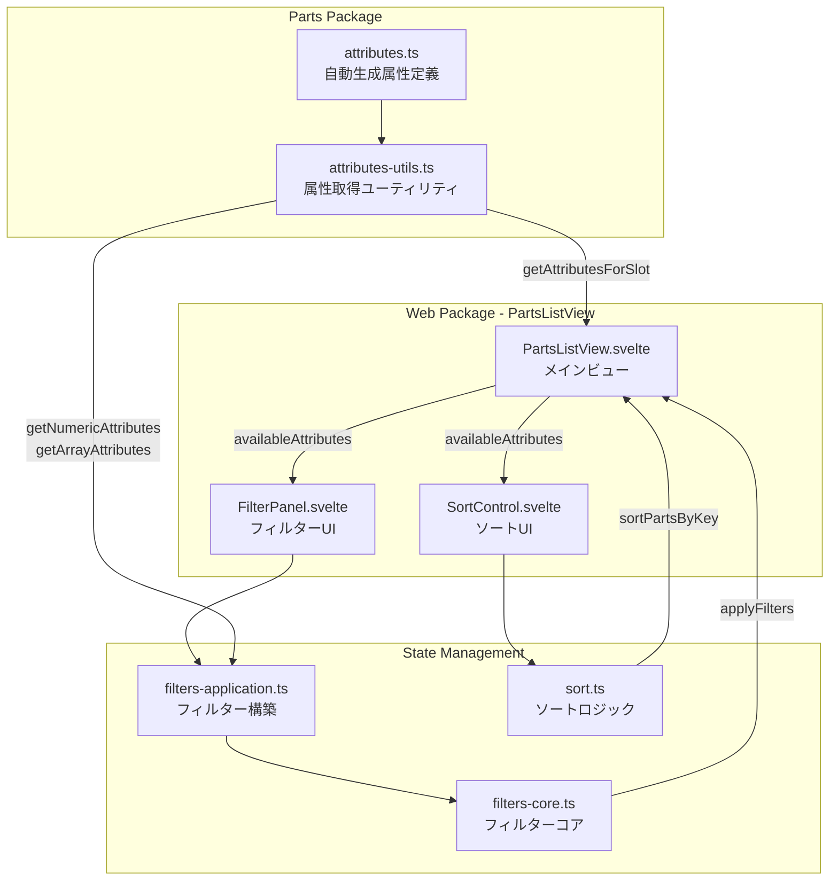
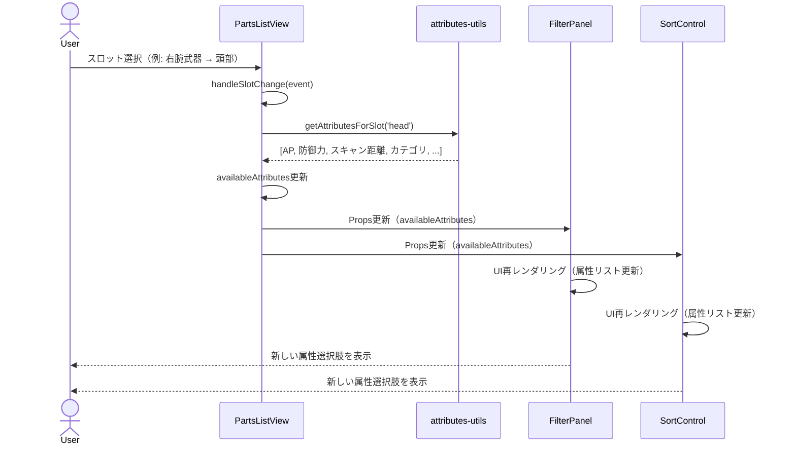
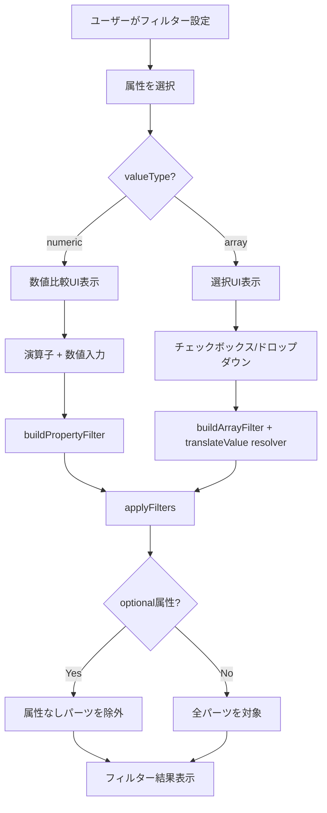
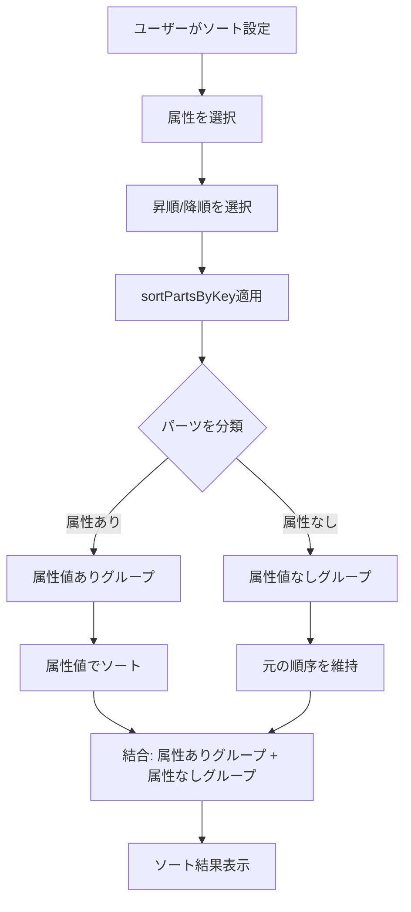
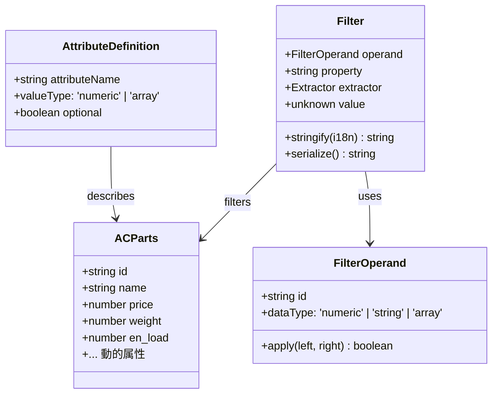
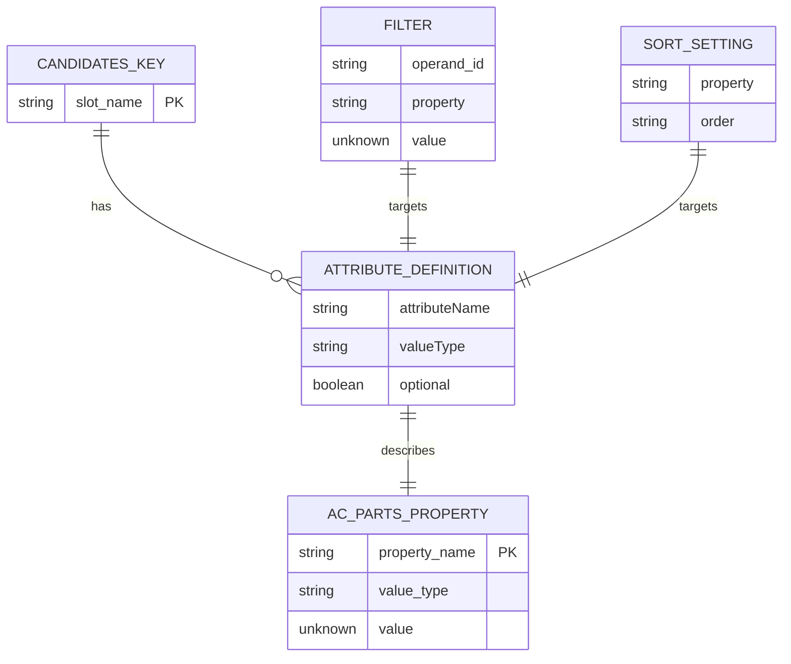
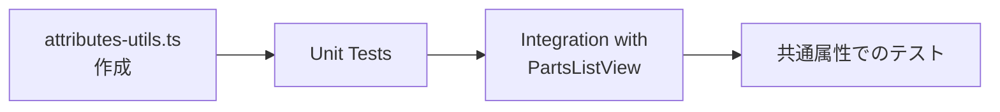
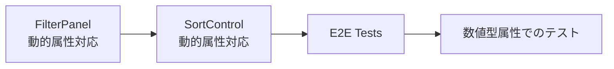
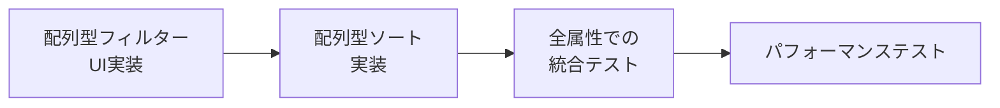
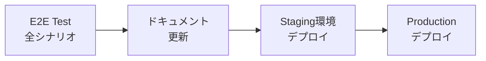

# Technical Design: Filter and Sort by Slot-Specific Attributes

## Overview

このドキュメントでは、パーツリストビューにおけるスロット固有の属性によるフィルター・ソート機能の技術設計を定義します。本機能により、エンドユーザーは共通項目（価格・重量・EN負荷）以外のスロット固有属性（攻撃力、射程、防御力、カテゴリ、製造企業など）を使用して、探索的にパーツを検討・選択できるようになります。

**Purpose**: エンドユーザーに対して、スロット固有の詳細属性を使った探索的なパーツ選択体験を提供し、アセンブリ最適化を効率化します。

**Users**: AC6プレイヤーが、機体構築時にパーツリストビューを使用して、特定の性能要件に基づいて最適なパーツを発見する際に利用します。

**Impact**: 現在のフィルター・ソートシステムは共通属性（price, weight, en_load）のみをサポートしていますが、本機能によりスロット固有の全属性（数値型・配列型）を動的に利用可能にします。`attributes.ts` を単一真実の源（Single Source of Truth）とすることで、パーツデータ変更時の保守性が向上します。

### Goals

- `attributes.ts` を単一真実の源としてスロット固有の属性を動的に取得し、フィルター・ソート対象とする
- `valueType` に基づいて適切なUIを提供（numeric: 数値比較UI、array: 選択UI）
- optional属性を適切に扱う（フィルター: 属性なしパーツを除外、ソート: 属性なしパーツを末尾配置）
- 属性表示順序を `attributes.ts` の定義順通りに維持する
- 既存のフィルター・ソート機能との後方互換性を保持する

### Non-Goals

- 新しい属性の追加やパーツデータの変更（attributes.ts は自動生成ファイル）
- 複数属性による複合ソート機能（例: 攻撃力でソート後、同値の場合は重量でソート）
- パーツ同士の詳細比較機能
- フィルター・ソート条件の保存機能の拡張（既存のURL共有機能で対応）

## Architecture

### Existing Architecture Analysis

本機能は既存のパーツリストビューシステムの拡張です。現在のアーキテクチャ：

**現在の制約**:
- フィルター・ソート対象は `PROPERTY_FILTER_KEYS = ['price', 'weight', 'en_load']` に固定
- `PropertyFilterKey` は型レベルで限定されたユニオン型
- スロット変更時の属性リスト切り替え機能が未実装

**保持すべき既存パターン**:
- Svelte 5 runes ($state, $derived, $effect) によるリアクティブ状態管理
- FilterPanel / SortControl / PartsListView の責務分離
- Filter オブジェクトによるフィルタリングロジックの抽象化
- URL パラメータへの状態シリアライゼーション

**統合ポイント**:
- `PartsListView.svelte`: スロット変更時に利用可能属性を更新
- `FilterPanel.svelte` / `SortControl.svelte`: 動的属性リストを受け取りUIを更新
- `filters-application.ts`: PropertyFilterKey を文字列に変更し、動的属性に対応
- `sort.ts`: 配列型属性のソートロジックを追加

### High-Level Architecture



**Architecture Integration**:
- **既存パターン保持**: Filter オブジェクトの構造、applyFilters/sortPartsByKey の関数シグネチャは維持
- **新規コンポーネント**: `attributes-utils.ts` を parts パッケージに追加（属性メタデータ抽出）
- **Technology Alignment**: Svelte 5、TypeScript、既存の型システムとの整合性を維持
- **Steering Compliance**: 型安全性（Never use `any`）、Parse Don't Validate、レイヤー分離原則を遵守

### Technology Alignment

本機能は既存技術スタックに完全に準拠します：

**Frontend Framework**: Svelte 5 + SvelteKit
- Svelte 5 runes を活用した状態管理（$state, $derived, $effect）
- コンポーネント設計原則の維持

**Type Safety**: TypeScript
- `AttributeDefinition` 型による属性メタデータの型安全性確保
- ジェネリクスを活用した型推論（`FilterOperand<'numeric' | 'array'>`）

**New Utilities Introduced**:
- `packages/parts/src/attributes-utils.ts`: 属性メタデータ取得ユーティリティ
  - Rationale: attributes.ts が自動生成ファイルであり、直接依存するとメンテナンス性が低下するため、抽象化層を提供
  - candidates フィールドにより、配列型属性の選択肢を動的に取得可能（ハードコード不要）
  - literal 型属性を自動的に除外し、フィルター・ソート対象を適切に制限
  - No external dependencies

### Key Design Decisions

#### 1. PropertyFilterKey の文字列型への変更

**Decision**: `PropertyFilterKey` を固定ユニオン型から `string` 型に変更

**Context**: 現在の `PropertyFilterKey` は `'price' | 'weight' | 'en_load'` として固定されており、動的な属性追加に対応できない

**Alternatives**:
1. テンプレートリテラル型でスロットごとにユニオン型を生成
2. ジェネリクス型パラメータで属性を受け取る設計
3. `string` 型に変更し、実行時に検証

**Selected Approach**: `string` 型に変更し、実行時に `attributes.ts` から取得した属性リストで検証

**Rationale**:
- テンプレートリテラル型は attributes.ts の自動生成との相性が悪く、型生成の複雑度が増加
- ジェネリクス型は既存コードの大規模リファクタリングが必要
- `string` 型 + 実行時検証は最小限の変更で動的属性に対応可能

**Trade-offs**:
- 利点: 実装が簡潔、既存コードへの影響が最小
- 欠点: コンパイル時の型安全性が低下（実行時検証でカバー）

#### 2. Array型属性のソート実装

**Decision**: Array型属性（category, manufacture等）を文字列として比較しソート可能にする

**Context**: 要件では `valueType: "array"` の属性もソート対象とし、文字列としてソートする必要がある

**Alternatives**:
1. 配列の最初の要素を取り出して文字列比較
2. 配列全体を JSON.stringify して文字列比較
3. 配列の要素を join して文字列比較

**Selected Approach**: 配列の最初の要素を取り出して文字列比較（存在しない場合は空文字列扱い）

**Rationale**:
- AC6 のパーツデータでは、配列型属性は単一要素または少数要素を持つことが多い
- category や manufacture は通常単一値
- UI上で直感的（表示されている値でソートされる）

**Trade-offs**:
- 利点: シンプル、パフォーマンス良好、UI表示と一貫性
- 欠点: 複数要素を持つ配列の場合、2番目以降の要素は無視される（現実のデータでは稀）

#### 3. Optional属性のフィルター除外戦略

**Decision**: Optional属性でフィルター適用時、その属性を持たないパーツは自動的に除外

**Context**: 一部のパーツのみが持つ任意属性（charge_attack_power等）でフィルタリングする際の挙動を定義

**Alternatives**:
1. 属性なしパーツも表示し、フィルター条件を「値が存在しない」として扱う
2. 属性なしパーツを除外（選択したアプローチ）
3. UI上で「属性なしを含む」チェックボックスを提供

**Selected Approach**: 属性なしパーツを自動的に除外

**Rationale**:
- ユーザーが特定の属性でフィルターをかける意図は、その属性を持つパーツを探すこと
- 「チャージ攻撃力 >= 1000」を設定した場合、チャージ機能がないパーツは除外されるべき
- 既存の filters-core.ts のロジックで自然に実現可能（属性なし = undefined → 条件不一致）

**Trade-offs**:
- 利点: 直感的、実装がシンプル、パフォーマンス良好
- 欠点: 属性なしパーツを意図的に表示したい場合は別のフィルターが必要（現在の要件では対象外）

#### 4. Candidates フィールドによる選択肢の動的生成

**Decision**: 配列型属性のフィルターUIで、`AttributeDefinition.candidates` から選択肢を動的に生成

**Context**: 従来は製造企業やカテゴリの選択肢をコード内にハードコードしていたが、パーツデータ追加時に選択肢の更新漏れが発生するリスクがあった

**Alternatives**:
1. 選択肢をコード内にハードコード（従来方式）
2. パーツデータから実行時に選択肢を抽出（extractManufacturers, extractCategories）
3. attributes.ts の candidates フィールドを使用（選択したアプローチ）

**Selected Approach**: attributes.ts の candidates フィールドを単一真実の源として使用し、UI選択肢を動的生成

**Rationale**:
- attributes.ts は自動生成ファイルであり、パーツデータと常に同期している
- 実行時抽出（Alternative 2）と比較して、パフォーマンスが向上（事前計算済み）
- ハードコード（Alternative 1）と比較して、保守性が大幅に向上（更新漏れゼロ）
- 存在しない値（廃止されたカテゴリなど）を選択肢から自動的に除外可能

**Trade-offs**:
- 利点: 保守性向上、パフォーマンス良好、データ整合性保証
- 欠点: attributes.ts の生成ロジックに依存（ただし、既に自動生成インフラが確立済み）

## System Flows

### User Interaction Flow: Slot Change and Attribute Update



### Filter Application Flow: Numeric vs Array Attributes



### Sort Application Flow: Handling Optional Attributes



## Requirements Traceability

| Requirement | Summary | Components | Interfaces | Flows |
|-------------|---------|------------|------------|-------|
| 1.1, 1.2 | スロット固有属性の提供 | attributes-utils, PartsListView | getAttributesForSlot() | User Interaction Flow |
| 1.3 | 属性表示順序の維持 | attributes-utils | getAttributesForSlot() | - |
| 2.1, 2.2 | 数値属性フィルター | FilterPanel, filters-application | buildPropertyFilter() | Filter Application Flow |
| 2.3 | 配列属性フィルター | FilterPanel, filters-application | buildArrayFilter(), resolveSelectionValueTranslator() | Filter Application Flow |
| 2.4 | 複数フィルター適用 | filters-core | applyFilters() | Filter Application Flow |
| 2.6 | スロット変更時のフィルタークリア | PartsListView | handleSlotChange() | User Interaction Flow |
| 3.1, 3.2, 3.3 | ソート機能 | SortControl, sort | sortPartsByKey() | Sort Application Flow |
| 3.5, 3.6 | スロット変更時のソート切り替え | PartsListView | handleSlotChange() | User Interaction Flow |
| 4.1, 4.2 | 任意属性フィルタリング | filters-core | applyFilters() | Filter Application Flow |
| 5.1, 5.2, 5.3 | 任意属性ソート | sort | sortPartsByKey() | Sort Application Flow |
| 6.1, 6.2 | 属性翻訳 | filters-application | translateProperty() | - |
| 7.1, 7.2 | レスポンス性能 | 全コンポーネント | Svelte runes | - |

## Components and Interfaces

### Parts Package Layer

#### attributes-utils (New Component)

**Responsibility & Boundaries**
- **Primary Responsibility**: `attributes.ts` から属性メタデータを抽出し、型安全に提供する
- **Domain Boundary**: Parts パッケージのユーティリティ層
- **Data Ownership**: 属性定義データの読み取り専用アクセス
- **Transaction Boundary**: なし（純粋関数のみ）

**Dependencies**
- **Inbound**: web パッケージの PartsListView, filters-application
- **Outbound**: attributes.ts（自動生成ファイル）
- **External**: なし

**Contract Definition**

```typescript
export interface AttributeDefinition {
  readonly attributeName: string
  readonly valueType: 'numeric' | 'array' | 'literal'
  readonly candidates: readonly string[]
  readonly optional: boolean
}

interface AttributesUtilsService {
  /**
   * 指定スロットの全属性定義を取得
   * @param slot - 対象スロット（例: 'rightArmUnit', 'head'）
   * @returns 属性定義の配列（attributes.ts の定義順）
   */
  getAttributesForSlot(slot: CandidatesKey): readonly AttributeDefinition[]

  /**
   * 指定スロットの数値型属性名を取得
   * @param slot - 対象スロット
   * @returns 数値型属性名の配列（valueType が 'numeric' の属性のみ）
   * @note literal 型属性は除外される
   */
  getNumericAttributes(slot: CandidatesKey): readonly string[]

  /**
   * 指定スロットの配列型属性名を取得
   * @param slot - 対象スロット
   * @returns 配列型属性名の配列（valueType が 'array' の属性のみ）
   * @note literal 型属性は除外される
   */
  getArrayAttributes(slot: CandidatesKey): readonly string[]

  /**
   * 指定属性がオプショナルかチェック
   * @param slot - 対象スロット
   * @param attributeName - 属性名
   * @returns オプショナルの場合 true
   */
  isAttributeOptional(slot: CandidatesKey, attributeName: string): boolean
}
```

**Preconditions**:
- `slot` は有効な CandidatesKey であること
- attributes.ts が正しく生成されていること

**Postconditions**:
- 返される配列は attributes.ts の定義順を維持
- 返される属性名は ACParts 型のプロパティキーとして有効

**Invariants**:
- 同じスロット・同じ属性名に対して常に同じ結果を返す（純粋関数）
- 空配列を返すことはない（最低でも共通属性が存在）

### Web Package - View Layer

#### PartsListView (Modified Component)

**Responsibility & Boundaries**
- **Primary Responsibility**: パーツリスト全体の状態管理とサブコンポーネントの統合
- **Domain Boundary**: Parts List View の最上位コンポーネント
- **Data Ownership**: currentSlot, filters, sortKey, sortOrder の状態
- **Transaction Boundary**: なし（クライアントサイド状態のみ）

**Dependencies**
- **Inbound**: SvelteKit routes
- **Outbound**: FilterPanel, SortControl, PartsGrid, attributes-utils
- **External**: なし

**Modification Strategy**: 既存コードを拡張
- 新規追加: `availableAttributes` の derived state
- 変更: FilterPanel, SortControl への Props 追加
- 保持: 既存のフィルター・ソート状態管理ロジック

**Contract Definition**

```typescript
interface PartsListViewState {
  // 既存状態
  currentSlot: CandidatesKey
  filters: Filter[]
  sortKey: SortKey | null
  sortOrder: SortOrder | null

  // 新規追加
  availableAttributes: readonly AttributeDefinition[]
}

// Derived state（$derived.by で自動計算）
const availableAttributes = $derived.by<readonly AttributeDefinition[]>(() => {
  return getAttributesForSlot(currentSlot)
})
```

**Integration Strategy**:
- **Modification Approach**: 既存コンポーネントを拡張（新規 derived state 追加）
- **Backward Compatibility**: 既存の URL パラメータシリアライゼーションを維持
- **Migration Path**: 段階的リリース可能（新属性は追加機能として扱う）

#### FilterPanel (Modified Component)

**Responsibility & Boundaries**
- **Primary Responsibility**: フィルター条件の設定UIを提供し、ユーザー入力を Filter オブジェクトに変換
- **Domain Boundary**: フィルターUI層
- **Data Ownership**: フィルター入力状態（選択された属性、演算子、値）
- **Transaction Boundary**: なし

**Dependencies**
- **Inbound**: PartsListView
- **Outbound**: filters-application, filters-core
- **External**: なし

**Modification Strategy**: 既存UIを拡張
- 新規追加: `availableAttributes` Props、valueType に基づくUI分岐
- 変更: 属性選択ドロップダウンを動的リストに変更
- 保持: 既存のフィルター構築ロジック（buildPropertyFilter 等）

**Contract Definition**

```typescript
interface FilterPanelProps {
  slot: CandidatesKey
  filters: Filter[]
  availableAttributes: readonly AttributeDefinition[] // 新規追加
  showFavoritesOnly: boolean
  onclearfilters: () => void
  onfilterchange: (filters: Filter[]) => void
  ontogglefavorites: () => void
}
```

**UI Contract**:
| Attribute valueType | UI Component | Input Method | Data Source |
|---------------------|--------------|--------------|-------------|
| numeric | Operator dropdown + Number input | 演算子選択（>=, <=, ==, !=, >, <） + 数値入力フィールド | - |
| array | Checkbox group or Dropdown | 選択肢から複数選択可能（カテゴリ、製造企業など） | AttributeDefinition.candidates から選択肢を動的生成 |
| literal | （対象外） | フィルター不可 | - |

#### SortControl (Modified Component)

**Responsibility & Boundaries**
- **Primary Responsibility**: ソート条件の設定UIを提供し、ユーザー入力をソートパラメータに変換
- **Domain Boundary**: ソートUI層
- **Data Ownership**: ソート入力状態（選択された属性、順序）
- **Transaction Boundary**: なし

**Dependencies**
- **Inbound**: PartsListView
- **Outbound**: sort, filters-application
- **External**: なし

**Modification Strategy**: 既存UIを拡張
- 新規追加: `availableAttributes` Props
- 変更: 属性選択ドロップダウンを動的リストに変更、配列型属性のソートサポート
- 保持: 既存の昇順・降順選択UI

**Contract Definition**

```typescript
interface SortControlProps {
  slot: CandidatesKey
  availableAttributes: readonly AttributeDefinition[] // 新規追加（properties を置き換え）
  sortKey: SortKey | null
  sortOrder: SortOrder | null
  onsortchange?: (payload: { key: SortKey; order: SortOrder }) => void
  onsortclear?: () => void
}
```

### Web Package - State Layer

#### filters-application (Modified Module)

**Responsibility & Boundaries**
- **Primary Responsibility**: アプリケーション固有のフィルター構築ロジックと翻訳機能
- **Domain Boundary**: フィルターアプリケーション層
- **Data Ownership**: なし（ステートレス関数群）
- **Transaction Boundary**: なし

**Dependencies**
- **Inbound**: FilterPanel
- **Outbound**: filters-core, i18n, attributes-utils
- **External**: なし

**Modification Strategy**: 型定義と関数シグネチャを拡張
- 変更: `PropertyFilterKey` を string 型に変更
- 新規追加: 汎用 `buildArrayFilter` と `resolveSelectionValueTranslator`
- 保持: 既存のフィルター構築ロジック

**Contract Definition**

```typescript
// 型定義の変更
export type PropertyFilterKey = string // 従来: 'price' | 'weight' | 'en_load'

interface FiltersApplicationService {
  // 既存関数（シグネチャ維持）
  buildPropertyFilter(
    property: PropertyFilterKey,
    operand: FilterOperand<'numeric'>,
    value: number
  ): Filter

  buildNameFilter(
    operand: FilterOperand<'string'>,
    value: string
  ): Filter

  // 汎用配列型フィルター構築
  buildArrayFilter(
    property: PropertyFilterKey,
    operand: FilterOperand<'array'>,
    value: readonly string[],
    options?: {
      displayName?: string
      translateValue?: (value: string, i18n: I18Next) => string
    }
  ): Filter

  resolveSelectionValueTranslator(
    property: PropertyFilterKey
  ): ((value: string, i18n: I18Next) => string) | undefined

  // 翻訳関数
  translateProperty(property: PropertyFilterKey, i18n: I18Next): string
  translateManufacturer(manufacturer: string, i18n: I18Next): string
  translateCategory(category: string, i18n: I18Next): string
  translateOperand(operand: FilterOperand, i18n: I18Next): string
}
```

**State Management**: ステートレス（全て純粋関数）

#### sort (Modified Module)

**Responsibility & Boundaries**
- **Primary Responsibility**: パーツリストのソートロジック
- **Domain Boundary**: ソート処理層
- **Data Ownership**: なし（ステートレス関数群）
- **Transaction Boundary**: なし

**Dependencies**
- **Inbound**: PartsListView
- **Outbound**: attributes-utils（`attributes.ts` から取得したメタデータを参照）
- **External**: なし

**Modification Strategy**: ソートロジックを拡張
- 変更: `SortKey` を string 型に変更、配列型属性のソート処理を追加
- 保持: 既存の sortPartsByKey の optional属性処理（属性なしパーツを末尾配置）

**Contract Definition**

```typescript
export type SortKey = string // 従来: PropertyFilterKey
export type SortOrder = 'asc' | 'desc'

interface SortService {
  /**
   * 指定キーと順序でパーツをソート
   * @param parts - ソート対象パーツ配列
   * @param key - ソートキー（属性名）
   * @param order - ソート順序（昇順/降順）
   * @returns ソート済みパーツ配列
   */
  sortPartsByKey(
    parts: readonly ACParts[],
    key: SortKey,
    order: SortOrder
  ): ACParts[]

  /**
   * スロットで利用可能なソートキーを取得
   * @param slot - 対象スロット
   * @returns 利用可能なソートキー配列（attributes.ts の定義順）
   */
  getAvailableSortKeys(slot: CandidatesKey): SortKey[]

  /**
   * ソートパラメータをパース
   * @param sortParam - ソートパラメータ文字列（例: "price:asc"）
   * @returns パース結果（失敗時はnull）
   */
  parseSort(sortParam: string): { key: SortKey; order: SortOrder } | null
}
```

`getAvailableSortKeys` は `attributes-utils` を通じて `attributes.ts` のメタデータを参照し、スロットごとの数値・配列属性を定義順で返す。実際のパーツデータを走査して候補を導出する実装は禁止し、単一真実の源を維持する。

**Preconditions**:
- `parts` 配列が空でないこと
- `key` が ACParts のプロパティとして存在すること

**Postconditions**:
- 属性値を持つパーツが先頭、持たないパーツが末尾
- 同じ属性値を持つパーツは元の順序を維持（安定ソート）

**Invariants**:
- 入力配列を変更しない（イミュータブル）
- 同じ入力に対して常に同じ結果を返す（純粋関数）

## Data Models

### Domain Model

**Core Concepts**:

**AttributeDefinition (Value Object)**:
属性メタデータを表すイミュータブルなValue Object
- `attributeName`: 属性名（ACParts のプロパティキー）
- `valueType`: データ型（'numeric' | 'array' | 'literal'）
  - `'numeric'`: 数値型属性（フィルター・ソート対象）
  - `'array'`: 配列型属性（フィルター・ソート対象）
  - `'literal'`: リテラル型属性（フィルター・ソート対象外、単一固定値）
- `candidates`: 配列型属性の選択肢リスト（valueType が 'array' の場合のみ有効、それ以外は空配列）
- `optional`: オプショナルフラグ（true: 一部パーツのみ持つ）

**Filter (Entity)**:
フィルター条件を表すEntity（既存、変更なし）
- `operand`: フィルター演算子
- `property`: 対象属性名
- `extractor`: 値抽出関数
- `value`: フィルター値
- `stringify()`: 人間可読文字列化
- `serialize()`: URLパラメータ化

**Business Rules & Invariants**:
1. **Attribute Definition Order**: `attributes.ts` の定義順を維持する
2. **Optional Attribute Filtering**: optional: true の属性でフィルター時、属性なしパーツは除外
3. **Optional Attribute Sorting**: optional: true の属性でソート時、属性なしパーツは末尾配置
4. **Value Type Consistency**: valueType と Filter operand の dataType は一致する必要がある



### Logical Data Model

**Entity Relationships**:



**Consistency & Integrity**:
- **Transaction Boundaries**: クライアントサイドのみ（サーバー側トランザクションなし）
- **Referential Integrity**: AttributeDefinition.attributeName は ACParts のプロパティキーと一致
- **Temporal Aspects**: なし（バージョン管理・監査不要）

## Error Handling

### Error Strategy

本機能は主にクライアントサイドの状態管理とUI更新であり、エラー発生時は可能な限りユーザーに継続的な体験を提供します。エラーは以下のカテゴリに分類し、それぞれ適切に処理します。

### Error Categories and Responses

**User Errors (入力エラー)**:
- **Invalid Filter Value** (数値フィルターに文字列入力): フィールドレベルバリデーションでリアルタイムフィードバック、適用ボタンを無効化
- **Empty Filter Value** (必須入力が空): UI上でエラーメッセージ表示、適用ボタンを無効化
- **Attribute Not Found** (存在しない属性名): 選択肢から選択するUIのため発生しない（防御的プログラミングで対応）

**System Errors (システムエラー)**:
- **Attributes.ts Parse Error** (属性定義の読み込み失敗): フォールバック値（共通属性のみ）を使用し、エラーログ出力
- **Filter Application Error** (フィルター適用時の例外): フィルターをスキップし、全パーツ表示、コンソールエラー出力
- **Sort Application Error** (ソート適用時の例外): ソートをスキップし、元の順序で表示、コンソールエラー出力

**Business Logic Errors (ビジネスロジックエラー)**:
- **Incompatible Filter Type** (valueType と operand の不一致): UI設計により発生を防止、実行時チェックで例外スロー
- **Invalid Slot Key** (存在しないスロット): TypeScript型チェックで防止、実行時チェックでフォールバック

**Error Handling Implementation**:

```typescript
// attributes-utils.ts
export function getAttributesForSlot(slot: CandidatesKey): readonly AttributeDefinition[] {
  try {
    const attributes = SLOT_ATTRIBUTE_MAP[slot]
    if (!attributes) {
      logger.warn(`No attributes found for slot: ${slot}. Using fallback.`)
      return FALLBACK_ATTRIBUTES // [price, weight, en_load]
    }
    return attributes
  } catch (error) {
    logger.error(`Failed to get attributes for slot: ${slot}`, { error })
    return FALLBACK_ATTRIBUTES
  }
}

// PartsListView.svelte
const filteredParts = $derived.by<readonly ACParts[]>(() => {
  const slotParts: readonly ACParts[] = regulation.candidates[currentSlot]

  try {
    let filtered = applyFilters(slotParts, filters)
    // ... お気に入りフィルター、ソート適用
    return filtered
  } catch (error) {
    logger.error('Failed to apply filters or sort', { error })
    return slotParts // フィルター失敗時は全パーツを表示
  }
})
```

### Monitoring

**Error Tracking**:
- **Structured Logging**: `@ac6_assemble_tool/shared/logger` を使用し、エラー情報を構造化ログとして出力
- **Log Levels**: ERROR（システムエラー）、WARN（フォールバック発生）、DEBUG（開発時デバッグ）

**Health Monitoring**:
- クライアントサイドアプリケーションのため、サーバー側ヘルスチェックは不要
- ブラウザコンソールでのエラー監視（開発者ツール）

**Metrics** (将来拡張):
- フィルター適用回数、ソート適用回数
- エラー発生率（属性取得失敗、フィルター適用失敗）

## Testing Strategy

### Unit Tests

**attributes-utils.ts**:
1. `getAttributesForSlot()` - 各スロットタイプで正しい属性リストを返すことを検証
2. `getNumericAttributes()` - 数値型属性のみを抽出することを検証
3. `getArrayAttributes()` - 配列型属性のみを抽出することを検証
4. `isAttributeOptional()` - optional フラグの判定が正しいことを検証
5. Error handling - 存在しないスロットキーでフォールバックすることを検証

**filters-application.ts**:
1. `buildArrayFilter()` - 配列型フィルターの構築が正しいことを検証
2. `translateProperty()` - 動的属性名の翻訳（フォールバック含む）を検証
3. PropertyFilterKey string 型への変更に伴う型安全性テスト

**sort.ts**:
1. `sortPartsByKey()` - 配列型属性の文字列ソートを検証
2. Optional属性ソート - 属性なしパーツが末尾に配置されることを検証
3. Stable sort - 同値パーツの順序が維持されることを検証

### Integration Tests

**PartsListView + FilterPanel + filters-application**:
1. スロット変更時に利用可能属性が更新され、FilterPanel に反映されることを検証
2. 数値型属性でフィルター適用時、正しくパーツが絞り込まれることを検証
3. 配列型属性（category, manufacture）でフィルター適用時、正しくパーツが絞り込まれることを検証
4. Optional属性でフィルター適用時、属性なしパーツが除外されることを検証
5. 複数フィルター適用時、AND条件で絞り込まれることを検証

**PartsListView + SortControl + sort**:
1. スロット変更時に利用可能属性が更新され、SortControl に反映されることを検証
2. 数値型属性でソート適用時、正しくパーツがソートされることを検証
3. 配列型属性でソート適用時、文字列としてソートされることを検証
4. Optional属性でソート適用時、属性なしパーツが末尾に配置されることを検証
5. スロット変更時に不正なソートキーがクリアされることを検証

### E2E/UI Tests

**探索的フィルタリングシナリオ**:
1. 右腕武器スロットで「攻撃力 >= 1000」フィルターを適用し、結果が正しいことを確認
2. 頭部スロットで「カテゴリ = 重量型」フィルターを適用し、結果が正しいことを確認
3. スロット変更時にフィルターがクリアされることを確認
4. フィルター適用後に該当件数が表示されることを確認

**多様な観点でのソートシナリオ**:
1. 右腕武器スロットで「攻撃力」降順ソートを適用し、結果が正しいことを確認
2. 頭部スロットで「製造企業」昇順ソートを適用し、文字列ソートされることを確認
3. スロット変更時に無効なソートがクリアされることを確認

### Performance Tests

**属性取得パフォーマンス**:
1. `getAttributesForSlot()` が 10ms 以内に完了することを検証
2. 全スロットタイプでの属性取得が 100ms 以内に完了することを検証

**フィルター・ソート適用パフォーマンス**:
1. 100件のパーツに対するフィルター適用が 50ms 以内に完了することを検証
2. 100件のパーツに対するソート適用が 50ms 以内に完了することを検証
3. フィルター+ソート同時適用が 100ms 以内に完了することを検証（Requirement 7.1, 7.2）

## Security Considerations

**Input Validation**:
- **Filter Values**: 数値フィルターの入力値を Number.isFinite() で検証し、NaN や Infinity を拒否
- **Attribute Names**: ドロップダウンからの選択のため、インジェクション攻撃のリスクは低いが、実行時に ACParts のプロパティキーとして存在することを確認
- **URL Parameters**: シリアライズ・デシリアライズ時に不正な値を検証し、パースエラー時はデフォルト値を使用

**XSS Prevention**:
- Svelte の自動エスケープ機能により、ユーザー入力がHTMLとしてレンダリングされることを防止
- 属性名・フィルター値の表示時も自動エスケープが適用される

**Data Protection**:
- 本機能は公開ゲームデータ（パーツ性能）のみを扱い、個人情報や機密情報は含まない
- クライアントサイドのみで完結し、サーバー送信は発生しない

**Authentication & Authorization**:
- 認証・認可は不要（パブリックアクセス可能なツール）

## Performance & Scalability

### Target Metrics

- **Slot Change Response**: スロット変更から属性リスト更新まで 100ms 以内（Requirement 7.1）
- **Filter Application**: フィルター適用から結果表示まで 50ms 以内（100件パーツ）
- **Sort Application**: ソート適用から結果表示まで 50ms 以内（100件パーツ）
- **UI Responsiveness**: フィルター・ソート処理中もUIが応答可能（Requirement 7.2）

### Measurement Strategies

- **Performance API**: `performance.mark()` / `performance.measure()` を使用して処理時間を測定
- **Development Monitoring**: 開発時にコンソールログで処理時間を出力
- **User Perceived Performance**: Svelte の $derived による自動最適化で、不要な再計算を削減

### Scaling Approaches

**Horizontal Scaling**:
- クライアントサイドアプリケーションのため、ユーザー数増加によるスケーリングは不要
- 静的サイト生成により、CDN（Cloudflare Pages）で配信

**Vertical Scaling**:
- 不要（クライアント端末のリソースを使用）

### Caching Strategies

**Attribute Definitions Caching**:
- `getAttributesForSlot()` の結果をメモ化（同じスロットへの繰り返しアクセスを高速化）
- 実装例: `Map<CandidatesKey, AttributeDefinition[]>` でキャッシュ

**Parts List Caching**:
- `regulation.candidates[slot]` はビルド時に静的データとして含まれ、キャッシュ不要
- ブラウザの JavaScript ヒープに自動キャッシュ

**UI State Caching**:
- Svelte の $derived による自動メモ化で、依存する状態が変更されない限り再計算されない

### Optimization Techniques

**Lazy Evaluation**:
- `$derived.by()` を活用し、必要な時のみ計算を実行
- フィルター・ソート結果は依存する状態（filters, sortKey, sortOrder）が変更された時のみ再計算

**Immutable Data Structures**:
- フィルター・ソート処理は元の配列を変更せず、新しい配列を返す
- Svelte の変更検知の効率化

**Tree Shaking**:
- 未使用の属性定義やフィルター関数は Vite のビルドプロセスで除去

## Migration Strategy

本機能は既存システムの拡張であり、段階的なリリースが可能です。

### Phase 1: 基盤整備（Week 1）



- `attributes-utils.ts` の実装とテスト
- PartsListView への統合（共通属性のみで動作確認）
- 既存フィルター・ソート機能との互換性確認

### Phase 2: UI拡張（Week 2）



- FilterPanel, SortControl の動的属性対応
- 数値型属性のフィルター・ソート機能テスト
- UI/UX の検証

### Phase 3: 配列型属性サポート（Week 3）



- 配列型属性のフィルター・ソート実装
- 全スロット・全属性での統合テスト
- パフォーマンス測定と最適化

### Phase 4: リリース準備（Week 4）



- E2Eテスト全シナリオ実行
- ユーザー向けドキュメント更新
- Staging 環境での最終確認
- Production デプロイ

### Rollback Triggers

- **Critical Bug**: フィルター・ソート機能が完全に動作しない
- **Performance Degradation**: ページロード時間が2倍以上に増加
- **Data Loss**: URL共有機能が破損し、状態が復元できない

### Validation Checkpoints

- **Phase 1 完了**: 共通属性での動作確認、既存機能の回帰テスト合格
- **Phase 2 完了**: 数値型属性でのE2Eテスト合格、パフォーマンス目標達成
- **Phase 3 完了**: 全属性での統合テスト合格、ブラウザ互換性確認
- **Phase 4 完了**: Staging 環境で全機能正常動作、ドキュメント完成

---

## Appendix

### References

- [Requirements Document](./requirements.md)
- [AGENTS.md](/workspaces/ac6_assemble_tool/AGENTS.md) - 開発指針
- [Structure.md](/workspaces/ac6_assemble_tool/docs/steering/structure.md) - プロジェクト構造
- [Tech.md](/workspaces/ac6_assemble_tool/docs/steering/tech.md) - 技術スタック

### Glossary

- **Slot (スロット)**: パーツの装着位置（右腕武器、頭部、脚部など）
- **Attribute (属性)**: パーツの性能値やメタデータ（攻撃力、重量、カテゴリなど）
- **Optional Attribute (任意属性)**: 一部のパーツのみが持つ属性（optional: true）
- **Value Type**: 属性のデータ型（numeric: 数値型、array: 配列型）
- **Filter (フィルター)**: パーツを条件で絞り込む機能
- **Sort (ソート)**: パーツを特定の順序で並べ替える機能
- **Single Source of Truth (単一真実の源)**: データの権威ある唯一の情報源（本機能では attributes.ts）
