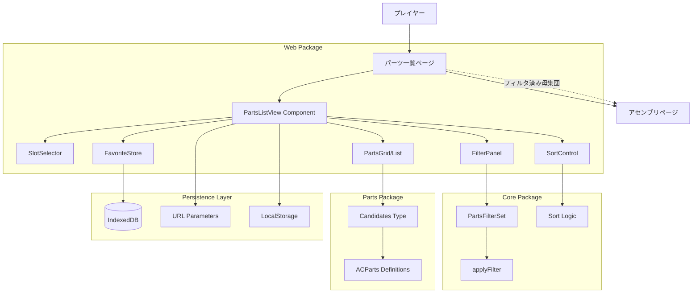
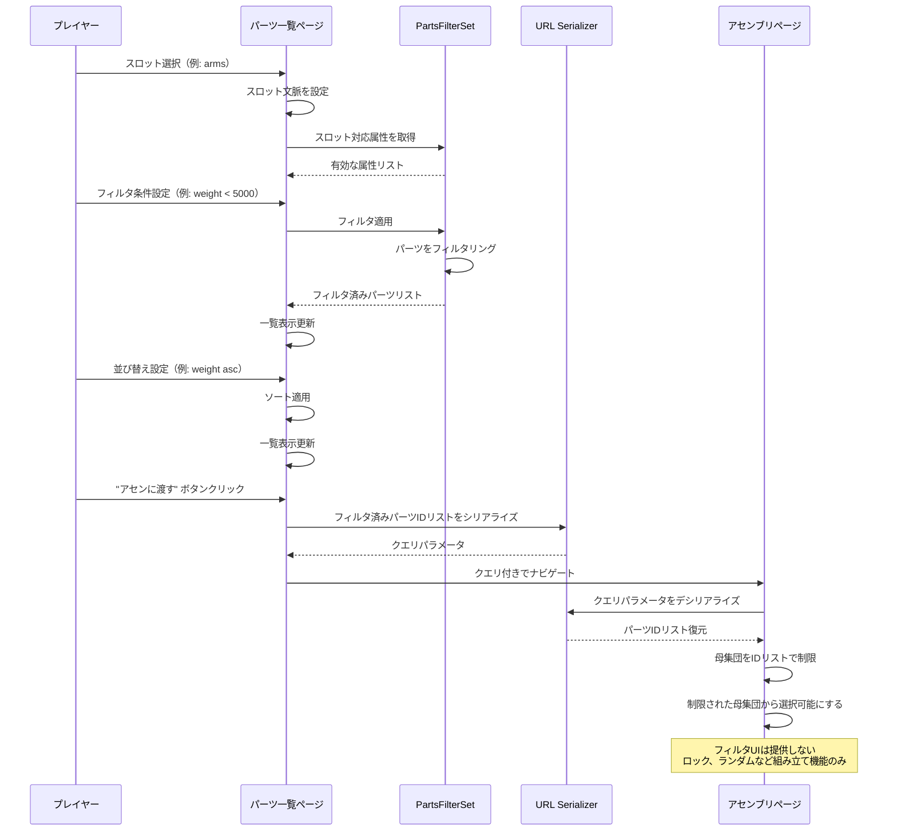
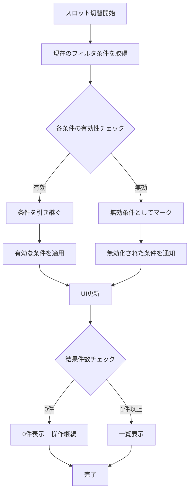
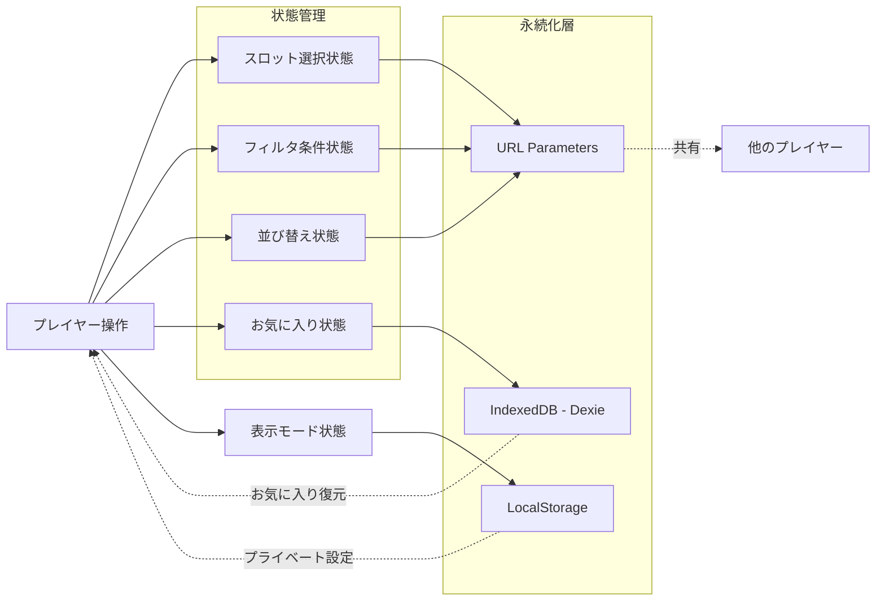
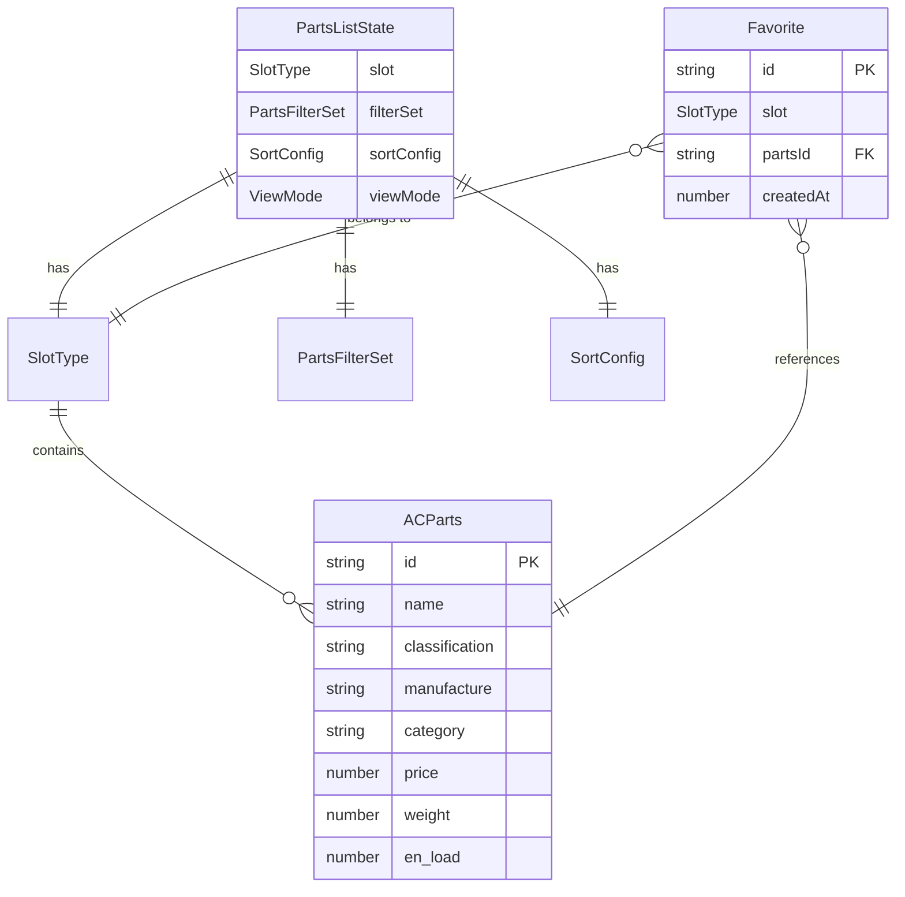
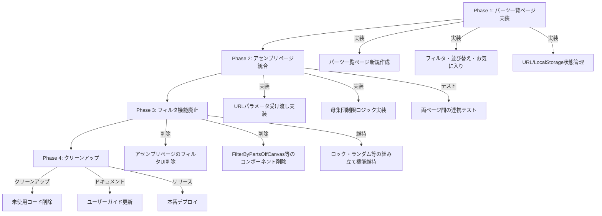

# 技術設計書: パーツ一覧ページ

## Overview

パーツ一覧ページは、AC6 Assemble Toolにおける新しい探索的UI機能であり、スロット先行のアプローチによってパーツの一覧表示・フィルタリング・並び替えを実現します。本機能は既存のアセンブリページを補完し、プレイヤーが効率的にパーツを探索した後、絞り込まれた母集団でビルドを組み立てられるようにします。

**Purpose**: 原作ゲームでは不可能だった「条件による探索」を実現し、プレイヤーがスロット文脈に基づいて効率的に候補パーツを発見できるようにする。

**Users**: AC6プレイヤー全般（初心者から熟練者まで）が、機体構築前の探索段階や攻略前後の差し替え検討時に利用する。コミュニティメンバーが条件や候補集合を共有して議論する際にも使用される。

**Architecture Context**: 本アプリケーションは**SSG（Static Site Generation）**で実装されており、サーバーサイド処理は存在しない。すべての処理はクライアントサイド（ブラウザ）で完結する。

**Impact**:

- 既存のアセンブリページ（`/packages/web/src/routes/+page.svelte`）から**フィルタリング機能を廃止**し、新しいパーツ一覧ページ（`/packages/web/src/routes/parts-list/+page.svelte`）が追加される
- **役割分担の明確化**:
  - **パーツ一覧ページ**: パーツの探索（フィルタリング、並び替え、お気に入り）に専念
  - **アセンブリページ**: 機体の組み立て（ロック、ランダム、計算結果表示）に専念
- アセンブリページへのパーツ選択フローが「一覧ページで絞り込み → アセンに遷移 → 母集団から選択」に変更される
- 既存のフィルタリングロジック（`@ac6_assemble_tool/core/assembly/filter`）はパーツ一覧ページでのみ使用され、アセンブリページでは使用されなくなる

### Goals

- スロット選択による文脈確立と、選択中スロットのパーツのみの一覧表示
- 任意属性によるフィルタリングと並び替えの実現
- フィルタ済み母集団のアセンブリページへの受け渡し
- 探索状態のURL/ローカルストレージによる保存・共有
- 0件時でも操作継続可能な探索体験の提供

### Non-Goals

- 結果スナップショットのURL共有（条件のみを共有、結果は含めない）
- 条件緩和の自動提案機能（将来拡張として残す）
- アセンブリページでのフィルタリング機能の提供（パーツ一覧ページで完結）
- 既存のフィルタリングロジックの書き換え（再利用を優先）
- アセンブリページの「組み立て」機能（ロック、ランダムなど）への影響

## Architecture

### Existing Architecture Analysis

**現在のアーキテクチャパターン**:

- **SSG（Static Site Generation）**: SvelteKit の Static Adapter によるビルド時静的生成、サーバーサイド処理なし
- **クライアントサイド完結**: すべての処理（フィルタリング、並び替え、計算）はブラウザで実行
- **モノレポ構成**: pnpm workspaces + Turboによるパッケージ管理
- **レイヤーアーキテクチャ**: entrypoint (routes) → application (lib/view) → domain (core) → infrastructure (store)
- **型安全性**: TypeScript + Zod による Parse Don't Validate パターン
- **状態管理**: Svelte 5 stores + URL serialization + IndexedDB (Dexie)
- **データ配信**: パーツデータは静的JSONファイルとして配信され、ビルド時にバンドル

**既存のドメイン境界**:

- `@ac6_assemble_tool/core`: ビジネスロジック（アセンブリ計算、フィルタ、シリアライズ）
- `@ac6_assemble_tool/parts`: パーツデータとタイプ定義
- `@ac6_assemble_tool/web`: フロントエンド（SvelteKit）
- `@ac6_assemble_tool/shared`: 共通ユーティリティ

**保持すべき統合ポイント**:

- フィルタリングロジック: `PartsFilterSet` クラスと `applyFilter()` メソッドを再利用
- パーツデータ構造: `Candidates` 型（スロットごとのパーツ配列）を踏襲
- URL シリアライゼーション: `as-query-v2.ts` のパターンを拡張
- IndexedDB: Dexie による永続化パターンを継承

**アセンブリページへの影響**:

- **フィルタリング機能の廃止**: 既存の `FilterByPartsOffCanvas.svelte` などフィルタ関連UIは削除またはパーツ一覧ページに移行
- **母集団の受け渡し**: URLパラメータでフィルタ済み母集団を受け取り、その範囲でのみパーツ選択を許可
- **組み立て機能の継続**: ロック、ランダム、計算結果表示など「組み立て」に関する機能はそのまま維持
- **シンプル化**: フィルタUIの削除により、アセンブリページの責務が明確化され、UIがシンプルになる

**技術的負債への対応**:

- 既存のフィルタUIコンポーネントはアセンブリページから削除され、パーツ一覧ページで新規実装される
- お気に入り機能は新規実装だが、既存のIndexedDB（Dexie）インフラを活用する

### High-Level Architecture



**アーキテクチャ統合**:

- **保持される既存パターン**:
  - SvelteKit のファイルベースルーティング
  - Svelte 5 の runes システム（`$state`, `$derived`, `$effect`）
  - イベントディスパッチャーによるコンポーネント間通信
  - Bootstrap 5 + Sveltestrap によるレスポンシブデザイン

- **新規コンポーネントの根拠**:
  - `PartsListView`: スロット文脈の管理と一覧表示の責務を持つメインコンポーネント
  - `SlotSelector`: スロット選択UIの独立コンポーネント（再利用性向上）
  - `FilterPanel`: パーツ一覧専用のフィルタUI（アセンブリページのフィルタUIとは別）
  - `PartsGrid/List`: カード/リスト表示モードの切り替え可能なコンポーネント
  - `FavoriteStore`: お気に入り管理の状態とロジックを集約

- **技術スタック整合性**:
  - Svelte 5 + TypeScript（既存と同じ）
  - Sveltestrap（既存UIライブラリを継続使用）
  - i18next（既存の多言語化インフラを活用）
  - Dexie（既存のIndexedDB抽象化を再利用）

- **Steering準拠**:
  - レイヤーアーキテクチャ: entrypoint → application → domain → infrastructure
  - 依存の一方向性: 上位レイヤーは下位レイヤーの抽象に依存
  - Parse Don't Validate: Zod によるスキーマバリデーション
  - テスト容易性: コンポーネント単位のテスト可能な設計

### Technology Alignment

本機能は既存システムへの拡張であるため、既存の技術スタックと完全に整合します。

**既存技術スタックとの整合**:

- **Frontend**: Svelte 5 + SvelteKit（既存パターンを踏襲）
- **State Management**: Svelte stores + URL params + IndexedDB（既存パターンを継承）
- **Styling**: Bootstrap 5 + Sveltestrap（既存UIライブラリを継続使用）
- **i18n**: i18next + svelte-i18next（既存の多言語化インフラを活用）
- **Type Safety**: TypeScript + Zod（既存の型安全性アプローチを維持）
- **Persistence**: Dexie（既存のIndexedDB抽象化を再利用）

**新規導入される依存**:

- **lz-string** (1.5.0): URL圧縮ライブラリ
  - **導入理由**: スロットごとの独立フィルタ管理（Requirement 2.5）において、12スロット分のフィルタ状態をLocalStorageに保存し、URL共有時にも現在選択中スロットのフィルタを含める必要がある。通常のJSON + encodeURIComponentではURLが長大になり、ブラウザのURL長制限（2048文字程度）を超えるリスクがあるため、LZ圧縮を使用してURL長を削減する
  - **代替案**: 通常のJSON + encodeURIComponent（却下理由: URL長が長大になる）
  - **セキュリティ**: クライアントサイドのみで使用、外部送信なし
  - **ライセンス**: MIT License（商用利用可能）

**確立されたパターンからの逸脱**:

- なし（既存パターンに完全に従う）

### Key Design Decisions

#### Decision 1: フィルタロジックの再利用 vs 新規実装

**Context**: 既存のアセンブリページには `PartsFilterSet` クラスによるフィルタリングロジックが実装されているが、パーツ一覧ページでは異なる表示形態が必要。

**Alternatives**:

1. **完全新規実装**: パーツ一覧専用のフィルタロジックを新規作成
2. **フィルタロジック再利用 + UI新規作成**: 既存の `PartsFilterSet` を再利用し、UIのみ新規作成
3. **フィルタロジック・UI両方再利用**: 既存のフィルタUIをそのまま使用

**Selected Approach**: **フィルタロジック再利用 + UI新規作成**

既存の `PartsFilterSet` クラスと `applyFilter()` メソッドを再利用し、パーツ一覧ページ専用のUIコンポーネントを新規作成する。

```typescript
// 既存のフィルタロジック（再利用）
import { PartsFilterSet } from '@ac6_assemble_tool/core/assembly/filter/filters'

// 新規のUIコンポーネント
<FilterPanel
  slot={selectedSlot}
  filterSet={$filterSet}
  on:filterChange={handleFilterChange}
/>
```

**Rationale**:

- **コード重複の排除**: フィルタリングロジックは既にテスト済みで安定しており、再利用することでバグリスクを低減
- **保守性の向上**: フィルタリングルールの変更時、1箇所の修正で両ページに反映される
- **UI柔軟性の確保**: パーツ一覧ページ特有のUI要件（スロット文脈の明示、0件時の表示など）に対応可能

**Trade-offs**:

- **獲得**: コード重複の排除、テスト済みロジックの再利用、保守性の向上
- **犠牲**: UIコンポーネントの新規作成コスト（ただし、既存パターンを参考にできるため限定的）

#### Decision 2: お気に入りの管理方法

**Context**: お気に入り機能は新規実装であり、スロット単位での管理が必要。

**Alternatives**:

1. **LocalStorage直接利用**: `localStorage.setItem()` / `getItem()` で直接管理
2. **IndexedDB (Dexie)**: 既存のDexieインフラを拡張してお気に入りテーブルを追加
3. **URL Parameters**: お気に入り情報をURLに含める

**Selected Approach**: **IndexedDB (Dexie)**

既存のDexieインフラを拡張し、お気に入り専用のテーブルを追加する。

```typescript
// Dexieスキーマ拡張
class FavoritesDatabase extends Dexie {
  favorites!: Table<Favorite, string>

  constructor() {
    super('AC6FavoritesDB')
    this.version(1).stores({
      favorites: '&id, slot, partsId, createdAt'
    })
  }
}

interface Favorite {
  id: string // UUID
  slot: SlotType
  partsId: string
  createdAt: number
}
```

**Rationale**:

- **スケーラビリティ**: お気に入りが多数になってもパフォーマンスを維持
- **型安全性**: Dexieの型定義により、お気に入りデータの型安全性を確保
- **クエリ能力**: スロット単位でのフィルタリングが効率的に実行可能
- **既存パターン整合**: アセンブリ保存と同じDexieパターンを使用

**Trade-offs**:

- **獲得**: スケーラビリティ、型安全性、クエリ効率、既存パターンとの整合性
- **犠牲**: LocalStorageより実装が複雑（ただし、Dexieの抽象化により許容範囲）

#### Decision 3: スロットごとの独立フィルタ管理

**Context**: プレイヤーがスロットごとに異なるフィルタ条件で探索できるようにする必要がある。スロットを切り替えても、各スロットのフィルタ状態が保持されるべき。

**Alternatives**:

1. **グローバルフィルタ**: すべてのスロットで共通のフィルタ条件を使用
2. **選択的引き継ぎ**: スロット切替時に有効な条件のみを引き継ぐ
3. **スロットごとの独立管理**: 各スロットが独自のフィルタ状態を持ち、スロット切替時に復元される

**Selected Approach**: **スロットごとの独立管理**

各スロット（12種類）ごとに独立したフィルタ状態を保持し、スロット切替時に該当スロットのフィルタ状態を復元する。

```typescript
// スロットごとのフィルタ状態を管理
interface FiltersPerSlot {
  [key: CandidatesKey]: Filter[]
}

let filtersPerSlot = $state<FiltersPerSlot>({
  rightArmUnit: [],
  leftArmUnit: [],
  rightBackUnit: [],
  leftBackUnit: [],
  head: [],
  core: [],
  arms: [],
  legs: [],
  booster: [],
  fcs: [],
  generator: [],
  expansion: [],
})

// スロット切替時の処理
function handleSlotChange(newSlot: CandidatesKey) {
  // 現在のスロットのフィルタは既にfiltersPerSlotに保存されている
  // 新しいスロットのフィルタを復元
  currentSlot = newSlot
  currentFilters = filtersPerSlot[newSlot]
}

// フィルタ変更時の処理
function handleFilterChange(newFilters: Filter[]) {
  filtersPerSlot[currentSlot] = newFilters
  currentFilters = newFilters
}
```

**Persistence Strategy**:

- **LocalStorage**: スロットごとのフィルタ状態をLocalStorageに保存し、ページリロード時に復元
- **URL Parameters**: URL共有時は現在選択中のスロットのフィルタのみをシリアライズ（全スロットのフィルタをURLに含めるとURLが長大になるため）

```typescript
// LocalStorageへの保存
function saveFiltersToLocalStorage(filtersPerSlot: FiltersPerSlot) {
  localStorage.setItem('ac6-parts-list-filters-per-slot', JSON.stringify(filtersPerSlot))
}

// LocalStorageからの復元
function loadFiltersFromLocalStorage(): FiltersPerSlot | null {
  const saved = localStorage.getItem('ac6-parts-list-filters-per-slot')
  if (!saved) return null
  try {
    return JSON.parse(saved)
  } catch {
    return null
  }
}
```

**Rationale**:

- **柔軟な探索**: スロットごとに異なる探索条件を設定でき、効率的な比較検討が可能
- **文脈の保持**: スロットを切り替えても各スロットの探索文脈が失われない
- **ユーザー体験の向上**: 「headは軽量重視」「coreは高出力重視」など、スロットごとに異なる探索方針を並行して実行できる

**Trade-offs**:

- **獲得**: 柔軟な探索、文脈の保持、ユーザー体験の向上
- **犠牲**: 状態管理の複雑化、LocalStorage使用量の増加（ただし、フィルタ条件は小サイズなので問題なし）

**Migration Note**:

この設計は、以前の「選択的引き継ぎ」戦略（Requirement 2, Acceptance Criteria 5）を置き換えます。既存の実装から移行する場合、`splitFiltersBySlot`関数は不要になり、代わりにスロットごとのフィルタマップを管理します。

## System Flows

### Sequence Diagram: パーツ一覧からアセンブリへの遷移



### Process Flow: スロット切替時の条件引き継ぎ



### Data Flow: フィルタ条件の永続化と共有



## Requirements Traceability

| Requirement | 要件概要 | Components | Interfaces | Flows |
|-------------|---------|------------|-----------|-------|
| 1.1 | 初期表示で1スロット選択 | PartsListView, SlotSelector | `currentSlot: $state<SlotType>` | - |
| 1.2 | スロット選択でパーツ一覧表示 | PartsListView, PartsGrid, Candidates | `filteredParts: $derived<ACParts[]>` | Sequence Diagram |
| 1.3 | スロット切替で文脈切替 | PartsListView, FilterPanel, FavoriteStore | `switchSlot(slot: SlotType)` | Process Flow |
| 2.1 | スロット対応属性のみ提示 | FilterPanel, PartsFilterSet | `getValidProperties(slot: SlotType)` | - |
| 2.2 | フィルタ条件適用 | PartsFilterSet | `applyFilter(parts, filters)` | Sequence Diagram |
| 2.3 | 属性未定義パーツの除外 | PartsFilterSet | `applyFilter(parts, filters)` | - |
| 2.4 | 0件時の明示 | PartsGrid | `EmptyState` component | Process Flow |
| 2.5 | スロット切替時の条件引き継ぎ | PartsListView | `switchSlot(slot: SlotType)` | Process Flow |
| 3.1-3.4 | アセンページへの受け渡し | PartsListView, URL Serializer | `navigateToAssembly(partsIdList)` | Sequence Diagram |
| 4.1-4.4 | 0件時の操作継続性 | PartsListView, PartsGrid | `EmptyState` + enabled controls | Process Flow |
| 5.1-5.4 | 並び替え機能 | SortControl | `sort(parts, key, order)` | - |
| 6.1-6.4 | お気に入り管理 | FavoriteStore, IndexedDB | `addFavorite()`, `removeFavorite()` | Data Flow |
| 7.1-7.4 | URL共有 | URL Serializer, PartsListView | `serializeToURL()`, `deserializeFromURL()` | Data Flow |
| 8.1-8.3 | ローカル復元 | LocalStorage Manager | `saveViewMode()`, `loadViewMode()` | Data Flow |
| 9.1-9.4 | スロット切替時の条件明示 | PartsListView, FilterPanel | `showInvalidFiltersNotification()` | Process Flow |

## Components and Interfaces

### Presentation Layer (Web Package)

#### PartsListView

##### Responsibility & Boundaries

- **Primary Responsibility**: パーツ一覧ページのメインコンポーネントとして、スロット文脈、フィルタ、並び替え、お気に入りの状態を統合管理
- **Domain Boundary**: プレゼンテーション層（`/packages/web/src/routes/parts-list/`）
- **Data Ownership**: スロット選択状態、フィルタ状態、並び替え状態、表示モード状態
- **Transaction Boundary**: なし（状態変更は即座にUIに反映、永続化は非同期）

##### Dependencies

- **Inbound**: なし（ルートコンポーネント）
- **Outbound**:
  - `SlotSelector` - スロット選択UI
  - `FilterPanel` - フィルタ設定UI
  - `SortControl` - 並び替え制御UI
  - `PartsGrid` / `PartsList` - パーツ表示UI
  - `FavoriteStore` - お気に入り管理ストア
  - `PartsFilterSet` (from `@ac6_assemble_tool/core`) - フィルタリングロジック
- **External**:
  - `svelte` - Svelte 5 runtime
  - `@sveltejs/kit` - SvelteKit navigation

##### Contract Definition

**Component Interface**:

```typescript
// PartsListView.svelte
interface PartsListViewProps {
  // URL パラメータから初期状態を復元
  initialSlot?: SlotType
  initialFilters?: FilterSet
  initialSort?: SortConfig
}

interface PartsListViewState {
  currentSlot: SlotType // 選択中のスロット
  filterSet: PartsFilterSet // フィルタ条件
  sortConfig: SortConfig // 並び替え設定
  viewMode: 'grid' | 'list' // 表示モード
  filteredParts: ACParts[] // フィルタ済みパーツ
}

interface PartsListViewEvents {
  // アセンブリページへの遷移
  navigateToAssembly: { filterSet: PartsFilterSet }
}
```

**Preconditions**:

- パーツデータ（`Candidates`）がロード済みであること
- i18n リソースが初期化済みであること

**Postconditions**:

- スロット選択状態、フィルタ、並び替えがURL/LocalStorageに保存される
- フィルタ済みパーツリストが正しく計算・表示される

**Invariants**:

- `currentSlot` は常に有効な `SlotType` 値を持つ（未選択状態は存在しない）
- `filteredParts` は常に `currentSlot` に対応するパーツのみを含む

#### SlotSelector

##### Responsibility & Boundaries

- **Primary Responsibility**: スロット選択UIを提供し、スロット切替イベントを発火
- **Domain Boundary**: プレゼンテーション層（`/packages/web/src/lib/view/parts-list/`）
- **Data Ownership**: なし（状態は親コンポーネントが管理）

##### Dependencies

- **Inbound**: `PartsListView`
- **Outbound**: なし
- **External**: `sveltestrap` - Bootstrap UIコンポーネント

##### Contract Definition

**Component Interface**:

```typescript
// SlotSelector.svelte
interface SlotSelectorProps {
  currentSlot: SlotType
  availableSlots: SlotType[] // 利用可能なスロット一覧
}

interface SlotSelectorEvents {
  slotChange: { slot: SlotType }
}
```

**Preconditions**: `availableSlots` が空でないこと

**Postconditions**: `slotChange` イベントが発火され、親コンポーネントが状態を更新する

#### FilterPanel

##### Responsibility & Boundaries

- **Primary Responsibility**: スロット対応の属性フィルタUIを提供し、フィルタ条件の変更イベントを発火
- **Domain Boundary**: プレゼンテーション層（`/packages/web/src/lib/view/parts-list/`）
- **Data Ownership**: なし（状態は親コンポーネントが管理）

##### Dependencies

- **Inbound**: `PartsListView`
- **Outbound**: `PartsFilterSet` (from `@ac6_assemble_tool/core`) - 有効属性の取得
- **External**:
  - `sveltestrap` - Bootstrap UIコンポーネント
  - `i18next` - 多言語化

##### Contract Definition

**Component Interface**:

```typescript
// FilterPanel.svelte
interface FilterPanelProps {
  slot: SlotType
  filterSet: PartsFilterSet
  invalidatedFilters?: Filter[] // スロット切替で無効化された条件
}

interface FilterPanelEvents {
  filterChange: { filterSet: PartsFilterSet }
  clearFilters: void
}
```

**Preconditions**: `slot` が有効な `SlotType` であること

**Postconditions**:

- `filterChange` イベントが発火され、親コンポーネントがフィルタを適用する
- 無効化されたフィルタが存在する場合、UIで明示される（エラー扱いはしない）

##### フィルタ項目の実装詳細

**属性値フィルタ（property）**:

```typescript
interface PropertyFilter {
  type: 'property'
  property: 'price' | 'weight' | 'en_load' // 対象属性
  operator: 'lt' | 'lte' | 'gt' | 'gte' | 'eq' | 'ne' // 比較演算子
  value: number // 比較値
}

// 実装例
function applyPropertyFilter(parts: ACParts[], filter: PropertyFilter): ACParts[] {
  return parts.filter(part => {
    const value = part[filter.property]
    if (value === undefined || value === null) return false

    switch (filter.operator) {
      case 'lt': return value < filter.value
      case 'lte': return value <= filter.value
      case 'gt': return value > filter.value
      case 'gte': return value >= filter.value
      case 'eq': return value === filter.value
      case 'ne': return value !== filter.value
      default: return false
    }
  })
}
```

**UI構成**:
- 属性選択ドロップダウン（price, weight, en_load）
- 演算子選択ドロップダウン（≤, ≥, <, >, =, ≠）
- 数値入力フィールド
- **UI表示名**: 「属性値検索」

**名前フィルタ（name）**:

```typescript
interface NameFilter {
  type: 'name'
  mode: 'exact' | 'contains' | 'not_contains' // 検索モード
  value: string // 検索テキスト
}

// 実装例
function applyNameFilter(parts: ACParts[], filter: NameFilter): ACParts[] {
  const normalizedValue = filter.value.toLowerCase()

  return parts.filter(part => {
    const normalizedName = part.name.toLowerCase()

    switch (filter.mode) {
      case 'exact':
        return normalizedName === normalizedValue
      case 'contains':
        return normalizedName.includes(normalizedValue)
      case 'not_contains':
        return !normalizedName.includes(normalizedValue)
    }
  })
}
```

**UI構成**:
- テキスト入力フィールド（Bootstrap Input）
- 検索モード選択ドロップダウン（Bootstrap Select）
- デフォルトモードは「含む」（contains）

**メーカーフィルタ（manufacture）**:

```typescript
interface ManufactureFilter {
  type: 'manufacture'
  values: string[] // 選択されたメーカーのリスト（複数可）
}

// 実装例
function applyManufactureFilter(parts: ACParts[], filter: ManufactureFilter): ACParts[] {
  if (filter.values.length === 0) {
    return parts // 未選択時は全パーツを表示
  }

  return parts.filter(part => filter.values.includes(part.manufacture))
}
```

**UI構成**:
- チェックボックスリスト（Bootstrap Form Check）またはマルチセレクトドロップダウン
- 選択肢は現在のスロットのパーツに存在するメーカーのみを動的に生成
- OR条件（いずれかのメーカーに該当すれば表示）
- **UI表示名**: 「メーカー検索」
- **i18n対応**: メーカー名は `i18next` の `manufacture` ネームスペースを使用して翻訳される
  ```typescript
  const i18n = getContext<I18NextStore>('i18n')
  const translatedName = $i18n.t(manufacturer, { ns: 'manufacture' })
  ```

**カテゴリフィルタ（category）**:

```typescript
interface CategoryFilter {
  type: 'category'
  values: string[] // 選択されたカテゴリのリスト（複数可）
}

// 実装例
function applyCategoryFilter(parts: ACParts[], filter: CategoryFilter): ACParts[] {
  if (filter.values.length === 0) {
    return parts // 未選択時は全パーツを表示
  }

  return parts.filter(part => filter.values.includes(part.category))
}
```

**UI構成**:
- チェックボックスリスト（Bootstrap Form Check）またはマルチセレクトドロップダウン
- 選択肢は現在のスロットのパーツに存在するカテゴリのみを動的に生成
- OR条件（いずれかのカテゴリに該当すれば表示）
- **UI表示名**: 「カテゴリ検索」
- **i18n対応**: カテゴリ名は `i18next` の `category` ネームスペースを使用して翻訳される
  ```typescript
  const i18n = getContext<I18NextStore>('i18n')
  const translatedName = $i18n.t(category, { ns: 'category' })
  ```

**分類フィルタ（classification）**:

分類はスロット選択によって暗黙的に決定されるため、フィルタUIとして提供しない。

**理由**:
- スロット選択（例: arms）により分類（例: ARM UNIT）は自動的に確定する
- 追加のフィルタは冗長であり、ユーザーを混乱させる可能性がある

#### PartsGrid / PartsList

##### Responsibility & Boundaries

- **Primary Responsibility**: フィルタ済みパーツをグリッド/リスト形式で表示し、お気に入り追加/削除を処理
- **Domain Boundary**: プレゼンテーション層（`/packages/web/src/lib/view/parts-list/`）
- **Data Ownership**: なし（表示のみ）

##### Dependencies

- **Inbound**: `PartsListView`
- **Outbound**: `FavoriteStore` - お気に入り状態の参照
- **External**:
  - `sveltestrap` - Bootstrap UIコンポーネント
  - `i18next` - 多言語化

##### Contract Definition

**Component Interface**:

```typescript
// PartsGrid.svelte / PartsList.svelte
interface PartsDisplayProps {
  parts: ACParts[] // 表示対象パーツ
  slot: SlotType
  favorites: Set<string> // お気に入りパーツIDセット
  viewMode: 'grid' | 'list'
}

interface PartsDisplayEvents {
  toggleFavorite: { partsId: string }
  selectParts: { parts: ACParts } // パーツ詳細表示
}
```

**Preconditions**: `parts` が `slot` に対応するパーツのみを含むこと

**Postconditions**:

- パーツがグリッド/リスト形式で正しく表示される
- お気に入りアイコンが状態に応じて表示される
- 0件の場合、`EmptyState` が表示される

### Application Layer (Web Package)

#### FavoriteStore

##### Responsibility & Boundaries

- **Primary Responsibility**: スロット単位のお気に入り状態を管理し、IndexedDBへの永続化を担当
- **Domain Boundary**: アプリケーション層（`/packages/web/src/lib/view/parts-list/stores/`）
- **Data Ownership**: お気に入りデータ（スロット × パーツID）
- **Transaction Boundary**: お気に入りの追加/削除は即座にIndexedDBに反映される

##### Dependencies

- **Inbound**: `PartsListView`, `PartsGrid/PartsList`
- **Outbound**: `FavoritesDatabase` (Dexie)
- **External**: `dexie` - IndexedDB抽象化ライブラリ

##### Contract Definition

**Service Interface**:

```typescript
// favoriteStore.ts
interface FavoriteStore {
  // お気に入り追加
  addFavorite(slot: SlotType, partsId: string): Promise<Result<void, FavoriteError>>

  // お気に入り削除
  removeFavorite(slot: SlotType, partsId: string): Promise<Result<void, FavoriteError>>

  // スロットのお気に入り一覧取得
  getFavorites(slot: SlotType): Promise<Result<Set<string>, FavoriteError>>

  // お気に入り状態チェック
  isFavorite(slot: SlotType, partsId: string): Promise<Result<boolean, FavoriteError>>

  // すべてのお気に入りクリア
  clearFavorites(slot: SlotType): Promise<Result<void, FavoriteError>>
}

type FavoriteError =
  | { type: 'database_error', message: string }
  | { type: 'not_found', partsId: string }

// Dexie schema
interface Favorite {
  id: string // UUID
  slot: SlotType
  partsId: string
  createdAt: number
}
```

**Preconditions**:

- IndexedDBが利用可能であること
- `partsId` が有効なパーツIDであること

**Postconditions**:

- お気に入りの追加/削除がIndexedDBに永続化される
- お気に入り状態がSvelteストアとして反応的に更新される

**Invariants**:

- 同じスロット × パーツIDの組み合わせは1つのみ存在する（重複登録不可）

#### StateSerializer

##### Responsibility & Boundaries

- **Primary Responsibility**:
  - URLパラメータ: スロット、フィルタ、並び替えのシリアライズ/デシリアライズ（共有用）
  - LocalStorage: 表示モード（grid/list）のシリアライズ/デシリアライズ（プライベート設定）
- **Domain Boundary**: アプリケーション層（`/packages/web/src/lib/view/parts-list/`）
- **Data Ownership**: シリアライゼーションロジック（データそのものは所有しない）

##### Dependencies

- **Inbound**: `PartsListView`
- **Outbound**:
  - `PartsFilterSet` (from `@ac6_assemble_tool/core`)
  - `as-query-v2.ts` (from `@ac6_assemble_tool/core`) - 既存のシリアライゼーションパターンを参考
- **External**: なし

##### Contract Definition

**Service Interface**:

```typescript
// stateSerializer.ts
interface StateSerializer {
  // URLクエリパラメータへのシリアライズ（共有用）
  serializeToURL(state: SharedState): URLSearchParams

  // URLクエリパラメータからのデシリアライズ
  deserializeFromURL(params: URLSearchParams): Result<SharedState, DeserializeError>

  // LocalStorageへのシリアライズ（プライベート設定）
  saveViewMode(viewMode: ViewMode): void

  // LocalStorageからのデシリアライズ
  loadViewMode(): ViewMode // デフォルトは 'grid'
}

// URL Parameters: 共有したい状態（スロット、フィルタ、並び替え）
interface SharedState {
  slot: SlotType
  filterSet: PartsFilterSet
  sortConfig: SortConfig
}

// LocalStorage: プライベート設定（表示モード）
type ViewMode = 'grid' | 'list'

type DeserializeError =
  | { type: 'invalid_format', message: string }
  | { type: 'unknown_slot', slot: string }
  | { type: 'invalid_filter', filter: string }
```

**Preconditions**:

- URLパラメータが有効な形式であること（デシリアライズ時）

**Postconditions**:

- 共有状態（スロット、フィルタ、並び替え）がURLパラメータに保存される
- プライベート設定（表示モード）がLocalStorageに保存される
- デシリアライズされた状態が正しく復元される、または適切なエラーが返される

**Invariants**:

- URLパラメータには共有用の状態のみが含まれる（表示モードは含まれない）
- LocalStorageにはプライベート設定のみが含まれる（スロット、フィルタ、並び替えは含まれない）

### Domain Layer (Core Package)

#### PartsFilterSet (既存コンポーネント - 再利用)

##### Responsibility & Boundaries

- **Primary Responsibility**: パーツのフィルタリングロジックを提供（既存のアセンブリページで使用中）
- **Domain Boundary**: ドメイン層（`/packages/core/src/assembly/filter/`）
- **Data Ownership**: フィルタ条件の定義と適用ロジック
- **Transaction Boundary**: なし（純粋関数）

##### Dependencies

- **Inbound**: `PartsListView`, `FilterPanel`, アセンブリページ
- **Outbound**: `Candidates` (from `@ac6_assemble_tool/parts`)
- **External**: なし

##### Contract Definition

**Service Interface**:

```typescript
// filters.ts (既存)
class PartsFilterSet {
  // フィルタ適用
  applyFilter<T extends ACParts>(
    parts: T[],
    filters: Filter[]
  ): T[]

  // スロットで有効な属性取得
  getValidProperties(slot: SlotType): PropertyKey[]

  // フィルタ追加
  addFilter(filter: Filter): PartsFilterSet

  // フィルタ削除
  removeFilter(filterId: string): PartsFilterSet

  // フィルタクリア
  clearFilters(): PartsFilterSet
}

type Filter =
  | PropertyRangeFilter<number>
  | PropertyEqualityFilter<string>
  | EnableFilter
  | NameFilter
  | ManufactureFilter
  | CategoryFilter

interface PropertyRangeFilter<T> {
  type: 'range'
  property: keyof ACParts
  min?: T
  max?: T
}

interface PropertyEqualityFilter<T> {
  type: 'equality'
  property: keyof ACParts
  value: T
}

interface EnableFilter {
  type: 'enable'
  enabled: boolean
}

interface NameFilter {
  type: 'name'
  mode: 'exact' | 'contains' | 'not_contains'
  value: string
}

interface ManufactureFilter {
  type: 'manufacture'
  values: string[] // 選択されたメーカーのリスト（複数可）
}

interface CategoryFilter {
  type: 'category'
  values: string[] // 選択されたカテゴリのリスト（複数可）
}
```

**Preconditions**:

- `parts` が有効な `ACParts` 配列であること
- `filters` が有効な `Filter` 配列であること

**Postconditions**:

- フィルタ条件を満たすパーツのみが返される
- 属性を持たないパーツはフィルタ対象外として除外される

**Invariants**:

- フィルタ適用は純粋関数であり、元の配列を変更しない

## Data Models

### Domain Model

**Core Concepts**:

- **Candidates** (既存): スロットごとのパーツ配列を管理する型
  - 12のスロット（head, core, arms, legs, booster, fcs, generator, expansion, r_arm_unit, l_arm_unit, r_back_unit, l_back_unit）
  - 各スロットは `ACParts[]` の配列を持つ

- **ACParts** (既存): パーツの基底型
  - 共通属性: id, name, classification, manufacture, category, price, weight, en_load
  - スロット固有属性: 各スロットのパーツ型で拡張（例: `HeadParts` は `anti_kinetic_defense` などを持つ）

- **PartsListState** (新規): パーツ一覧ページの状態を表現する値オブジェクト
  - slot: 選択中のスロット
  - filterSet: フィルタ条件
  - sortConfig: 並び替え設定
  - viewMode: 表示モード

- **Favorite** (新規): お気に入りを表現するエンティティ
  - id: ユニークID（UUID）
  - slot: スロット
  - partsId: パーツID
  - createdAt: 作成日時

**Business Rules & Invariants**:

- スロット未選択状態は存在しない（初期表示で必ず1スロットが選択される）
- フィルタ済みパーツは常に選択中スロットに対応するパーツのみを含む
- お気に入りは同じスロット × パーツIDの組み合わせが重複しない
- スロット切替時、新スロットで無効な条件は自動的に除外される（エラーにはしない）

**Domain Events**:

- `SlotSwitched`: スロットが切り替えられた
- `FilterApplied`: フィルタが適用された
- `FavoriteAdded`: お気に入りが追加された
- `FavoriteRemoved`: お気に入りが削除された

### Logical Data Model

**Structure Definition**:



**Entity Relationships**:

- `PartsListState` は `SlotType`, `PartsFilterSet`, `SortConfig` を持つ（1:1）
- `SlotType` は複数の `ACParts` を含む（1:N）
- `Favorite` は `SlotType` に属し、`ACParts` を参照する（N:1, N:1）

**Referential Integrity Rules**:

- `Favorite.partsId` は有効な `ACParts.id` を参照する
- `Favorite` の削除時、参照されている `ACParts` は削除されない（カスケードなし）

**Temporal Aspects**:

- `Favorite.createdAt` でお気に入り追加日時を記録（ソート用）

### Physical Data Model

**For IndexedDB (Dexie)**:

```typescript
// FavoritesDatabase schema
class FavoritesDatabase extends Dexie {
  favorites!: Table<Favorite, string>

  constructor() {
    super('AC6FavoritesDB')
    this.version(1).stores({
      // インデックス定義: &id (主キー), slot, partsId, createdAt
      favorites: '&id, slot, partsId, createdAt'
    })
  }
}

interface Favorite {
  id: string // UUID (主キー)
  slot: SlotType // インデックス（スロット単位でクエリ）
  partsId: string // インデックス（パーツ単位でクエリ）
  createdAt: number // インデックス（作成日時でソート）
}
```

**Index Definitions**:

- `id`: 主キー（UUID）
- `slot`: スロット単位でのクエリ最適化
- `partsId`: パーツ単位でのクエリ最適化
- `createdAt`: 作成日時でのソート最適化

**For LocalStorage**:

```typescript
// LocalStorage key pattern
const VIEW_MODE_KEY = 'ac6-parts-list-view-mode'

// プライベート設定（表示モード）のみ保存
type ViewMode = 'grid' | 'list'

// 保存例: localStorage.setItem(VIEW_MODE_KEY, 'grid')
```

**For URL Parameters**:

```typescript
// URLSearchParams format
// ?slot=arms&filter=weight:lt:5000&filter=price:lte:100000&sort=weight:asc

interface URLState {
  slot: string // SlotType
  filter: string[] // Filter conditions (可変長配列)
  sort: string // SortConfig (key:order)
  // 注: viewMode はURLに含めない（プライベート設定）
}
```

**TTL and Compaction**:

- LocalStorageにはviewModeのみを保存し、TTLは設定しない（永続的なユーザー設定）
- IndexedDBのお気に入りにはTTLなし（ユーザーが明示的に削除するまで保持）

### Data Contracts & Integration

**API Data Transfer** (アセンブリページへの遷移):

```typescript
// URL query parameters for assembly page navigation
interface AssemblyNavigationParams {
  // スロットごとのフィルタ済みパーツIDリスト
  [key: `${SlotType}_parts`]: string // カンマ区切りパーツIDリスト
}

// Example URL:
// /assembly?arms_parts=AC-2000,AC-3000,AC-J-120&legs_parts=AC-4000,AC-5000
```

**Validation Rules**:

- パラメータキーは `{SlotType}_parts` 形式であること
- 値は有効なパーツIDのカンマ区切りリストであること
- パーツIDは実際に存在するパーツを参照していること

**Serialization Format**: カンマ区切りリスト (URL-encoded)

**Cross-Service Data Management**:

- パーツ一覧ページはフィルタ済みパーツのIDリストをURLパラメータで渡す
- アセンブリページは受け取ったIDリストで母集団を制限し、その範囲でのみパーツ選択を許可
- アセンブリページはフィルタUIを提供せず、ロック・ランダムなど組み立て機能のみを提供
- データの一貫性はパーツIDリストによって保証される

## Error Handling

### Error Strategy

パーツ一覧ページでは、以下のエラー戦略を採用します：

- **User Errors (4xx)**: 無効な入力やURL パラメータ → デフォルト状態にフォールバック + ユーザーへの通知
- **System Errors (5xx)**: IndexedDB障害、予期しない例外 → グレースフルデグラデーション + エラー報告
- **Business Logic Errors (422)**: フィルタ結果0件、スロット切替による条件無効化 → エラー扱いせず、情報として提示

### Error Categories and Responses

#### User Errors (クライアント側エラー)

**Invalid URL Parameters**:

- **発生条件**: URLパラメータが不正な形式、または未知のスロット名を含む
- **Response**:
  - デフォルト状態（例: `slot=head`, フィルタなし）にフォールバック
  - ユーザーに通知: "URLパラメータが無効です。デフォルト表示に戻しました。"
  - エラーログ出力（`warn` レベル）

**Invalid Filter Condition**:

- **発生条件**: フィルタ条件が不正な形式（例: `weight:invalid:5000`）
- **Response**:
  - 該当フィルタのみスキップし、他のフィルタは適用
  - ユーザーに通知: "一部のフィルタ条件が無効でした。"
  - エラーログ出力（`warn` レベル）

#### System Errors (サーバー/インフラ側エラー)

**IndexedDB Access Failure**:

- **発生条件**: IndexedDBへのアクセスが失敗（ブラウザ制限、ストレージ不足など）
- **Response**:
  - お気に入り機能を一時的に無効化
  - ユーザーに通知: "お気に入り機能が利用できません。ブラウザの設定を確認してください。"
  - エラーログ出力（`error` レベル）
  - グレースフルデグラデーション: お気に入りなしで一覧表示を継続

**Parts Data Load Failure**:

- **発生条件**: パーツデータのロードが失敗
- **Response**:
  - エラーページ表示
  - ユーザーに通知: "パーツデータの読み込みに失敗しました。ページを再読み込みしてください。"
  - エラーログ出力（`fatal` レベル）

#### Business Logic Errors (ビジネスルール違反)

**Filter Result is Empty**:

- **発生条件**: フィルタ条件の結果が0件
- **Response**:
  - EmptyState コンポーネントを表示
  - メッセージ: "条件に一致するパーツが見つかりませんでした。"
  - 操作継続可能（フィルタ変更、スロット切替など）
  - エラー扱いはしない（`info` レベルログ）

**Slot Switch Invalidates Filters**:

- **発生条件**: スロット切替により一部のフィルタ条件が無効化
- **Response**:
  - 無効化された条件をUIで明示（通知バナー）
  - メッセージ: "スロット切替により、以下の条件が無効化されました: [条件一覧]"
  - 有効な条件のみ適用して一覧表示を継続
  - エラー扱いはしない（`info` レベルログ）

### Monitoring

**Error Tracking**:

- **Structured Logging**: すべてのエラーを構造化ログとして出力（JSON形式）
- **Log Levels**:
  - `info`: フィルタ結果0件、スロット切替による条件無効化
  - `warn`: 無効なURL パラメータ、無効なフィルタ条件
  - `error`: IndexedDB アクセス失敗
  - `fatal`: パーツデータロード失敗

**Health Monitoring**:

- IndexedDB の可用性チェック（初期化時）
- パーツデータのロード成功率
- フィルタ適用のパフォーマンス（1秒以内を監視）

**User Experience Metrics**:

- フィルタ結果0件の発生率
- スロット切替による条件無効化の発生率
- お気に入り機能の利用率

## Testing Strategy

### Unit Tests

1. **PartsFilterSet.applyFilter()**
   - フィルタ条件を満たすパーツのみが返されることを検証
   - 属性未定義パーツが正しく除外されることを検証
   - 複数フィルタの組み合わせが正しく動作することを検証

2. **StateSerializer.serializeToURL() / deserializeFromURL()**
   - パーツ一覧状態が正しくURL パラメータにシリアライズされることを検証
   - 無効なURL パラメータがエラーまたはデフォルト状態を返すことを検証
   - URL パラメータが正しくデシリアライズされることを検証

3. **FavoriteStore.addFavorite() / removeFavorite()**
   - お気に入り追加がIndexedDBに正しく保存されることを検証
   - お気に入り削除がIndexedDBから正しく削除されることを検証
   - 同じスロット × パーツIDの重複登録が防止されることを検証

4. **switchSlot() logic**
   - スロット切替時に有効な条件のみが引き継がれることを検証
   - 無効化された条件が正しく識別されることを検証
   - 切替後のフィルタ済みパーツが新スロットに対応することを検証

5. **sort() logic**
   - 並び替えが指定された属性で正しく動作することを検証
   - 属性未定義パーツが序列外（末尾）に配置されることを検証
   - 昇順/降順が正しく適用されることを検証

### Integration Tests

1. **パーツ一覧ページの初期表示**
   - URL パラメータなしで開いたとき、デフォルトスロット（例: head）が選択されていることを検証
   - パーツデータが正しくロードされ、一覧表示されることを検証

2. **フィルタ適用フロー**
   - フィルタパネルで条件を設定したとき、一覧が正しくフィルタリングされることを検証
   - フィルタ結果が0件の場合、EmptyState が表示されることを検証

3. **スロット切替フロー**
   - スロットを切り替えたとき、一覧が新スロットのパーツに更新されることを検証
   - 無効化された条件が通知され、有効な条件のみが引き継がれることを検証

4. **お気に入り管理フロー**
   - パーツをお気に入りに追加したとき、IndexedDBに保存されアイコンが更新されることを検証
   - お気に入りを削除したとき、IndexedDBから削除されアイコンが更新されることを検証
   - スロット切替時にお気に入り集合が新スロットに対応することを検証

5. **アセンブリページへの遷移フロー**
   - "アセンに渡す" ボタンをクリックしたとき、フィルタ条件がURL パラメータに含まれることを検証
   - アセンブリページでURL パラメータが正しくデシリアライズされることを検証
   - アセンブリページで母集団が正しく制限されることを検証

### E2E Tests

1. **パーツ探索から組み立てまでの完全フロー**
   - パーツ一覧ページを開く → スロット選択 → フィルタ設定 → お気に入り追加 → アセンに遷移 → パーツ選択
   - 全ステップが正しく動作し、状態が保持されることを検証

2. **URL共有フロー**
   - パーツ一覧ページで状態を設定 → URLをコピー → 新しいタブで開く → 状態が復元される
   - 共有されたURLで同じ条件・表示が再現されることを検証

3. **ローカル復元フロー**
   - パーツ一覧ページで状態を設定 → ページを閉じる → 再度開く → 状態が復元される
   - LocalStorageから正しく状態が復元されることを検証

4. **モバイル操作フロー**
   - スマートフォンでパーツ一覧ページを開く → タップ操作でフィルタ設定 → スロット切替
   - モバイル環境での視認性・操作性が確保されることを検証

5. **0件からの回復フロー**
   - フィルタ条件を厳しく設定し0件にする → 条件を緩和 → パーツが再表示される
   - 0件時も操作が継続可能で、回復できることを検証

### Performance Tests

1. **初回表示パフォーマンス**
   - パーツ一覧ページを開いてから一覧表示が完了するまでの時間を測定
   - 目標: 3秒以内

2. **フィルタ適用パフォーマンス**
   - フィルタ条件を設定してから一覧が更新されるまでの時間を測定
   - 目標: 1秒以内

3. **スロット切替パフォーマンス**
   - スロットを切り替えてから一覧が更新されるまでの時間を測定
   - 目標: 1秒以内

4. **大量お気に入りのロードパフォーマンス**
   - 100件以上のお気に入りをIndexedDBから読み込んだときの時間を測定
   - 目標: 2秒以内

## Security Considerations

**Authentication & Authorization**:

- 本機能は公開Webアプリであり、認証・認可は不要
- お気に入りデータはブラウザローカル（IndexedDB）に保存され、サーバーには送信されない

**Data Protection**:

- お気に入りデータは個人のブラウザにのみ保存され、外部に送信されない
- URLパラメータにはフィルタ条件のみが含まれ、個人情報は含まれない
- LocalStorageのデータは永続的に保存される（TTL機能は将来拡張として検討可能）

**Input Validation**:

- URL パラメータのデシリアライズ時に Zod によるスキーマバリデーションを実施
- 無効な入力はデフォルト状態にフォールバックし、エラーログを出力
- フィルタ条件の値は型安全性を確保し、SQLインジェクション等の脅威を排除

**XSS Prevention**:

- すべてのユーザー入力（フィルタ条件、パーツ名など）はSvelteのエスケープ機能で自動的にサニタイズ
- `{@html}` 構文は使用しない

**CSRF Protection**:

- 本機能はフォーム送信やAPI呼び出しを行わないため、CSRF対策は不要
- すべての操作はクライアントサイドで完結

## Performance & Scalability

**Target Metrics**:

- **初回表示**: 3秒以内（パーツデータロード + 初期レンダリング）
- **フィルタ適用**: 1秒以内（フィルタ計算 + リスト更新）
- **スロット切替**: 1秒以内（条件引き継ぎ + リスト更新）
- **お気に入り操作**: 500ms以内（IndexedDB読み書き + UI更新）

**Measurement Strategies**:

- Lighthouse による Core Web Vitals 測定
- ブラウザ DevTools の Performance プロファイラによる計測
- 構造化ログによるパフォーマンスメトリクスの記録

**Scaling Approaches**:

- **SSG アーキテクチャの利点**:
  - すべての処理がクライアントサイドで実行されるため、サーバー負荷ゼロ
  - ユーザー数増加に対してサーバースケーリング不要
  - 各ユーザーのブラウザが計算リソースを提供

- **水平スケーリング**:
  - Cloudflare Pages による静的サイトホスティング（グローバルCDN）
  - パーツデータは静的JSONファイルとしてビルド時にバンドル、CDNから配信
  - エッジロケーションによる低レイテンシ配信

- **垂直スケーリング**:
  - 不要（SSGのためサーバーサイド処理なし）
  - クライアントデバイスの性能に依存するが、現代のブラウザは十分な性能を持つ

**Caching Strategies**:

- **パーツデータキャッシュ**:
  - SvelteKit の preload 機能でパーツデータを先読み
  - ブラウザキャッシュを活用し、2回目以降の訪問でロード時間を短縮

- **フィルタ結果キャッシュ**:
  - `$derived` による計算結果のメモ化
  - 同じフィルタ条件では再計算をスキップ

- **IndexedDB クエリキャッシュ**:
  - お気に入りデータをメモリキャッシュし、IndexedDB アクセスを最小化

**Optimization Techniques**:

- **仮想スクロール**:
  - 大量パーツ（100件以上）の場合、仮想スクロールでレンダリング対象を制限

- **遅延ロード**:
  - パーツ画像をLazy Loading（`loading="lazy"`）で読み込み

- **Bundle サイズ最適化**:
  - Tree Shaking による未使用コードの除去
  - Code Splitting による初期バンドルサイズの削減

## Migration Strategy

本機能の実装に伴い、アセンブリページからフィルタリング機能を廃止し、パーツ一覧ページに移行します。

### Migration Phases



### Phase 1: パーツ一覧ページ実装 (Must Requirements)

**目標**: パーツ一覧ページの基本機能を実装し、単独で動作することを確認

**実装内容**:

1. 新規ルート `/parts-list` の作成
2. スロット選択UIの実装
3. フィルタリング機能の実装（既存の `PartsFilterSet` を再利用）
4. 並び替え機能の実装
5. お気に入り管理機能の実装（IndexedDB）
6. URL/LocalStorage状態管理の実装
7. 0件時の表示とエラーハンドリング

**検証基準**:

- パーツ一覧ページが単独で正しく動作すること
- フィルタ・並び替え・お気に入りが正しく機能すること
- URL/LocalStorageで状態が正しく保存・復元されること

**ロールバック**:

- パーツ一覧ページのルートを削除
- 新規コンポーネントを削除

### Phase 2: アセンブリページ統合

**目標**: パーツ一覧ページとアセンブリページを連携させ、母集団の受け渡しを実現

**実装内容**:

1. パーツ一覧ページに「アセンに渡す」ボタンを実装
2. フィルタ済みパーツIDリストのURL シリアライゼーション実装
3. アセンブリページでURLパラメータからパーツIDリストを受け取る
4. アセンブリページで母集団をIDリストで制限する
5. 両ページ間の連携テスト

**検証基準**:

- パーツ一覧ページからアセンブリページへ正しく遷移すること
- アセンブリページで母集団が正しく制限されること
- フィルタ済みパーツのみが選択肢として表示されること

**ロールバック**:

- アセンブリページの母集団制限ロジックを削除
- URLパラメータ処理を削除
- パーツ一覧ページの「アセンに渡す」ボタンを削除

### Phase 3: フィルタ機能廃止

**目標**: アセンブリページからフィルタ機能を削除し、組み立て機能に専念

**実装内容**:

1. アセンブリページからフィルタUIコンポーネントを削除
   - `FilterByPartsOffCanvas.svelte` 等の削除
   - フィルタ関連のボタン・パネルの削除
2. フィルタ関連の状態管理コードを削除
3. ロック・ランダムなど組み立て機能は維持
4. UIのリファクタリング（フィルタ削除によるレイアウト調整）

**検証基準**:

- アセンブリページにフィルタUIが存在しないこと
- ロック・ランダムなど組み立て機能が正しく動作すること
- パーツ一覧ページから渡された母集団で組み立てができること

**ロールバック**:

- フィルタUIコンポーネントを復元
- フィルタ関連の状態管理コードを復元

### Phase 4: クリーンアップとリリース

**目標**: 未使用コードを削除し、ドキュメントを更新してリリース

**実装内容**:

1. 未使用コードの削除
   - 削除されたフィルタコンポーネントの依存関係を確認
   - 未使用のインポート・型定義を削除
2. ドキュメント更新
   - ユーザーガイドに新しいワークフローを記載
   - 開発者向けドキュメントを更新
3. パフォーマンステスト
   - 初回表示、フィルタ適用、遷移のパフォーマンス測定
4. 本番デプロイ

**検証基準**:

- 未使用コードが存在しないこと
- ドキュメントが最新の状態であること
- パフォーマンス目標を達成していること（初回表示3秒、フィルタ1秒）

**ロールバック**:

- 全フェーズをロールバックし、元の状態に戻す

### Rollback Strategy

各フェーズでロールバックが必要な場合の手順：

1. **Phase 1 ロールバック**: パーツ一覧ページのルートと関連コンポーネントを削除
2. **Phase 2 ロールバック**: アセンブリページの母集団制限ロジックとURLパラメータ処理を削除
3. **Phase 3 ロールバック**: フィルタUIコンポーネントと状態管理コードを復元
4. **Phase 4 ロールバック**: 全フェーズを逆順でロールバック

**ロールバックトリガー**:

- 重大なバグが発見された場合
- パフォーマンスが目標を大きく下回る場合
- ユーザーからの否定的フィードバックが多数の場合

### Validation Checkpoints

各フェーズ完了時の検証項目：

**Phase 1**:

- [ ] パーツ一覧ページが単独で動作する
- [ ] フィルタ・並び替え・お気に入りが正しく機能する
- [ ] URL/LocalStorageで状態が保存・復元される

**Phase 2**:

- [ ] パーツ一覧ページからアセンブリページへ遷移できる
- [ ] 母集団が正しく制限される
- [ ] 連携テストがすべて通過する

**Phase 3**:

- [ ] アセンブリページにフィルタUIが存在しない
- [ ] 組み立て機能が正しく動作する
- [ ] UIがシンプルで使いやすい

**Phase 4**:

- [ ] 未使用コードが存在しない
- [ ] ドキュメントが最新
- [ ] パフォーマンス目標を達成
