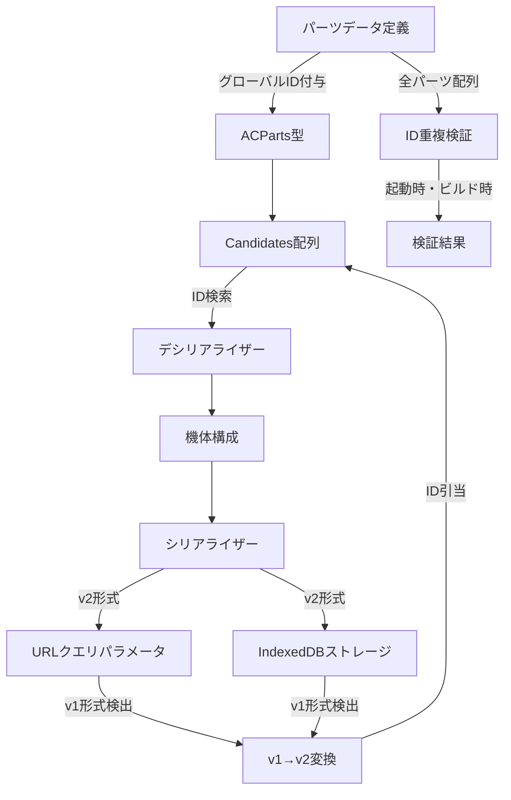
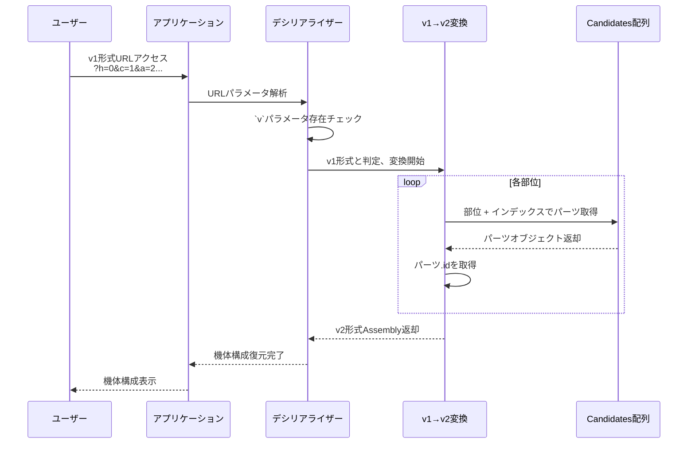
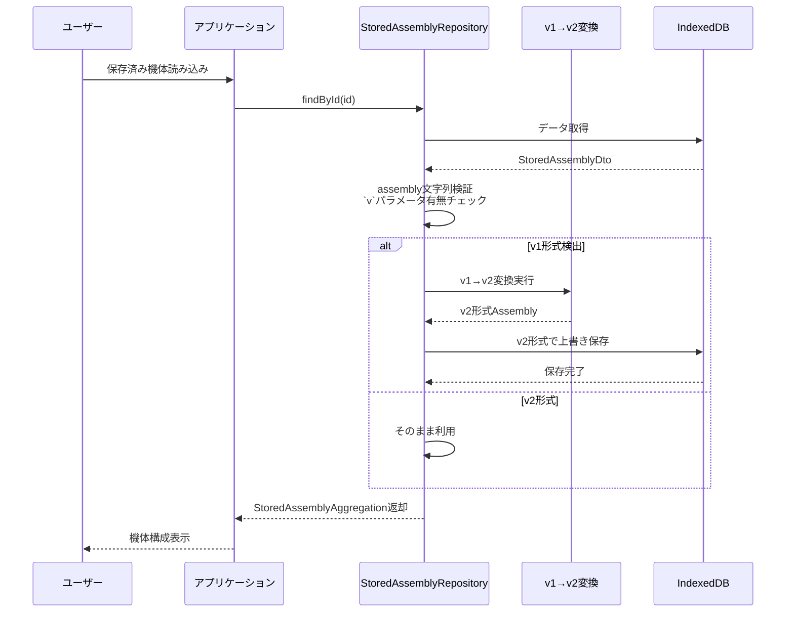
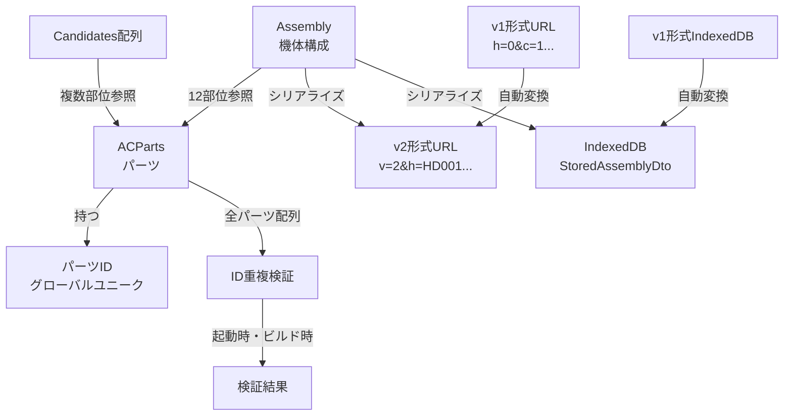
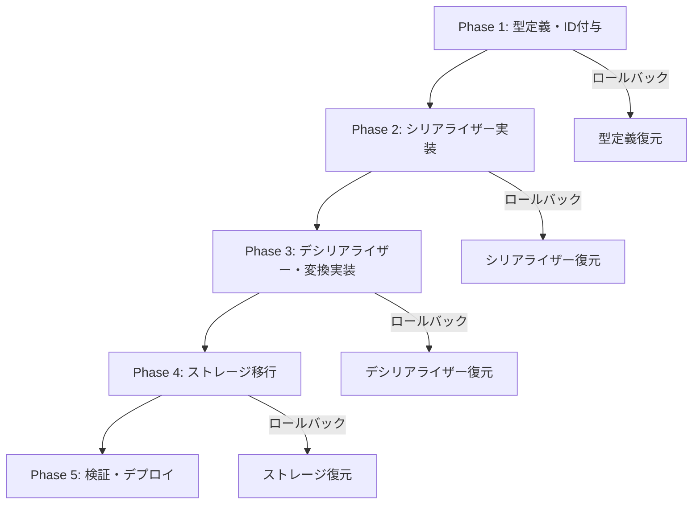

# 技術設計書

## 概要

本機能は、AC6 Assemble Toolの各パーツにグローバルユニークIDを付与し、IDベースでの引当を実現する。現行のインデックスベース方式では、パーツ追加・削除時にインデックスが変動し、URL共有やIndexedDBストレージの互換性が失われる問題がある。グローバルユニークID方式により、パーツ配列の順序変更に影響されない安定したパーツ識別を提供する。

### 目的

パーツ追加・削除時のURL共有およびストレージデータの互換性を維持する。

### 利用者

AC6プレイヤー（機体構成の共有・保存）、パーツデータ管理者（パッチバージョン追加時のパーツ管理）。

### 影響

既存のv1形式（インデックスベース）からv2形式（IDベース）への移行が必要。v1形式のURL・ストレージデータは自動変換により互換性を維持する。

### ゴール

- パーツに短縮形式のグローバルユニークID（例: `HD001`, `WP042`）を付与し、ID重複を起動時およびビルド時に検証する
- URL共有およびIndexedDBストレージをIDベース方式に移行し、v2形式URLに`v=2`パラメータを含める
- v1形式（インデックスベース）のURL・ストレージデータを自動的にv2形式へ変換し、後方互換性を維持する
- ゲームパッチによるパーツ追加・削除時もIDを維持し、既存データとの互換性を保証する

### 非ゴール

- 既存のv1形式URLを完全に廃止する（自動変換により継続利用可能）
- 過去のゲームレギュレーション（現在未サポート）への対応
- パーツ名の変更時のID自動更新（IDはパーツ名と独立して管理）

## アーキテクチャ

### 既存アーキテクチャの分析

#### 現行のパーツ管理構造

- パーツは部位ごとに配列として定義（`heads.ts`, `arms.ts` 等）
- `Candidates`型で各部位の候補配列を管理
- 同一パーツが複数部位で使用可能（例: 腕武器が`rightArmUnit`, `leftArmUnit`, `rightBackUnit`, `leftBackUnit`で参照）
- URL共有: `assemblyToSearch`関数でインデックスを取得し、`?h=0&c=1...`形式のクエリパラメータを生成
- ストレージ: `StoredAssemblyDto`でクエリ文字列形式（インデックスベース）を保存

#### 保持すべき既存パターン

- パーツ定義の配列構造（`heads.ts`, `arms.ts` 等）
- `Candidates`型による部位ごとの候補管理
- 同一パーツオブジェクトの複数部位参照
- `StoredAssemblyRepository`インターフェース

#### 統合ポイント

- `ACParts`型にIDフィールドを追加
- `assemblyToSearch` / `searchToAssembly`をIDベース方式に変更
- `StoredAssemblyDto`のクエリ文字列形式をIDベース方式に対応

### 高レベルアーキテクチャ



### 技術スタック整合性

本機能は既存の技術スタックに準拠し、新規ライブラリの追加は不要。

#### 既存技術の活用

- **TypeScript**: パーツ型定義にIDフィールドを追加（`ACParts`型の拡張）
- **Zod**: StoredAssemblyDtoスキーマをv2形式対応に更新
- **IndexedDB (Dexie)**: 既存のストレージ層を維持し、データ形式のみ変更

#### 新規導入要素

- ID生成スクリプト（開発時ツール、ランタイム非依存）
- ID重複検証ロジック（起動時・ビルド時）

### 主要設計決定

#### 決定1: グローバルユニークID方式の採用

**決定**: 各パーツに`{2-3文字カテゴリコード}{3-4桁連番}`形式のグローバルユニークIDを付与する（例: `HD001`, `WP042`, `CR123`）

**コンテキスト**: 現行のインデックスベース方式では、パーツ配列の順序変更により既存のURL・ストレージデータとの互換性が失われる。また、同一パーツが複数部位で異なるインデックスを持つケースがあり、部位ごとのIDでは二重管理が必要となる。

**代替案**:

1. **部位ごとのID**: `{部位コード}-{カテゴリコード}{連番}`（例: `RAU-WP001`）→ 同一パーツの二重管理が必要
2. **ULID/UUID**: グローバル一意性は保証されるが、URL長制約（Edge 2084バイト）に対して冗長
3. **名前ベースID**: パーツ名をそのままID化 → URL長超過、特殊文字エンコード問題

**選定アプローチ**: グローバルユニークID方式では、同一パーツオブジェクトを複数の候補配列で参照し、IDは1つのみ付与する。ID形式は短縮形式（5-7文字）でURL長制約に適合し、カテゴリコードにより可読性も維持する。

**根拠**:

- 同一パーツが複数部位で使用される場合も、パーツオブジェクトは1つでIDも1つのみ
- URL長制約（Edge 2084バイト）内に収まる短縮形式
- カテゴリコードによりデバッグ時の可読性を維持

**トレードオフ**:

- **獲得**: パーツ配列順序変更への耐性、URL長制約への適合、管理の単純性
- **犠牲**: 完全な人間可読性（パーツ名全体を含まない）、ID採番の手動管理

#### 決定2: URLバージョン識別パラメータ`v=2`の導入

**決定**: v2形式のURLに`v=2`パラメータを含め、`v`パラメータの有無でv1/v2形式を判定する

**コンテキスト**: v1形式（インデックスベース）とv2形式（IDベース）を共存させ、既存のv1形式URLを自動変換により継続利用可能にする必要がある。

**代替案**:

1. **破壊的変更（互換性無し）**: v1形式URLをサポートしない → ユーザー体験の悪化
2. **ヒューリスティック判定**: パラメータ値の形式から推定 → 誤判定リスク
3. **完全並行運用**: v1/v2両形式を永続的にサポート → メンテナンスコスト増大

**選定アプローチ**: `v`パラメータが存在しない場合はv1形式、`v=2`が存在する場合はv2形式と明確に判定する。v1形式は部位ごとにインデックスから候補配列のパーツオブジェクトを取得し、そのグローバルIDを用いてv2形式へ自動変換する。

**根拠**:

- 明確なバージョン識別により誤判定を防止
- v1形式の既存URLを自動変換により継続利用可能
- 将来的なバージョン拡張（v3等）への対応が容易

**トレードオフ**:

- **獲得**: 後方互換性の維持、明確なバージョン管理、将来拡張性
- **犠牲**: URL長が若干増加（`v=2&`で4文字）

#### 決定3: v1→v2自動変換ロジックの実装

**決定**: v1形式のURL・ストレージデータを検出時に自動的にv2形式へ変換する

**コンテキスト**: 既存ユーザーが共有したv1形式URLや保存したIndexedDBデータを引き続き利用可能にする必要がある。変換失敗時はユーザーに明確なエラーメッセージを提示する。

**代替案**:

1. **手動移行ツール提供**: ユーザーが手動で変換を実行 → 利便性低下
2. **二重保存**: v1/v2両形式を並行保存 → ストレージ容量増加
3. **変換なし（破壊的変更）**: v1形式をサポートしない → 既存データ喪失

**選定アプローチ**: v1形式を検出した場合、部位ごとにインデックスから候補配列のパーツオブジェクトを取得し、そのパーツが持つグローバルIDを用いてv2形式へ変換する。変換後のデータはv2形式で保存し、次回以降は変換不要とする。

**根拠**:

- ユーザー操作不要で自動的に移行
- 同一パーツが複数部位で異なるインデックスを持つケースにも対応（各部位でインデックスからオブジェクト取得→グローバルID取得）
- 変換後はv2形式で保存され、変換コストは初回のみ

**トレードオフ**:

- **獲得**: シームレスな移行体験、既存データの保全
- **犠牲**: 初回アクセス時の変換コスト、変換ロジックの保守コスト

## システムフロー

### v1形式URL自動変換フロー



### IndexedDBデータ自動移行フロー



## 要件トレーサビリティ

| 要件 | 要件概要 | コンポーネント | インターフェース | フロー |
|------|----------|---------------|------------------|--------|
| 1.1 | パーツにグローバルユニークID付与 | ACParts型拡張 | id: string | - |
| 1.2 | ID形式`{カテゴリコード}{連番}` | ID生成スクリプト | generatePartId() | - |
| 1.3 | 同一パーツは1つのIDのみ | Candidates配列構築 | defineCandidates() | - |
| 1.4-1.5 | ID重複検証 | ID検証モジュール | validatePartIds() | - |
| 2.1-2.2 | パーツIDによる検索・引当 | デシリアライザー | searchToAssembly() | v1形式URL自動変換フロー |
| 2.3-2.4 | v2形式URL生成・読込 | シリアライザー | assemblyToSearch() | - |
| 2.5-2.6 | IndexedDB保存・読込 | StoredAssemblyRepository | storeNew(), findById() | IndexedDBデータ自動移行フロー |
| 3.1-3.3 | v1形式検出・変換 | v1→v2変換 | convertV1ToV2() | v1形式URL自動変換フロー |
| 3.4-3.5 | IndexedDBデータ移行 | StoredAssemblyRepository | findById() | IndexedDBデータ自動移行フロー |
| 4.1-4.4 | パッチバージョン対応 | パーツ定義 | ID不変性維持 | - |
| 5.1-5.4 | 開発者ツール・ドキュメント | ID生成スクリプト、検証ツール | - | - |

## コンポーネントとインターフェース

### Domain / Parts Data

#### パーツ型定義拡張

##### 責務と境界

- **主要責務**: 全パーツ型にIDフィールドを追加し、グローバルユニークIDを保持する
- **ドメイン境界**: Partsドメイン（`packages/parts/src`）
- **データ所有権**: パーツID、パーツ属性（名前、カテゴリ、性能値等）
- **トランザクション境界**: パーツ定義はビルド時に確定し、ランタイムでは不変

##### 依存関係

- **インバウンド**: Candidates構築、Assembly作成、シリアライザー・デシリアライザー
- **アウトバウンド**: なし（最下層の型定義）
- **外部**: なし

##### 契約定義

**型定義**:

```typescript
// packages/parts/src/types/base/types.ts
export type ACParts<
  Cl extends Classification = Classification,
  M extends Manufacture = Manufacture,
  Ca extends Category = Category,
> = Readonly<{
  /** グローバルユニークID */
  id: string
  /** 名前 */
  name: string
  /** 分類 */
  classification: Cl
  /** 製造企業 */
  manufacture: M
  /** カテゴリ */
  category: Ca
  /** 価格 */
  price: number
  /** 重量 */
  weight: number
  /** EN負荷 */
  en_load: number
}>
```

**事前条件**: パーツ定義時に有効なID形式（`{2-3文字カテゴリコード}{3-4桁連番}`）が付与されていること

**事後条件**: 全パーツオブジェクトが一意のIDを持ち、ID重複が存在しないこと

**不変条件**: パーツIDは定義後に変更されない

**統合戦略**:

- **変更アプローチ**: 既存の`ACParts`型を拡張（`id`フィールド追加）
- **後方互換性**: 型定義の拡張のため、既存コードでコンパイルエラーが発生。全パーツ定義に`id`フィールドを追加する必要がある
- **移行パス**: (1) 型定義更新 → (2) ID生成スクリプト実行 → (3) 全パーツ定義にID追加 → (4) ビルド検証

#### ID検証モジュール

##### 責務と境界

- **主要責務**: 起動時およびビルド時にパーツID重複を検証し、重複検出時はエラーを出力
- **ドメイン境界**: Partsドメイン（`packages/parts/src`）
- **データ所有権**: 検証ロジック、エラーメッセージ
- **トランザクション境界**: 検証は起動時・ビルド時の単発処理

##### 依存関係

- **インバウンド**: アプリケーション起動処理、ビルドスクリプト
- **アウトバウンド**: パーツ定義配列（heads, arms, cores等）
- **外部**: なし

##### 契約定義

**サービスインターフェース**:

```typescript
// packages/parts/src/validation/id-validator.ts
interface PartIdValidator {
  /**
   * 全パーツIDの重複を検証
   * @returns 重複IDが存在する場合はエラー情報、存在しない場合はnull
   */
  validateUniqueness(
    allParts: ReadonlyArray<{ id: string; name: string }>
  ): ValidationResult<null, DuplicateIdError>;
}

type DuplicateIdError = Readonly<{
  duplicateId: string;
  conflictingParts: ReadonlyArray<string>; // パーツ名のリスト
}>;
```

**事前条件**: 全パーツ定義が読み込まれていること

**事後条件**: 重複IDが存在する場合はエラーを返却し、アプリケーション起動を中断またはビルドを失敗させる

**不変条件**: 検証ロジックは副作用を持たない（純粋関数）

### Application / Serialization

#### URL シリアライザー（v2形式）

##### 責務と境界

- **主要責務**: 機体構成（Assembly）をv2形式URLクエリパラメータへ変換する
- **ドメイン境界**: Coreドメイン（`packages/core/src/assembly/serialize`）
- **データ所有権**: URL形式定義、パーツID→クエリパラメータマッピング
- **トランザクション境界**: 単一機体構成のシリアライズ処理

##### 依存関係

- **インバウンド**: UI（機体共有機能）、ストレージ保存処理
- **アウトバウンド**: Assembly、Candidates
- **外部**: なし

##### 契約定義

**サービスインターフェース**:

```typescript
// packages/core/src/assembly/serialize/as-query.ts
interface AssemblySerializer {
  /**
   * 機体構成をv2形式URLクエリパラメータへ変換
   * @param assembly 機体構成
   * @returns v2形式URLSearchParams（例: v=2&h=HD001&c=CR002...）
   */
  assemblyToSearch(assembly: Assembly): URLSearchParams;
}
```

**事前条件**: Assemblyオブジェクトが有効なパーツ参照を持つこと

**事後条件**: `v=2`パラメータを含むv2形式URLクエリパラメータを返却

**不変条件**: 同一Assemblyからは常に同一のURLクエリパラメータが生成される（冪等性）

**統合戦略**:

- **変更アプローチ**: 既存の`assemblyToSearch`関数を書き換え（インデックス→IDベース）
- **後方互換性**: デシリアライザー側でv1形式URLを自動変換するため、既存URLとの互換性は維持
- **移行パス**: (1) 関数実装変更 → (2) v2形式URL生成開始 → (3) 既存v1形式URLは自動変換

#### URL デシリアライザー（v1/v2対応）

##### 責務と境界

- **主要責務**: URLクエリパラメータから機体構成（Assembly）を復元する。v1形式を検出した場合は自動的にv2形式へ変換する
- **ドメイン境界**: Coreドメイン（`packages/core/src/assembly/serialize`）
- **データ所有権**: URL解析ロジック、v1→v2変換ロジック
- **トランザクション境界**: 単一URLのデシリアライズ処理

##### 依存関係

- **インバウンド**: UI（URL読み込み）、ストレージ読み込み処理
- **アウトバウンド**: Candidates（パーツID検索）
- **外部**: なし

##### 契約定義

**サービスインターフェース**:

```typescript
// packages/core/src/assembly/serialize/as-query.ts
interface AssemblyDeserializer {
  /**
   * URLクエリパラメータから機体構成を復元
   * v1形式（インデックスベース）の場合は自動的にv2形式へ変換
   * @param search URLSearchParams
   * @param candidates パーツ候補配列
   * @returns 機体構成
   */
  searchToAssembly(
    search: URLSearchParams,
    candidates: Candidates
  ): Assembly;
}
```

**事前条件**: Candidatesオブジェクトが全パーツ定義を保持していること

**事後条件**: 有効な機体構成を返却。パーツIDが存在しない場合はフォールバック処理（デフォルトパーツまたはNotEquipped）を実行

**不変条件**: 同一URLクエリパラメータからは常に同一のAssemblyが復元される（冪等性）

**処理フロー**:

```typescript
function searchToAssembly(search: URLSearchParams, candidates: Candidates): Assembly {
  const version = search.get('v');

  if (version === '2') {
    // v2形式: IDベース引当
    return deserializeV2(search, candidates);
  } else {
    // v1形式: インデックス→ID変換
    return convertV1ToV2(search, candidates);
  }
}

function deserializeV2(search: URLSearchParams, candidates: Candidates): Assembly {
  const partIds = extractPartIdsFromQuery(search);
  return createAssembly({
    head: findPartById(candidates.head, partIds.h) || candidates.head[0],
    core: findPartById(candidates.core, partIds.c) || candidates.core[0],
    // ... 他の部位
  });
}

function convertV1ToV2(search: URLSearchParams, candidates: Candidates): Assembly {
  const indices = extractIndicesFromQuery(search);
  return createAssembly({
    head: candidates.head[indices.h] || candidates.head[0],
    core: candidates.core[indices.c] || candidates.core[0],
    // ... 他の部位（インデックスからオブジェクト取得→グローバルID利用）
  });
}
```

**統合戦略**:

- **変更アプローチ**: 既存の`searchToAssembly`関数を拡張（v1/v2判定ロジック追加）
- **後方互換性**: v1形式URLを自動変換するため、既存URLとの互換性を完全に維持
- **移行パス**: (1) v1/v2判定ロジック実装 → (2) v2デシリアライザー実装 → (3) v1→v2変換実装

### Infrastructure / Storage

#### IndexedDB ストレージリポジトリ

##### 責務と境界

- **主要責務**: 機体構成をIndexedDBへ保存・読み込みする。v1形式データを検出した場合は自動的にv2形式へ変換し保存する
- **ドメイン境界**: Infrastructureドメイン（`packages/core/src/assembly/store`）
- **データ所有権**: IndexedDBスキーマ、StoredAssemblyDto変換ロジック
- **トランザクション境界**: 単一機体構成の保存・読み込み

##### 依存関係

- **インバウンド**: UI（機体保存・読み込み）
- **アウトバウンド**: IndexedDB (Dexie)、シリアライザー・デシリアライザー
- **外部**: Dexie（IndexedDBラッパーライブラリ）

##### 契約定義

**API契約**:

```typescript
// packages/core/src/assembly/store/stored-assembly.ts
interface StoredAssemblyRepository {
  /**
   * 新規機体構成を保存（v2形式）
   */
  storeNew(
    aggregation: NewAssemblyAggregation,
    candidates: Candidates,
    current?: Date
  ): Promise<void>;

  /**
   * 既存機体構成を更新（v2形式）
   */
  update(
    aggregation: UpdatedAssemblyAggregation,
    candidates: Candidates,
    current?: Date
  ): Promise<void>;

  /**
   * 全機体構成を取得（v1形式は自動変換）
   */
  all(candidates: Candidates): Promise<StoredAssemblyAggregation[]>;

  /**
   * IDで機体構成を取得（v1形式は自動変換してv2形式で保存）
   */
  findById(
    id: string,
    candidates: Candidates
  ): Promise<StoredAssemblyAggregation | null>;

  /**
   * 機体構成を削除
   */
  delete(aggregation: StoredAssemblyAggregation): Promise<void>;
}
```

**Data Transfer Object**:

```typescript
// packages/core/src/assembly/store/repository/data-transfer-object.ts
export const storedAssemblyDtoScheme = z.object({
  id: z.string().ulid().readonly(),
  name: z.string().min(1).max(30).readonly(),
  description: z.string().min(0).max(140).readonly(),
  assembly: z
    .string()
    .min(1)
    .regex(/([a-z]+=[\w\d]+&?)+/)  // v1/v2両形式に対応
    .readonly(),
  createdAt: z.date().readonly(),
  updatedAt: z.date().readonly(),
});

export type StoredAssemblyDto = z.infer<typeof storedAssemblyDtoScheme>;
```

**事前条件**: Candidatesオブジェクトが全パーツ定義を保持していること

**事後条件**:

- `storeNew`, `update`: v2形式でIndexedDBへ保存される
- `findById`, `all`: v1形式データを検出した場合、v2形式へ変換してIndexedDBを更新

**不変条件**: 同一IDの機体構成は1つのみ存在する（ULID重複なし）

**状態管理**:

- **状態モデル**: 機体構成は`StoredAssemblyDto`として永続化
- **永続化**: IndexedDB、Dexieによる管理
- **一貫性モデル**: 各機体構成は独立したトランザクションで保存（並行性制御不要）

**統合戦略**:

- **変更アプローチ**: 既存のリポジトリ実装を拡張（v1形式検出・変換ロジック追加）
- **後方互換性**: v1形式データを自動変換し、v2形式で上書き保存
- **移行パス**: (1) v1/v2判定ロジック実装 → (2) 読み込み時にv1→v2変換 → (3) v2形式で上書き保存

### Development Tools

#### ID生成スクリプト

##### 責務と境界

- **主要責務**: 新規パーツ追加時に次のユニークIDを生成する
- **ドメイン境界**: 開発ツール（`packages/parts/scripts`）
- **データ所有権**: ID生成ロジック、カテゴリコードマッピング
- **トランザクション境界**: スクリプト実行単位

##### 依存関係

- **インバウンド**: 開発者（手動実行）
- **アウトバウンド**: パーツ定義ファイル（読み込み）
- **外部**: Node.js ファイルシステムAPI

##### 契約定義

**バッチ契約**:

```typescript
// packages/parts/scripts/generate-part-id.ts
interface PartIdGenerator {
  /**
   * 指定カテゴリの次のユニークIDを生成
   * @param category パーツカテゴリ（head, core, arms等）
   * @param existingIds 既存IDリスト
   * @returns 次のユニークID（例: HD042）
   */
  generateNextId(
    category: string,
    existingIds: ReadonlyArray<string>
  ): string;
}
```

**トリガー**: 開発者による手動実行（`pnpm run generate-part-id -- --category=head`）

**入力**: パーツカテゴリ、既存パーツ定義ファイル

**出力**: 次のユニークID（標準出力）

**冪等性**: 同一の既存IDリストに対しては常に同じ次IDを生成

**リカバリー**: IDが既存と重複する場合はエラーを出力し、処理を中断

## データモデル

### ドメインモデル

**コア概念**:

**エンティティ**:

- **Assembly（機体構成）**: 12部位のパーツ参照で構成される機体。ULIDで一意に識別
- **ACParts（パーツ）**: グローバルユニークIDで識別されるパーツオブジェクト。名前、カテゴリ、性能値を持つ

**値オブジェクト**:

- **パーツID**: `{カテゴリコード}{連番}`形式の文字列。不変かつ一意性を保証
- **URLクエリパラメータ**: v1形式（インデックスベース）またはv2形式（IDベース）の機体構成表現

**ドメインイベント**:

- **パーツIDバリデーション失敗**: ID重複検出時に発火、アプリケーション起動を中断
- **v1形式データ検出**: 自動変換を実行し、v2形式で保存

**ビジネスルールと不変条件**:

- パーツIDは全パーツ間でグローバルに一意である
- 同一パーツが複数部位で使用される場合も、IDは1つのみ
- 機体構成の各部位は必ず有効なパーツを参照する（フォールバック処理により保証）
- v2形式URLは必ず`v=2`パラメータを含む

**概念図**:



### 論理データモデル

**エンティティ関係**:

**Assembly（機体構成）**:

- 属性: id (ULID), name, description, rightArmUnit, leftArmUnit, rightBackUnit, leftBackUnit, head, core, arms, legs, booster, fcs, generator, expansion, createdAt, updatedAt
- 主キー: id (ULID)
- 外部キー: 各部位がACPartsを参照（パーツID）

**ACParts（パーツ）**:

- 属性: id (パーツID), name, classification, manufacture, category, price, weight, en_load, ...（カテゴリごとの性能値）
- 主キー: id (パーツID)
- カーディナリティ: 1つのパーツは複数のAssemblyから参照される（1:N）

**Candidates（候補配列）**:

- 属性: rightArmUnit[], leftArmUnit[], rightBackUnit[], leftBackUnit[], head[], core[], arms[], legs[], booster[], fcs[], generator[], expansion[]
- 関係: 各配列は複数のACPartsオブジェクトを参照。同一ACPartsオブジェクトが複数配列で参照される

**参照整合性ルール**:

- Assembly → ACParts: 各部位は有効なパーツIDを参照。存在しないIDの場合はフォールバック処理
- Candidates → ACParts: 同一パーツオブジェクトを複数配列で参照（メモリ共有）

**時制的側面**:

- Assembly: createdAt（作成日時）、updatedAt（更新日時）をバージョニングとして保持
- ACParts: パッチバージョン適用時にステータス変更可能だが、IDは不変

### 物理データモデル

**IndexedDB（Dexie）**:

**テーブル定義**:

```typescript
// packages/core/src/assembly/store/repository/indexed-db/indexed-db.ts
class AssemblyDatabase extends Dexie {
  assemblies!: Dexie.Table<StoredAssemblyDto, string>;

  constructor() {
    super('AssemblyDatabase');
    this.version(2).stores({
      assemblies: 'id, name, createdAt, updatedAt'
    });
  }
}
```

**データ型**:

- `id`: string (ULID)
- `name`: string (1-30文字)
- `description`: string (0-140文字)
- `assembly`: string (v2形式クエリ文字列、例: `v=2&h=HD001&c=CR002...`)
- `createdAt`: Date
- `updatedAt`: Date

**インデックス**:

- 主キー: `id`
- セカンダリインデックス: `name`, `createdAt`, `updatedAt`

**パーティショニング戦略**: なし（小規模データセット）

**v1形式データ互換性**:

- `assembly`フィールドは正規表現`/([a-z]+=[\w\d]+&?)+/`でv1/v2両形式を許容
- 読み込み時に`v`パラメータの有無でv1/v2を判定
- v1形式検出時は自動変換してv2形式で上書き保存

## エラーハンドリング

### エラー戦略

**Result型パターン**: ユーザーが解決可能なエラー（パーツID不存在、v1形式変換失敗等）はResult型で表現し、UI側で適切なフォールバック処理を実行する。

**Exception**: システムレベルのエラー（ID重複検出、IndexedDB接続失敗等）は例外をスローし、アプリケーション起動を中断またはエラーページを表示する。

### エラーカテゴリと対応

#### ユーザーエラー（4xx相当）

- **パーツID不存在**: URLまたはIndexedDBから読み込んだパーツIDが候補配列に存在しない
  - **対応**: フォールバック処理（デフォルトパーツまたはNotEquipped）を実行し、機体構成を復元
  - **ユーザーメッセージ**: 「一部のパーツが見つかりませんでした。デフォルトパーツで代替しました。」

#### システムエラー（5xx相当）

- **パーツID重複検出**: 起動時またはビルド時にID重複を検出
  - **対応**: エラーログ出力（error レベル）、アプリケーション起動中断またはビルド失敗
  - **ログ**: `{ level: 'error', message: 'Duplicate part ID detected', duplicateId: 'HD001', conflictingParts: ['BASHO', 'MELANDER'] }`

- **IndexedDB接続失敗**: Dexie初期化エラー
  - **対応**: エラーページ表示、再試行ボタン提供
  - **ユーザーメッセージ**: 「データベース接続に失敗しました。ページを再読み込みしてください。」

#### ビジネスロジックエラー（422相当）

- **v1形式変換失敗**: インデックスが候補配列の範囲外
  - **対応**: warn レベルのログ出力、フォールバック処理実行
  - **ログ**: `{ level: 'warn', message: 'v1 to v2 conversion fallback', slot: 'head', index: 999, fallback: 'HD001' }`
  - **ユーザーメッセージ**: 「機体構成の一部を復元できませんでした。デフォルトパーツで代替しました。」

### モニタリング

#### エラートラッキング

構造化ログ（JSON形式）でエラー情報を出力。機微情報（ユーザーID等）は除外。

#### ログレベル

- **error**: ID重複検出、IndexedDB接続失敗
- **warn**: v1形式変換失敗（フォールバック実行）
- **info**: v1形式データ検出・自動変換成功

#### ヘルスモニタリング

`/health`エンドポイント（既存）で稼働状況を確認。ID検証失敗時は起動を中断するため、ヘルスチェックは実行されない。

## テスト戦略

### 単体テスト

- **パーツID検証**: 全パーツIDの一意性検証、重複検出時のエラー返却
- **ID生成スクリプト**: カテゴリごとの次ID生成ロジック、既存IDとの重複回避
- **v1→v2変換ロジック**: インデックスからパーツID取得、フォールバック処理
- **シリアライザー**: Assemblyからv2形式URLクエリパラメータ生成、`v=2`パラメータ含有
- **デシリアライザー**: v2形式URLからAssembly復元、v1形式自動検出・変換

### 統合テスト

- **URL共有フロー**: Assembly → シリアライザー → URLクエリパラメータ → デシリアライザー → Assembly復元
- **v1形式URL互換性**: v1形式URL → デシリアライザー → v1→v2変換 → Assembly復元
- **IndexedDB保存・読み込み**: Assembly → リポジトリ → IndexedDB保存 → 読み込み → Assembly復元
- **IndexedDBデータ移行**: v1形式データ読み込み → 自動変換 → v2形式で上書き保存
- **ID重複検証**: パーツ定義読み込み → ID検証 → 重複検出時のエラー出力

### E2Eテスト

- **機体構成共有**: UI上で機体構成作成 → URL生成 → URL共有 → 別セッションで読み込み → 同一機体構成復元
- **v1形式URL読み込み**: v1形式URLアクセス → 自動変換 → 機体構成表示
- **機体保存・読み込み**: UI上で機体保存 → IndexedDB書き込み → ページ再読み込み → 保存済み機体一覧表示 → 読み込み → 同一機体構成復元
- **v1形式データ移行**: v1形式IndexedDBデータ → 読み込み → v2形式へ自動変換 → 次回読み込み時はv2形式利用

### パフォーマンステスト

- **URL長制約**: 12部位全てにパーツを装備した機体構成のURL長が2084バイト以内であることを確認
- **ID検証処理時間**: 全パーツ（数百件）のID検証が起動時に100ms以内で完了することを確認
- **v1→v2変換処理時間**: v1形式URL読み込みから機体構成復元までが500ms以内であることを確認

## セキュリティ考慮事項

### 機微情報の取り扱い

- パーツIDおよび機体構成データは公開情報であり、機微情報を含まない
- IndexedDBに保存される機体名・説明はユーザー入力だが、個人識別情報ではない
- 構造化ログには機体名・説明を含めない（パーツID、エラー情報のみ）

### 入力検証

- URLクエリパラメータ: Zodスキーマでバリデーション。不正なパーツIDはフォールバック処理
- IndexedDBデータ: `storedAssemblyDtoScheme`で検証。不正データは読み込み失敗として扱う

### XSS対策

機体名・説明はSvelteの自動エスケープにより保護。追加対策不要。

### アクセス制御

IndexedDBはオリジン単位で分離。他オリジンからのアクセス不可。

## 移行戦略

### 移行フェーズ



### プロセス

#### Phase 1: 型定義・ID付与

- `ACParts`型に`id: string`フィールド追加
- ID生成スクリプト作成・実行
- 全パーツ定義ファイルにID追加（heads.ts, arms.ts等）
- ID重複検証ロジック実装、ビルドプロセスに組み込み
- **検証**: ビルド成功、ID重複なし
- **ロールバック**: `ACParts`型からIDフィールド削除、パーツ定義復元

#### Phase 2: シリアライザー実装

- `assemblyToSearch`関数をIDベース方式に変更
- v2形式URLに`v=2`パラメータ追加
- **検証**: v2形式URL生成、URL長が2084バイト以内
- **ロールバック**: `assemblyToSearch`関数をインデックスベースに復元

#### Phase 3: デシリアライザー・変換実装

- `searchToAssembly`関数にv1/v2判定ロジック追加
- v2形式デシリアライザー実装
- v1→v2変換ロジック実装（インデックス→ID）
- **検証**: v1形式URL自動変換、v2形式URL読み込み
- **ロールバック**: `searchToAssembly`関数をインデックスベースに復元

#### Phase 4: ストレージ移行

- `StoredAssemblyRepository`にv1/v2判定ロジック追加
- v1形式データ読み込み時にv2形式へ自動変換、上書き保存
- **検証**: v1形式IndexedDBデータ自動変換、v2形式で保存
- **ロールバック**: リポジトリ実装復元、既存v2形式データはv1形式へ手動変換

#### Phase 5: 検証・デプロイ

- E2Eテスト実行（機体共有、保存・読み込み）
- v1形式URL・ストレージデータの互換性確認
- 本番デプロイ
- **検証**: 本番環境で既存v1形式URL・ストレージデータの自動変換動作確認
- **ロールバック**: 前バージョンへのデプロイ復元

### ロールバックトリガー

- **Phase 1-3**: ビルド失敗、テスト失敗、ID重複検出
- **Phase 4**: IndexedDBデータ破損、v1→v2変換失敗率が5%超過
- **Phase 5**: 本番環境でのエラー率が1%超過、v1形式URL読み込み失敗

### 検証チェックポイント

#### Phase 1のチェックポイント

- [ ] 全パーツ定義にIDフィールドが追加されている
- [ ] ID重複検証がビルドプロセスで実行され、重複なし
- [ ] ビルド成功

#### Phase 2のチェックポイント

- [ ] v2形式URLが`v=2`パラメータを含む
- [ ] 12部位全装備時のURL長が2084バイト以内

#### Phase 3のチェックポイント

- [ ] v1形式URLが自動的にv2形式へ変換される
- [ ] v2形式URLが正しく読み込まれる
- [ ] 存在しないパーツIDでフォールバック処理が動作

#### Phase 4のチェックポイント

- [ ] v1形式IndexedDBデータがv2形式へ自動変換される
- [ ] 変換後のデータがv2形式でIndexedDBに保存される
- [ ] 次回読み込み時はv2形式として読み込まれる

#### Phase 5のチェックポイント

- [ ] 本番環境で既存v1形式URLが正常に読み込まれる
- [ ] 本番環境で既存IndexedDBデータが自動変換される
- [ ] エラー率が1%以下
