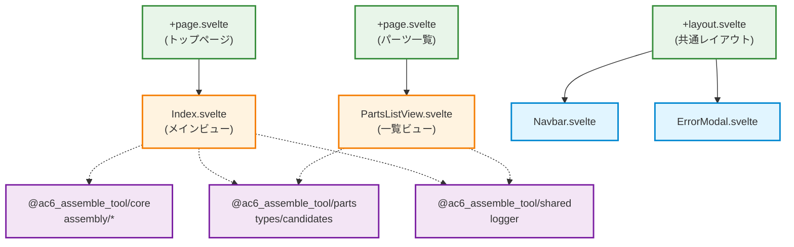

# Components Architecture

<!-- Inclusion Mode: Always -->

_Last Updated: 2025-12-12_

## 目的

このドキュメントは、Svelteコンポーネントと、コンポーネントが直接依存しているモジュールとの依存関係を図示します。コンポーネント・モジュール間で一方向の依存関係になっていることを確認可能にします。

## 核心原則

### MUST要件

- **Svelte 5 rune API**: 新規コンポーネントは Svelte 5 の rune API（`$state`, `$derived`, `$effect`）を用いて実装（AGENTS.md L24）
- **プレゼンテーション層の責務最小化**: 主要な計算処理はプレーンなTypeScriptモジュールに集約し、コンポーネントは原則イベントハンドラのみを持つ（AGENTS.md L33）
- **一方向依存**: コンポーネント→モジュールの依存のみ許可（逆方向禁止）

### SHOULD要件

- **レイヤー分離**: UI層（components/view）とロジック層（interaction/filter/sort）を物理的に分離
- **コンポーネントの粒度**: 単一責任の原則に従い、小さく再利用可能なコンポーネントを作成

## コンポーネント階層構造

### 全体構成

```txt
packages/web/src/
├── routes/                    # SvelteKitルーティング（ページコンポーネント）
│   ├── +page.svelte              # トップページ
│   ├── +layout.svelte            # 共通レイアウト
│   ├── parts-list/+page.svelte   # パーツ一覧ページ
│   └── about/*/+page.svelte      # Aboutページ（多言語）
│
├── lib/
│   ├── components/            # 汎用UIコンポーネント（ドメイン非依存）
│   │   ├── button/               # ボタン類
│   │   ├── form/                 # フォーム要素
│   │   ├── layout/               # レイアウト要素
│   │   ├── modal/                # モーダル
│   │   └── ...
│   │
│   ├── view/                  # ビュー固有コンポーネント（ドメイン依存）
│   │   ├── index/                # トップページビュー
│   │   │   ├── Index.svelte         # メインコンポーネント
│   │   │   ├── form/                # パーツ選択フォーム
│   │   │   ├── random/              # ランダム生成UI
│   │   │   ├── report/              # レポート表示
│   │   │   └── share/               # 共有機能UI
│   │   │
│   │   └── parts-list/           # パーツ一覧ビュー
│   │       ├── PartsListView.svelte # メインコンポーネント
│   │       ├── filter/              # フィルターUI
│   │       ├── sort/                # ソートUI
│   │       └── slot/                # スロット選択UI
│   │
│   └── (ロジックモジュール)
│       ├── interaction/          # ユーザー操作処理
│       ├── filter/               # フィルターロジック
│       └── sort/                 # ソートロジック
```

## コンポーネント依存関係図

### ページレベル依存



### Index ビュー詳細依存

```mermaid
---
config:
  theme: default
  themeVariables:
    fontSize: 12px
---
graph TD
    %% Main Component
    IndexView["Index.svelte"]

    %% UI Components (components/)
    TextButton["TextButton"]
    LanguageForm["LanguageForm"]
    CollapseText["CollapseText"]
    NavButton["NavButton"]
    Navbar["Navbar"]
    ToolSection["ToolSection"]
    ErrorModal["ErrorModal"]

    %% View-specific Components (view/index/)
    PartsSelectForm["PartsSelectForm"]
    RandomUI["RandomAssemblyOffCanvas"]
    ReportUI["ReportListViewer"]
    ShareUI["ShareAssembly"]
    StoreUI["StoreAssembly"]
    StatusBadge["StatusBadgeList"]

    %% Modules (TypeScript)
    InteractionModule["interaction/<br/>bootstrap.ts<br/>assembly.ts<br/>share.ts"]
    CoreModule["@ac6_assemble_tool/core<br/>assembly/*"]
    PartsModule["@ac6_assemble_tool/parts"]
    SharedModule["@ac6_assemble_tool/shared"]

    %% Dependencies
    IndexView --> TextButton
    IndexView --> LanguageForm
    IndexView --> CollapseText
    IndexView --> NavButton
    IndexView --> Navbar
    IndexView --> ToolSection
    IndexView --> ErrorModal
    IndexView --> PartsSelectForm
    IndexView --> RandomUI
    IndexView --> ReportUI
    IndexView --> ShareUI
    IndexView --> StoreUI
    IndexView --> StatusBadge

    IndexView -.->|ロジック呼び出し| InteractionModule
    IndexView -.->|直接依存| CoreModule
    IndexView -.->|直接依存| PartsModule
    IndexView -.->|直接依存| SharedModule

    InteractionModule -.-> CoreModule
    InteractionModule -.-> PartsModule

    style IndexView fill:#fff3e0,stroke:#f57c00,stroke-width:3px
    style TextButton fill:#e1f5ff,stroke:#0288d1,stroke-width:1px
    style LanguageForm fill:#e1f5ff,stroke:#0288d1,stroke-width:1px
    style CollapseText fill:#e1f5ff,stroke:#0288d1,stroke-width:1px
    style NavButton fill:#e1f5ff,stroke:#0288d1,stroke-width:1px
    style Navbar fill:#e1f5ff,stroke:#0288d1,stroke-width:1px
    style ToolSection fill:#e1f5ff,stroke:#0288d1,stroke-width:1px
    style ErrorModal fill:#e1f5ff,stroke:#0288d1,stroke-width:1px
    style PartsSelectForm fill:#ffe0b2,stroke:#ff6f00,stroke-width:1px
    style RandomUI fill:#ffe0b2,stroke:#ff6f00,stroke-width:1px
    style ReportUI fill:#ffe0b2,stroke:#ff6f00,stroke-width:1px
    style ShareUI fill:#ffe0b2,stroke:#ff6f00,stroke-width:1px
    style StoreUI fill:#ffe0b2,stroke:#ff6f00,stroke-width:1px
    style StatusBadge fill:#ffe0b2,stroke:#ff6f00,stroke-width:1px
    style InteractionModule fill:#f3e5f5,stroke:#7b1fa2,stroke-width:2px
    style CoreModule fill:#fce4ec,stroke:#c2185b,stroke-width:2px
    style PartsModule fill:#fce4ec,stroke:#c2185b,stroke-width:2px
    style SharedModule fill:#fce4ec,stroke:#c2185b,stroke-width:2px
```



### PartsListView 詳細依存

```mermaid
---
config:
  theme: default
  themeVariables:
    fontSize: 12px
---
graph TD
    %% Main Component
    PartsListView["PartsListView.svelte"]

    %% UI Components (components/)
    CollapseText["CollapseText"]

    %% View-specific Components
    FilterPanel["FilterPanel"]
    PartsGrid["PartsGrid"]
    SlotSelector["SlotSelector"]
    SortControl["SortControl"]
    EmptyState["EmptyState"]

    %% Modules (TypeScript)
    FilterModule["filter/<br/>filters-core.ts<br/>serialization.ts"]
    SortModule["sort/<br/>sort.ts"]
    SlotModule["slot/<br/>slot-utils.ts"]
    StateModule["state/<br/>state-serializer.ts<br/>view-mode.ts"]
    StoreModule["stores/<br/>favorite-store.ts"]

    %% Core Modules
    PartsModule["@ac6_assemble_tool/parts<br/>attributes-utils<br/>types/*"]
    SharedModule["@ac6_assemble_tool/shared<br/>logger"]

    %% Dependencies
    PartsListView --> CollapseText
    PartsListView --> FilterPanel
    PartsListView --> PartsGrid
    PartsListView --> SlotSelector
    PartsListView --> SortControl
    PartsListView --> EmptyState

    PartsListView -.->|ロジック呼び出し| FilterModule
    PartsListView -.->|ロジック呼び出し| SortModule
    PartsListView -.->|ロジック呼び出し| SlotModule
    PartsListView -.->|ロジック呼び出し| StateModule
    PartsListView -.->|Store購読| StoreModule

    PartsListView -.->|直接依存| PartsModule
    PartsListView -.->|直接依存| SharedModule

    FilterModule -.-> PartsModule
    SortModule -.-> PartsModule
    StoreModule -.-> SharedModule

    style PartsListView fill:#fff3e0,stroke:#f57c00,stroke-width:3px
    style CollapseText fill:#e1f5ff,stroke:#0288d1,stroke-width:1px
    style FilterPanel fill:#ffe0b2,stroke:#ff6f00,stroke-width:1px
    style PartsGrid fill:#ffe0b2,stroke:#ff6f00,stroke-width:1px
    style SlotSelector fill:#ffe0b2,stroke:#ff6f00,stroke-width:1px
    style SortControl fill:#ffe0b2,stroke:#ff6f00,stroke-width:1px
    style EmptyState fill:#ffe0b2,stroke:#ff6f00,stroke-width:1px
    style FilterModule fill:#f3e5f5,stroke:#7b1fa2,stroke-width:2px
    style SortModule fill:#f3e5f5,stroke:#7b1fa2,stroke-width:2px
    style SlotModule fill:#f3e5f5,stroke:#7b1fa2,stroke-width:2px
    style StateModule fill:#f3e5f5,stroke:#7b1fa2,stroke-width:2px
    style StoreModule fill:#f3e5f5,stroke:#7b1fa2,stroke-width:2px
    style PartsModule fill:#fce4ec,stroke:#c2185b,stroke-width:2px
    style SharedModule fill:#fce4ec,stroke:#c2185b,stroke-width:2px
```



## コンポーネントカテゴリ

### 1. ページコンポーネント（routes/）

**責務**: SvelteKitルーティングのエントリポイント

**特徴**:

- `+page.svelte`: ページ本体
- `+layout.svelte`: 共通レイアウト
- `+page.ts` / `+page.server.ts`: データロード

**依存ルール**:

- View コンポーネントを組み込む
- データロードロジックは `+page.ts` に集約
- 直接的なビジネスロジックは持たない

**例**:

```svelte
<!-- routes/+page.svelte -->
<script lang="ts">
  import Index from '$lib/view/index/Index.svelte'
  import type { PageData } from './+page'

  interface Props {
    data: PageData
  }
  let { data }: Props = $props()
</script>

<Index regulation={data.regulation} partsPool={data.partsPool} />
```

### 2. 汎用UIコンポーネント（components/）

**責務**: ドメイン非依存の再利用可能UIパーツ

**配置**: `src/lib/components/`

**特徴**:

- ビジネスロジックを持たない
- `@ac6_assemble_tool/core` や `@ac6_assemble_tool/parts` への依存禁止
- propsでデータを受け取り、イベントで通知

**サブディレクトリ**:

- `button/`: ボタン類（IconButton, TextButton）
- `form/`: フォーム要素（Switch）
- `layout/`: レイアウト要素（Navbar, CollapseText, ToolSection）
- `modal/`: モーダル（ErrorModal）
- `list/`: リスト表示（FlushList, ListItem）
- `spacing/`: スペーシング（Margin）
- `tooltip/`: ツールチップ（ClickToggleTooltip）

**例**:

```svelte
<!-- components/button/TextButton.svelte -->
<script lang="ts">
  interface Props {
    text: string
    onClick?: () => void
    disabled?: boolean
  }
  let { text, onClick, disabled = false }: Props = $props()
</script>

<button on:click={onClick} disabled={disabled}>
  {text}
</button>
```

### 3. ビュー固有コンポーネント（view/）

**責務**: 特定の画面・機能に特化したUIコンポーネント

**配置**: `src/lib/view/`

**特徴**:

- ドメインロジックを呼び出す
- `@ac6_assemble_tool/core`, `@ac6_assemble_tool/parts` への依存可能
- Svelte 5 rune API（`$state`, `$derived`, `$effect`）を活用

**サブディレクトリ**:

- `index/`: トップページビュー（機体組み立て）
  - `Index.svelte`: メインコンポーネント
  - `form/`: パーツ選択フォーム
  - `random/`: ランダム生成UI
  - `report/`: レポート表示
  - `share/`: 共有機能UI
  - `store/`: 保存・読み込みUI

- `parts-list/`: パーツ一覧ビュー
  - `PartsListView.svelte`: メインコンポーネント
  - `filter/`: フィルターUI
  - `sort/`: ソートUI
  - `slot/`: スロット選択UI
  - `state/`: 状態管理UI

**例**:

```svelte
<!-- view/parts-list/PartsListView.svelte -->
<script lang="ts">
  import { applyFilters } from './filter/filters-core'
  import { sortPartsByKey } from './sort/sort'
  import type { ACParts } from '@ac6_assemble_tool/parts/types/base/types'

  interface Props {
    parts: ACParts[]
    regulation: Regulation
  }
  let { parts, regulation }: Props = $props()

  // ロジックモジュールを呼び出して計算
  let filteredParts = $derived(applyFilters(parts, filters))
  let sortedParts = $derived(sortPartsByKey(filteredParts, sortKey))
</script>
```

### 4. ロジックモジュール（.ts ファイル）

**責務**: ビジネスロジック・計算処理

**配置**: `src/lib/view/*/interaction/`, `filter/`, `sort/` 等

**特徴**:

- プレーンなTypeScript関数/クラス
- コンポーネントから呼び出される（逆方向依存禁止）
- テスタブルな純粋関数を優先

**例**:

```typescript
// view/parts-list/filter/filters-core.ts
import type { ACParts } from '@ac6_assemble_tool/parts/types/base/types'

export function applyFilters(
  parts: ACParts[],
  filters: FiltersPerSlot
): ACParts[] {
  return parts.filter(part => {
    // フィルター適用ロジック
    return matchesFilter(part, filters)
  })
}
```

## 依存関係の検証手順

### 新規コンポーネント作成時

1. **カテゴリ判断**: コンポーネントがどのカテゴリに属するか決定
   - ドメイン非依存 → `components/`
   - ビュー固有 → `view/*/`
   - ページ → `routes/*/`

2. **依存方向確認**:

   ```txt
   OK: Component → TypeScript Module → Core/Parts/Shared
   NG: TypeScript Module → Component (逆方向依存)
   NG: components/ → @ac6_assemble_tool/core (ドメイン依存)
   ```

3. **Svelte 5 rune 使用確認**:
   - `let foo = $state(...)`: リアクティブな状態
   - `let bar = $derived(...)`: 派生状態
   - `$effect(() => {...})`: 副作用

4. **責務最小化確認**:
   - 計算ロジックは別モジュールに分離されているか？
   - コンポーネントはUIとイベントハンドラのみか？

### コンポーネント間依存の追加時

1. **親子関係の確認**:
   - 親コンポーネントが子コンポーネントをimport（正常）
   - 子から親をimport（循環依存リスク、避ける）

2. **イベント伝播**:
   - 子→親への通知はイベント経由
   - 親→子へのデータはprops経由

3. **共通コンポーネントの抽出**:
   - 複数の親から使われる → `components/` へ移動
   - 特定ビューでのみ使用 → `view/*/` 内に配置

## Svelte 5 Rune API ガイドライン

### $state - リアクティブな状態

```svelte
<script lang="ts">
  // プリミティブ
  let count = $state(0)

  // オブジェクト
  let user = $state({ name: 'Alice', age: 30 })

  // 配列
  let items = $state<string[]>([])
</script>

<button onclick={() => count++}>
  Count: {count}
</button>
```

### $derived - 派生状態

```svelte
<script lang="ts">
  let count = $state(0)

  // シンプルな派生
  let doubled = $derived(count * 2)

  // 複雑な派生（$derived.by を使用）
  let filtered = $derived.by(() => {
    return items.filter(item => item.active)
  })
</script>

<p>Doubled: {doubled}</p>
```

### $effect - 副作用

```svelte
<script lang="ts">
  let count = $state(0)

  // 副作用（ログ、ストレージ保存等）
  $effect(() => {
    console.log('Count changed:', count)
    localStorage.setItem('count', String(count))
  })
</script>
```

### $props - プロパティ

```svelte
<script lang="ts">
  interface Props {
    title: string
    count?: number
  }

  // デフォルト値付き
  let { title, count = 0 }: Props = $props()
</script>

<h1>{title}</h1>
<p>Count: {count}</p>
```

## URL クエリパラメータの取得

**SHOULD原則**: クライアントでクエリパラメータを参照する際は `$app/state` の `page.url.search` を `withPageQuery` と `$derived.by` で監視し、`window.location.search` へ直接依存しないこと（AGENTS.md L175）

**理由**: SSR/CSRの一貫性確保

**実装例**:

```typescript
// utils/page-query.ts
import { page } from '$app/state'

export function withPageQuery<T>(fn: (search: string) => T): () => T {
  return () => fn(page.url.search)
}
```

```svelte
<!-- Component.svelte -->
<script lang="ts">
  import { withPageQuery } from '$lib/utils/page-query'
  import { parseQueryParams } from './query-parser'

  // SSR/CSR両対応のクエリ監視
  let queryParams = $derived.by(
    withPageQuery(search => parseQueryParams(search))
  )
</script>
```

## アンチパターン

### ❌ コンポーネント内での重いロジック

```svelte
<!-- BAD: コンポーネント内で計算 -->
<script lang="ts">
  let parts = $state<ACParts[]>([])

  let filtered = $derived.by(() => {
    // 複雑なフィルタリング処理を直接書く（テスト困難）
    return parts.filter(p => {
      // 100行のロジック...
    })
  })
</script>
```

### ✅ ロジックを分離

```typescript
// filter/filters-core.ts (別モジュール)
export function applyFilters(parts: ACParts[], filters: Filters): ACParts[] {
  // テスト可能な純粋関数
  return parts.filter(p => matchesFilter(p, filters))
}
```

```svelte
<!-- GOOD: モジュールを呼び出すだけ -->
<script lang="ts">
  import { applyFilters } from './filter/filters-core'

  let parts = $state<ACParts[]>([])
  let filters = $state<Filters>({})

  let filtered = $derived(applyFilters(parts, filters))
</script>
```

### ❌ 逆方向依存

```typescript
// BAD: ロジックモジュールからコンポーネントをimport
import SomeComponent from './SomeComponent.svelte'

export function doSomething() {
  // コンポーネントを使おうとする（禁止）
}
```

### ✅ 一方向依存

```typescript
// GOOD: ロジックモジュールは純粋関数のみ
export function doSomething(data: Data): Result {
  // ビジネスロジック
  return result
}
```

```svelte
<!-- コンポーネントからロジックを呼び出す -->
<script lang="ts">
  import { doSomething } from './logic'

  let result = $derived(doSomething(data))
</script>
```

## トラブルシューティング

### 循環依存が発生した場合

1. **依存グラフの確認**:

   ```bash
   npx madge --circular --extensions ts,svelte packages/web/src
   ```

2. **共通コンポーネントの抽出**: 循環の原因となるコンポーネントを上位に移動

3. **イベント駆動の採用**: 子→親の通知をイベント経由に変更

### パフォーマンス問題

1. **$derived の最適化**: 不要な再計算を避ける
2. **コンポーネント分割**: 大きなコンポーネントを小さく分割し、再レンダリング範囲を最小化
3. **メモ化**: 重い計算は事前に実行し、結果をキャッシュ

## 参考資料

### 関連ドキュメント

- [AGENTS.md L24](AGENTS.md): Svelte 5 rune API の活用（MUST）
- [AGENTS.md L33](AGENTS.md): プレゼンテーション層の責務最小化（SHOULD）
- [AGENTS.md L175](AGENTS.md): URL クエリ取得の方針（SHOULD）
- [docs/steering/structure.md](docs/steering/structure.md): プロジェクト構造とレイヤーアーキテクチャ
- [docs/steering/dependencies.md](docs/steering/dependencies.md): パッケージ間依存関係

### 外部リソース

- [Svelte 5 Documentation](https://svelte.dev/docs/svelte/overview)
- [SvelteKit Documentation](https://kit.svelte.dev/docs)

## 変更履歴

- **2025-12-12**: 初版作成 - コンポーネント階層、依存関係図、Svelte 5 rune ガイドラインを記載
