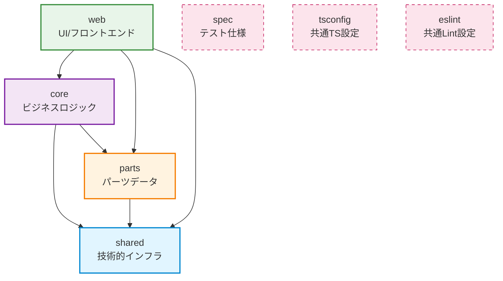

# Dependencies Management

<!-- Inclusion Mode: Always -->

_Last Updated: 2025-12-12_

## 目的

このドキュメントは、プロジェクトの依存関係を可視化し、一方向依存の原則が維持されていることを確認可能にします。仕様の追加・変更時に、このドキュメントを参照して依存関係の整合性を検証してください。

## 核心原則

### MUST要件

- **依存の一方向性**: 依存は常に一方向とすること。相互依存は禁止（AGENTS.md L170）
- **循環依存の禁止**: パッケージ間、モジュール間、レイヤー間のいずれでも循環依存を発生させない
- **抽象への依存**: 具象モジュールよりも抽象モジュールへの依存を優先（AGENTS.md L325）

### SHOULD要件

- **安定依存の原則**: より安定したモジュールに依存させる（より多くのモジュールに依存されているモジュール）（AGENTS.md L324）
- **レイヤー分離**: 異なるレイヤーのコードは物理的に別ディレクトリに配置（AGENTS.md L181）
- **上位→下位依存**: 依存は高次→低次の一方向（上位が下位へ）（AGENTS.md L182）

## パッケージ依存関係図

### 全体構成



### レイヤー構造

```txt
┌─────────────────────────────────────────┐
│  web (UI層)                             │  ← 最上位レイヤー
│  - ビュー固有ロジック                    │
│  - SvelteKit ルーティング                │
│  - ユーザー操作                         │
└─────────────────────────────────────────┘
              ↓ 依存
┌─────────────────────────────────────────┐
│  core (アプリケーション/ドメイン層)       │
│  - AC6アセンブリ計算エンジン             │
│  - ビジネスロジック                     │
│  - データ永続化                         │
└─────────────────────────────────────────┘
              ↓ 依存
┌─────────────────────────────────────────┐
│  parts (ドメインデータ層)                │
│  - パーツ型定義                         │
│  - パッチバージョン対応                  │
│  - パーツ実体定義                       │
└─────────────────────────────────────────┘
              ↓ 依存
┌─────────────────────────────────────────┐
│  shared (インフラストラクチャ層)         │  ← 最下位レイヤー
│  - logger                               │
│  - 共通ユーティリティ                   │
└─────────────────────────────────────────┘
```

## パッケージ詳細

### @ac6_assemble_tool/shared

**責務**: 技術的インフラレイヤー

**提供機能**:
- 構造化ログ（logger）
- 共通ユーティリティ（array, number等）

**依存先**:
- 外部パッケージ: `@praha/byethrow`
- 内部パッケージ: なし（最下位レイヤー）

**被依存元**:
- `@ac6_assemble_tool/core`
- `@ac6_assemble_tool/parts`
- `@ac6_assemble_tool/web`

**設計決定**: [ADR 20251018](docs/adr/20251018-logger-placement-in-shared-package.md) - logger を shared に配置し、循環依存リスクをゼロに

### @ac6_assemble_tool/parts

**責務**: ドメインデータ層 - パーツ定義とバージョン管理

**提供機能**:
- パーツ型定義（フレーム系、武装系、内装系、拡張系）
- パッチバージョン対応
- パーツ実体定義
- パーツ属性ユーティリティ

**依存先**:
- `@ac6_assemble_tool/shared`

**被依存元**:
- `@ac6_assemble_tool/core`
- `@ac6_assemble_tool/web`

**特記事項**: ビジネスロジックを持たず、純粋なデータ定義のみを担当

### @ac6_assemble_tool/core

**責務**: ビジネスロジック・計算エンジン

**提供機能**:
- 機体組み立てロジック
- パーツフィルタリング
- ランダム生成・検証
- データシリアライズ（URL/クエリパラメータ）
- データ永続化（IndexedDB）

**依存先**:
- `@ac6_assemble_tool/parts`
- `@ac6_assemble_tool/shared`
- 外部パッケージ: `valibot`, `ulid`, `@praha/byethrow`, `@philomagi/base-error.js`

**被依存元**:
- `@ac6_assemble_tool/web`

**特記事項**: UIに依存しない純粋なビジネスロジック層として設計

### @ac6_assemble_tool/web

**責務**: UI層 - Web フロントエンド

**提供機能**:
- SvelteKit ベースの Web アプリケーション
- ビュー固有ロジック（フィルター、インタラクション、レポート）
- 国際化対応（i18n）
- パッチバージョン別データ管理

**依存先**:
- `@ac6_assemble_tool/core`
- `@ac6_assemble_tool/parts`
- `@ac6_assemble_tool/shared`
- 外部パッケージ: `svelte`, `@sveltejs/kit`, `dexie`, `i18next`, `bootstrap` 等

**被依存元**: なし（最上位レイヤー）

**特記事項**: プレゼンテーション層の責務を最小化し、主要な計算処理は core に委譲

## サポートパッケージ

### @ac6_assemble_tool/spec

**責務**: テスト仕様・共通テストライブラリ

**依存形態**: devDependencies（実行時依存なし）

**使用パッケージ**: `core`, `parts`, `shared`, `web`

### @ac6_assemble_tool/tsconfig

**責務**: 共通 TypeScript 設定

**依存形態**: devDependencies

**使用パッケージ**: 全パッケージ

### @ac6_assemble_tool/eslint

**責務**: 共通 ESLint 設定

**依存形態**: devDependencies

**使用パッケージ**: 全パッケージ

## 依存関係の検証手順

### 新機能追加時

1. **レイヤー確認**: 追加する機能がどのレイヤーに属するか判断
   - UI操作 → `web`
   - ビジネスロジック → `core`
   - データ定義 → `parts`
   - 技術的ユーティリティ → `shared`

2. **依存方向確認**: 依存グラフに従い、上位→下位のみ許可されていることを確認
   ```txt
   OK: web → core → parts → shared
   NG: parts → core (下位から上位への依存)
   NG: core → web (下位から上位への依存)
   ```

3. **循環依存チェック**: 追加する依存が循環を生じないか確認
   ```bash
   # 依存グラフの可視化（例: madge を使用）
   pnpm add -D madge
   npx madge --circular --extensions ts packages/
   ```

### パッケージ間依存の追加手順

1. **必要性の確認**: 本当にパッケージ間依存が必要か検討
   - 重複コードの削除が目的 → 共通化を検討
   - 機能の再利用 → レイヤー構造に適合するか確認

2. **依存方向の確認**: 上位→下位の一方向依存となるか検証

3. **package.json への追加**:
   ```json
   {
     "dependencies": {
       "@ac6_assemble_tool/shared": "workspace:*"
     }
   }
   ```

4. **動作確認**:
   ```bash
   pnpm install
   pnpm run build
   pnpm run test
   ```

## 外部依存の管理

### 依存追加の原則

- **承認手順必須**: 新しい依存を追加する際は `docs/checklist/add-dependency.md` を参照し、承認を得る（AGENTS.md L91）
- **バージョン固定**: セキュリティ重視で具体的なバージョンを指定（キャレット・チルダ不使用）（AGENTS.md L362）
- **定期更新**: Renovate による自動更新PR

### 共通外部依存

以下のパッケージは複数のパッケージで使用されています：

- **@praha/byethrow**: Result型実装（[ADR 20251020](docs/adr/20251020-adopt-byethrow-for-result-type.md)）
  - 使用: `shared`, `core`, `web`

- **ulid**: ユニークID生成
  - 使用: `core`, `web`

## トラブルシューティング

### 循環依存が発生した場合

1. **依存グラフの確認**:
   ```bash
   npx madge --circular --extensions ts packages/
   ```

2. **共通コードの抽出**: 循環の原因となるコードを下位レイヤー（`shared`）へ移動

3. **インターフェース分離**: 抽象に依存するよう設計を変更

### ビルドエラー "Cannot find module" が発生

1. **workspace インストール**:
   ```bash
   pnpm install
   ```

2. **依存関係の確認**: `package.json` の `dependencies` に適切に記載されているか確認

3. **TypeScript 設定**: `tsconfig.json` の `references` が正しいか確認

## 参考資料

### 関連ドキュメント

- [AGENTS.md L161-L183](AGENTS.md): レイヤリングと配置、依存の一方向性
- [docs/steering/structure.md](docs/steering/structure.md): プロジェクト構造とレイヤーアーキテクチャ
- [docs/checklist/add-dependency.md](docs/checklist/add-dependency.md): 依存追加時のチェックリスト

### ADR（Architecture Decision Records）

- [ADR 20251018](docs/adr/20251018-logger-placement-in-shared-package.md): logger を shared パッケージに配置
- [ADR 20251020](docs/adr/20251020-adopt-byethrow-for-result-type.md): Result型として byethrow を採用

## 変更履歴

- **2025-12-12**: 初版作成 - パッケージ依存関係図、検証手順、トラブルシューティングを記載
